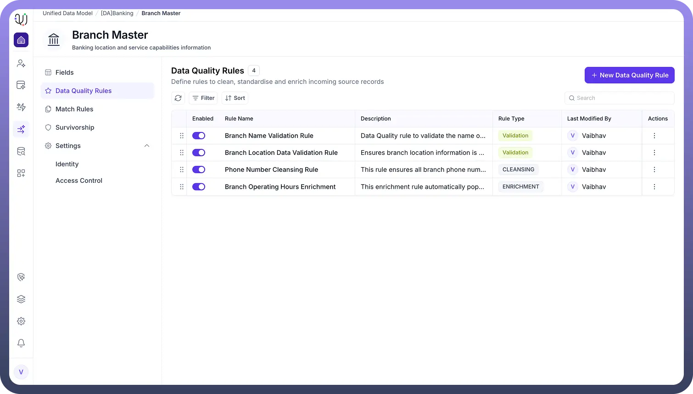

# Data Quality Rules

Source: https://www.unifyapps.com/docs/unify-data/overview-data-quality-rules
Section: data

---

## **Overview**

Data Quality Rules in UnifyApps ensure that ingested data meets required business and technical standards. After data is loaded into staging tables, these rules run **only during a scheduled processing event**, where they validate the staged records before those records are promoted to target objects.

### **How Data Quality Rules Work**

- **Ingestion:** Raw data is first written into staging tables with no transformations applied.
- **Scheduled Validation:** At the configured schedule, Data Quality Rules check the staged data for completeness, correct formatting, valid references, duplicates, and other quality conditions.
- **Promotion:** Only validated (or corrected) data is moved into final entities or made available to downstream processes. This staged and scheduled approach ensures cleaner, more reliable data before it reaches systems that depend on it.
