# Overview

Source: https://www.unifyapps.com/docs/unify-data/overview-logs
Section: data

---

## Introduction

The Logs tab provides a **comprehensive overview** of your data pipeline's performance and status. It includes various metrics that help you monitor and analyze the data ingestion and processing activities.

Understanding these metrics is crucial for maintaining efficient data movements and promptly addressing any issues.

## Key Metrics Explained

1. Records Ingested
  - **Description**: The total number of data records your system has taken in.
  - **Why it matters?**: It tells you how much data you're dealing with.
  - **Example**: If you usually process 10,000 customer records daily, but today you see 50,000, it might mean there's a big new batch of customers or possibly a data error.

    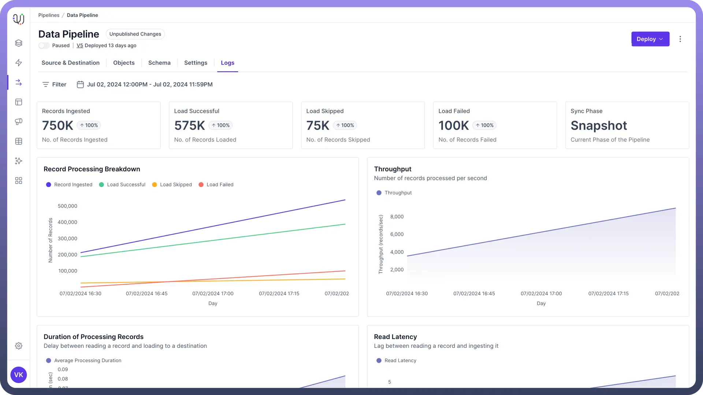

2. Load Successful
  - **Description**: How many records were successfully added to your destination system.
  - **Why it matters?**: It shows if your process is working as expected.
  - **Example**: If you ingested 10,000 records and 9,990 were loaded successfully, that's a 99.9% success rate. The 10 that didn't make it through need investigating.
3. Load Skipped
  - **Description**: Records that weren't loaded, usually because they didn't meet certain criteria.
  - **Why it matters?**: It can point out data quality issues or overly strict rules.
  - **Example**: If 500 out of 10,000 customer records are skipped because they're missing phone numbers, you might need to check why so many customers aren't providing this information.
4. Load Failed
  - **Description**: Records that couldn't be loaded due to errors.
  - **Why it matters?**: This directly shows where your process is having problems.
  - **Example**: If 100 out of 10,000 records fail because they have dates in the wrong format, you know you need to fix how dates are being handled.
5. Sync Phase
  - **Description**: Indicates whether the current sync is in the historic or live phase.
  - **Example**: "`Snapshot`" during initial data backfill, "`Live`" for ongoing real-time updates.
6. Record Processing Breakdown
  - **Description**: A timeline showing how records were processed over time.
  - **Why it matters?**: Helps you spot patterns or times when issues often occur.
  - **Example**: If you notice that most failed loads happen around 2 AM every night, you might find that's when another big job is running, causing conflicts.

    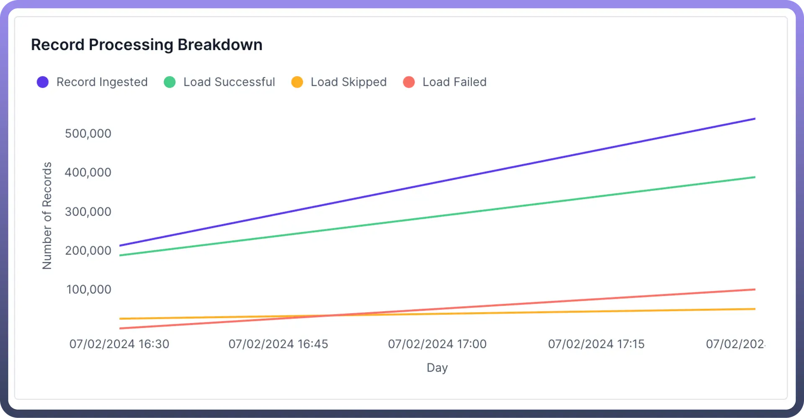

7. Throughput
  - **Description**: How many records your system processes per minute or second.
  - **Why it matters?**: Shows how fast your system is working.
  - **Example**: If you normally process 1,000 records per minute, but it drops to 500, something might be slowing your system down.

    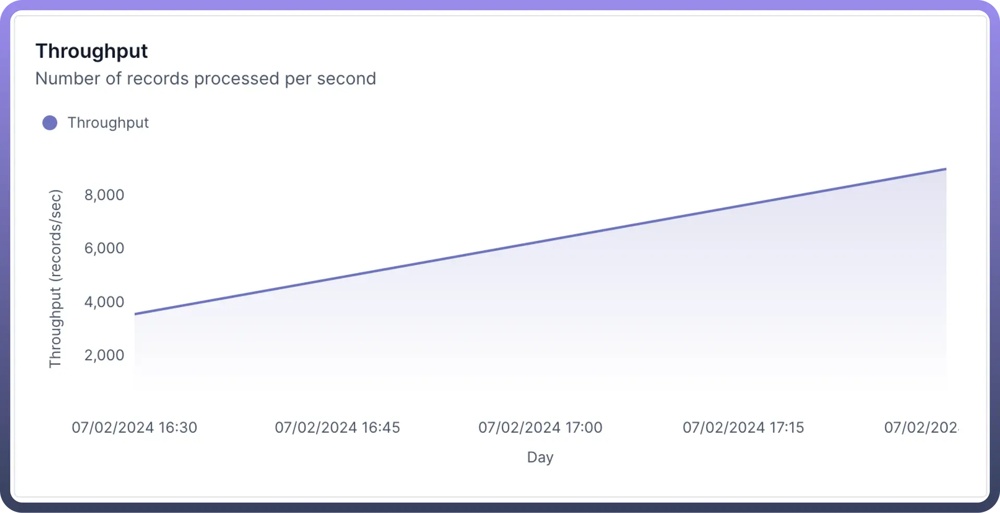

8. Read Latency
  - **Description**: How long it takes to read a record from the source objects.
  - **Why it matters?**: Important for when you need up-to-date data quickly.
  - **Example**: If it usually takes a few seconds for new sales data to be available for reporting, but now it's taking 5 minutes, your sales team might be working with outdated information. **Note:** Read latency is 0 for Snapshot phase, since during that time all the load is read at once. Hence, the read latency graph will not be present during snapshot phase.

    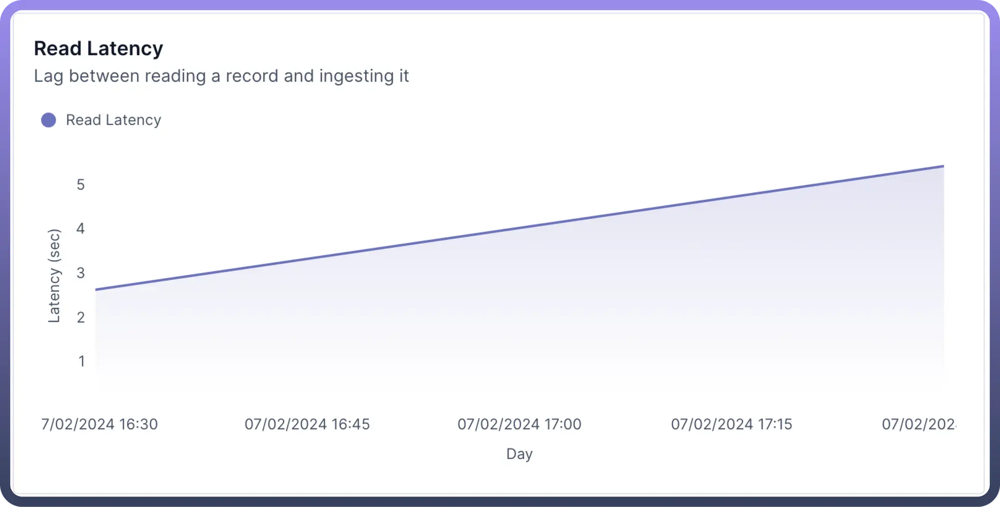

9. Average Processing Duration
  - **Description**: The average time it takes to process one record.
  - **Why it matters?**: Helps you understand and plan for how long jobs will take.

    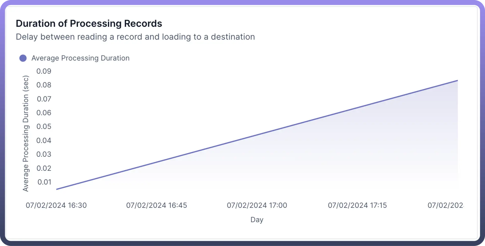

10. Logs Table
  - **Description**: A detailed list showing how different types of data were processed.
  - **Why it matters?**: Lets you see if certain types of data are causing more issues than others.
  - **Example**: You might see that while most data types have few issues, address data has a high failure rate, indicating you need to look at how addresses are being handled.

    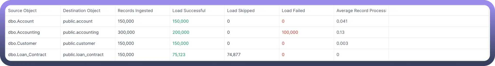

11. Object Logs
  - **Description**: Detailed logs for individual records processed for an object.
  - **Example?**: Log entry showing a specific record failed due to error in performing transformation.
  - **Use Case**: Investigating why the transformation failed. For instance, a cast transformation from string to date might fail if it actually receives a string in the source.

    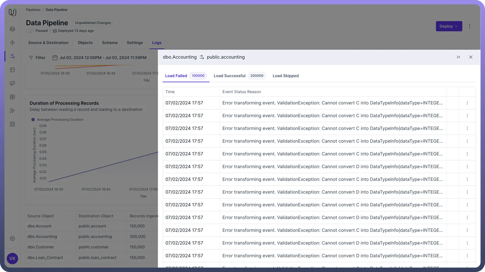

12. Record Details
  - **Record Status**: Indicates the status of the record
  - **Error Message**: Specifies the nature of the failure (transformation error in this case).

    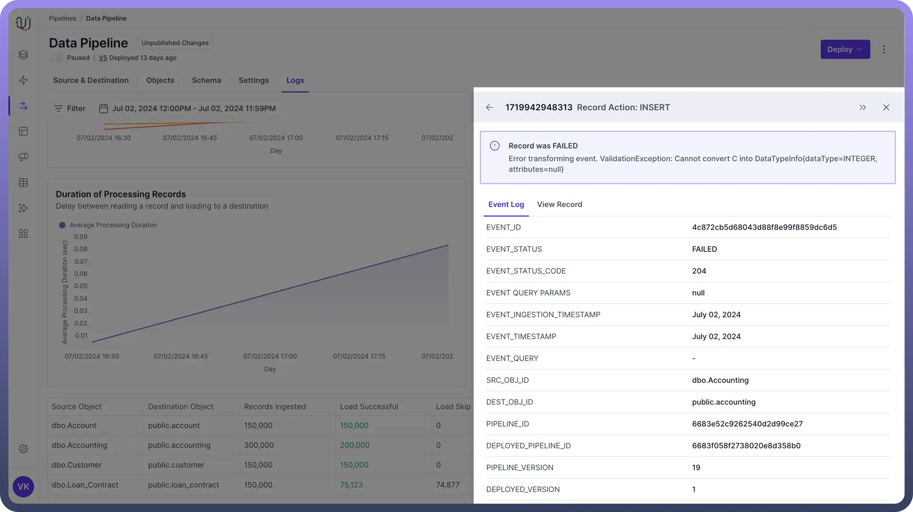

## Event Details

- `EVENT_ID`: Unique identifier for this processing event.
- `EVENT_STATUS`: Overall status of the event .
- `EVENT_STATUS_CODE`: Numeric code associated with the failure type.
- `EVENT QUERY PARAMS`: Parameters used in processing .
- `EVENT_INGESTION_TIMESTAMP`: When the record entered the data pipeline.
- `EVENT_TIMESTAMP`: When the processing attempt occurred.
- `EVENT_QUERY`: Query used to retrieve/process the record.

## Object and Pipeline Information

- `SRC_OBJ_ID`: Source object identifier.
- `DEST_OBJ_ID`: Destination object identifier.
- `PIPELINE_ID`: Identifier for the ETL pipeline used.
- `DEPLOYED_PIPELINE_ID`: ID of the deployed version of the pipeline.
- `PIPELINE_VERSION`: Version number of the pipeline.
- `DEPLOYED_VERSION`: Version number of the deployed pipeline.
- `JOB_ID`: Identifier for the specific job.
- `TXN_ID`: Transaction ID for this processing attempt.
- `SYNC_PHASE`: Current phase of the sync process .
- `TIMESTAMP`: Time of the event occurrence.

> **Note:** Use these metrics to trace the record's journey through the data pipeline and identify the exact point and context of failure.

## Source Event Query

- This shows the entire source event query.

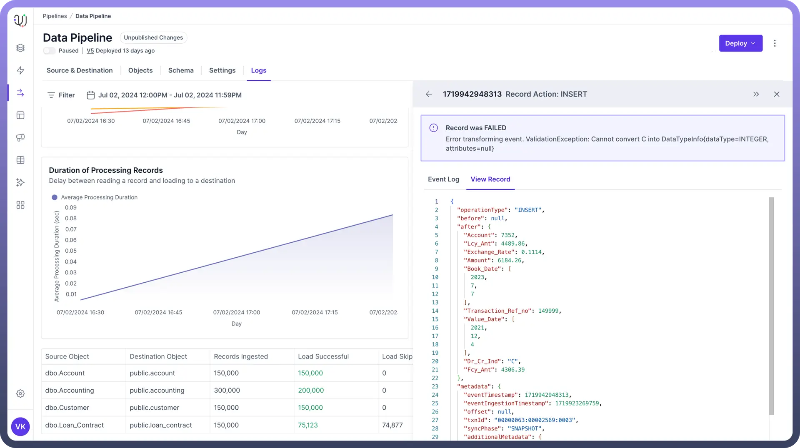

## Using Filters Effectively

**Time Filtering**

Use time filters to zoom in on specific periods:

- Compare this week's performance to last week's.
- Look at what happened during a reported outage.
- Check if certain times of day or days of the week have more issues.

**Example**: By looking at the last 24 hours, you might see that most errors happen right after midnight, when your daily update job runs.

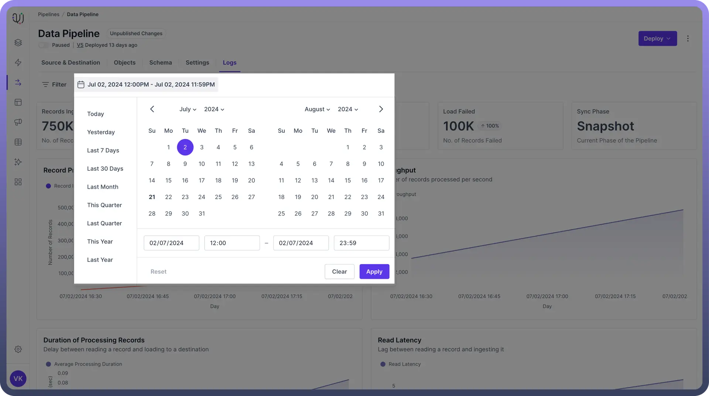

**Other Filters**

Combine filters to pinpoint issues:

- Filter by source objects to see if one source is causing more problems.
- Look at specific types of data (like customer info or product data) to see if some are more error-prone.
- Filter by error type to focus on particular problems.

**Example**: By filtering for "`Accounts`" and Time filter as “`Last Quarter`” you will discover the trends for data transfer of all the account data during the last quarter.

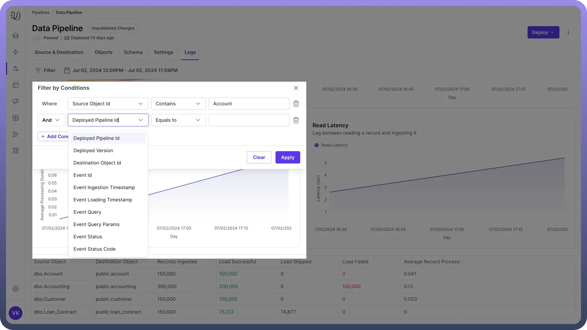

## Tips for Using Logs

1. **Set Up Regular Checks**: Look at your logs at the same time every day, even if just for a few minutes.
2. **Know Your Normal**: Understand what your typical numbers look like, so you can spot when something's off.
3. **Investigate Patterns**: If you see the same issue happening repeatedly, dig deeper to find the root cause.
4. **Use Logs for Planning**: If you see your data volume is steadily increasing, use this information to plan for upgrades or optimizations.

## Common Issues

1. **Sudden Drop in Throughput**:
  - **Possible causes:** Network issues, database slowdown, or resource constraints.
  - **Example:** If throughput drops from 1,000 to 100 records per second, check if your database is running low on space.
2. **Increase in Failed Loads**:
  - **Possible causes:** Changes in source data format, destination system issues, or new data quality problems.
  - **Example:** If failed loads jump from 0.1% to 5%, check if there was a recent change in how the source system formats dates.
