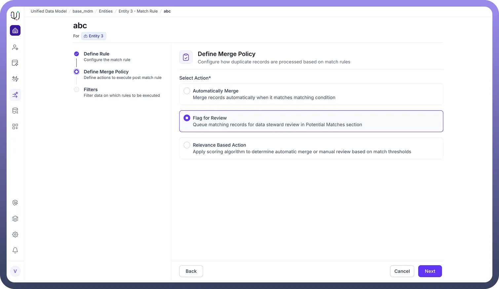

# Match Rules

Source: https://www.unifyapps.com/docs/unify-data/overview-match-rules
Section: data

---

**Overview**

Match Rules are the critical governance mechanism within the UnifyApps Base MDM used to ensure data integrity.

Their primary function is to identify, link, and consolidate potential duplicate records across your datasets.

By defining specific criteria—such as a matching email address or identical customer ID—these rules determine when two distinct records actually represent the same real-world entity, facilitating the creation of a single, trusted "Golden Record".

**The Configuration Framework**

Configuring a Match Rule follows a structured three-step wizard, ensuring that every aspect of the deduplication process is explicitly controlled.

1. **Define Rule** This step focuses on the identification logic.
2. **Define Merge Policy** Once a match is identified, the system needs to know how to react. UnifyApps offers three distinct action strategies:
3. **Filters** The final step allows you to apply scoping constraints. Match Rule Filters determine which records are eligible for this rule based on their field values. For instance, you can configure the rule to only apply to records where the Modified Time is after a certain date, ensuring that legacy or archived data is excluded from the matching process.

  
