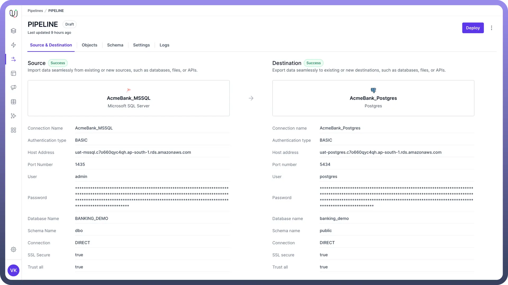
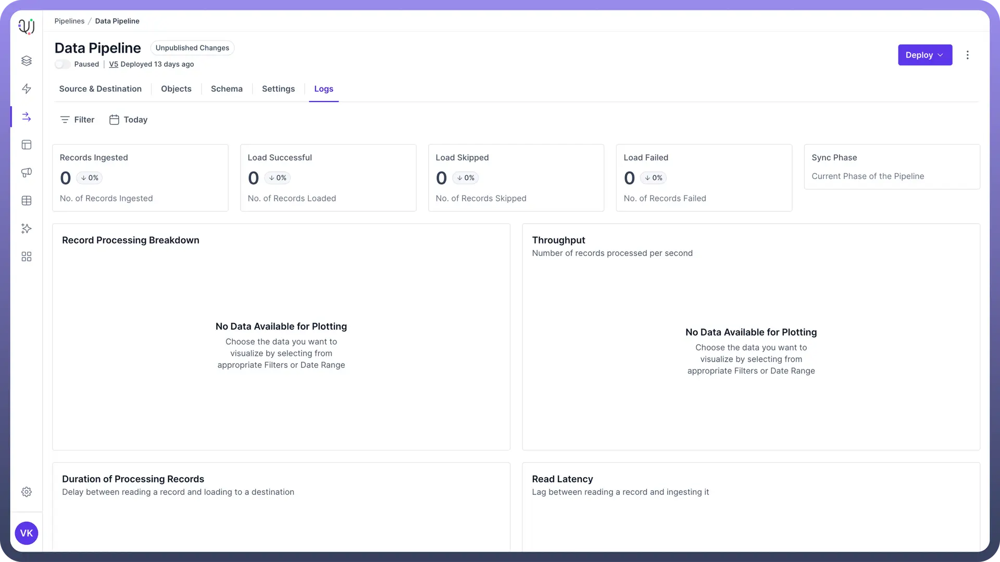
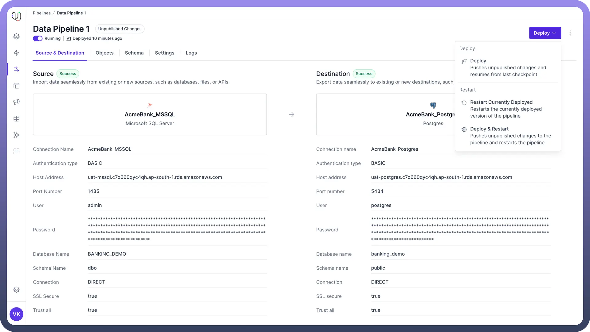
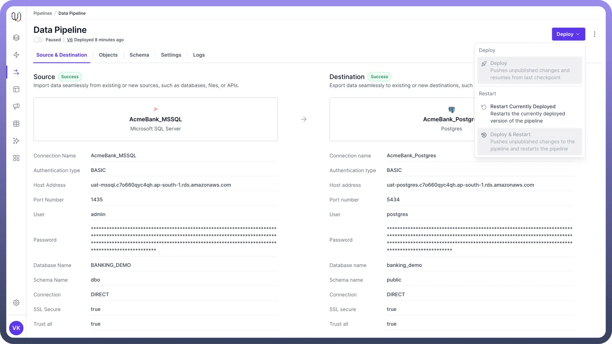
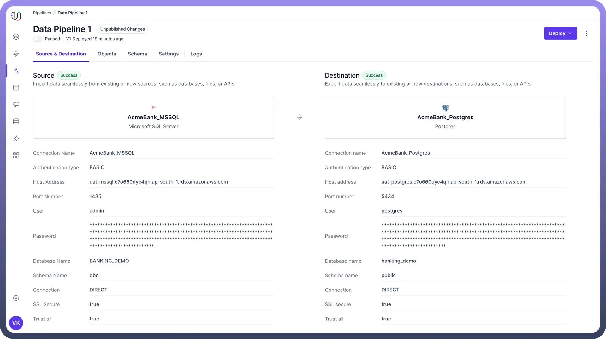
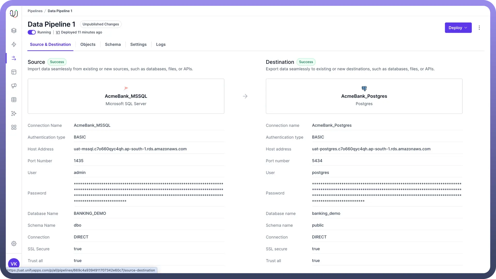
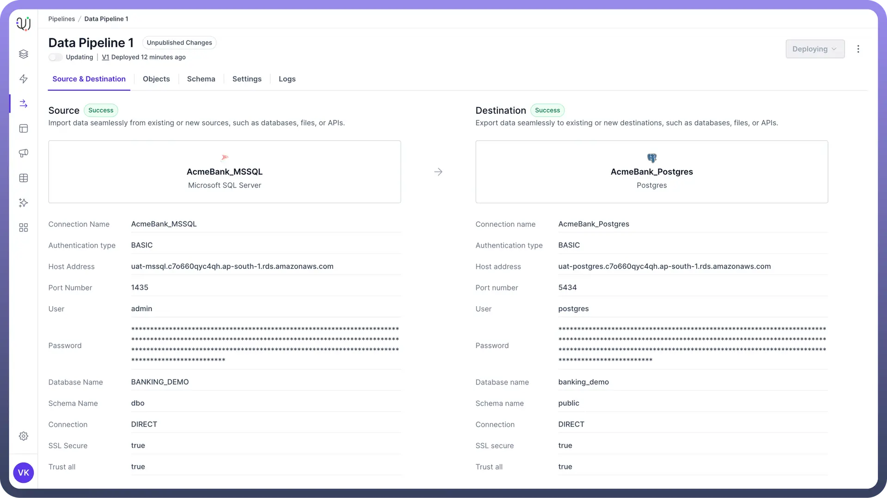

# Overview

Source: https://www.unifyapps.com/docs/unify-data/overview-pipeline-deployment
Section: data

---

## Introduction

Deploying an data pipeline is a critical step in putting your data processing automations into action.

This article covers the deployment options available after the initial pipeline deployment and how to manage the pipeline's execution.

## Pipeline States

Before diving into deployment options, it's important to understand the different states a pipeline can be in:

1. **Draft State**: The initial state of a pipeline that has never been deployed. All configurations and logic exist only in the development environment.

  

2. **Unpublished Changes**: This state occurs when modifications have been made to a previously deployed pipeline, but these changes haven't been deployed yet. The running pipeline still operates on the last deployed version.

  

## Deployment Options

After a pipeline has been deployed for the first time, you have several options for subsequent deployments and management:

1. Deploy
  - **Function**: Applies new changes to the pipeline.
  - **Behaviour**:
    - Moves the pipeline from "`Unpublished Changes`" to "`Deployed`" state.
    - Resumes operation from the last checkpoint.
  - **Use Case**: Implementing minor changes or updates that don't require full reprocessing.
  - **Example**: Adjusting a transformation rule or adding a new field to the output.
2. Deploy & Restart
  - **Function**: Applies changes and restarts the entire pipeline process.
  - **Behaviour**:
    - Deploys any unpublished changes.
    - Clears all progress and begins processing from the start.
  - **Use Case**: Major changes that affect historical data or require full reprocessing.
  - **Example**: Changing the primary key of a data set or modifying core transformation logic.
3. Restart Currently Deployed
  - **Function**: Restarts the existing deployed version without applying any new changes.
  - **Behaviour**:
    - Keeps the current deployed version.
    - Clears progress and starts from the beginning.
  - **Use Case**: Reprocessing data without any pipeline changes.
  - **Example**: Rerunning the pipeline after source data has been updated or corrected. **Note:** If there are no new changes in the pipeline, then only “**Restart Currently Deployed**” option is enabled.

    

## Pipeline Execution Control

### Pause/Resume Toggle

- `Function`: Allows you to pause or resume the pipeline execution.
- `Pause`: Temporarily stops the pipeline processing.
- `Resume`: Continues pipeline execution from where it was paused.
- `States`**:** There are three states of the toggle-
  - `Paused`**:** This state is present when the pipeline is paused.

    

  - `Running`**:** This state indicates that the pipeline is running and migrating the data from source to destination.

    

  - `Updating`**:** This is the transient state between paused and running. Whenever the toggle is clicked or pipeline is deployed the state of the toggle becomes updating. **Note:** If the pipeline is paused for a duration longer than log retention period, it can lead to permanent pipeline failure and the pipeline has to restarted in such a case.

    

## Best Practices

1. **Testing**: Always test changes in a non-production environment before deploying.
2. **Checkpoints**: Utilise checkpoints to enable efficient resumption after pauses or failures.
3. **Monitoring**: Keep an eye on pipeline performance after deployments to catch any issues early.
4. **Review Changes**: Review all the change made in the pipeline in Audit logs before deploying to ensure data integrity.
