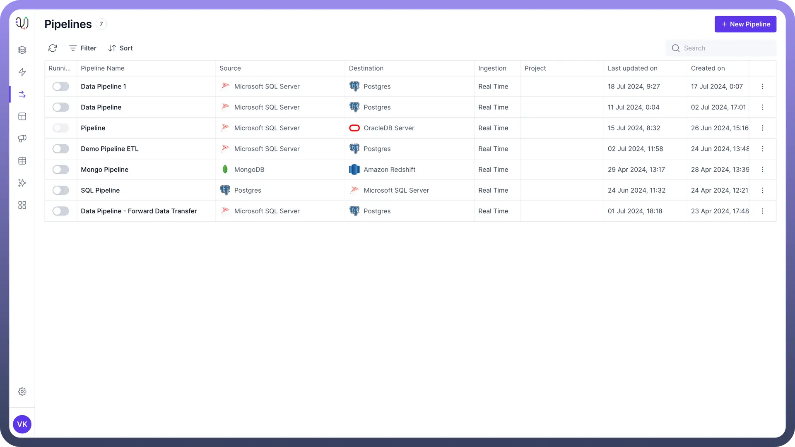
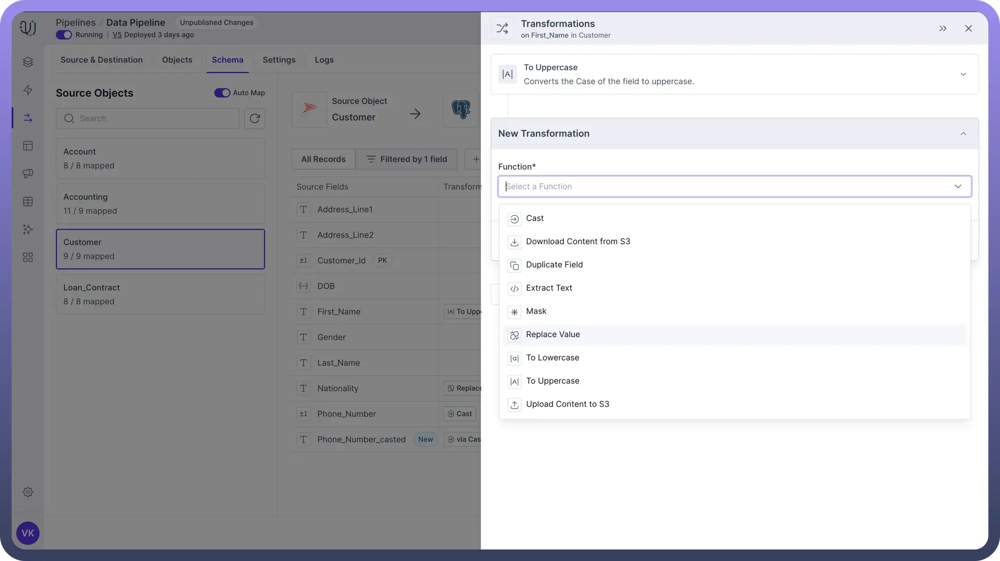
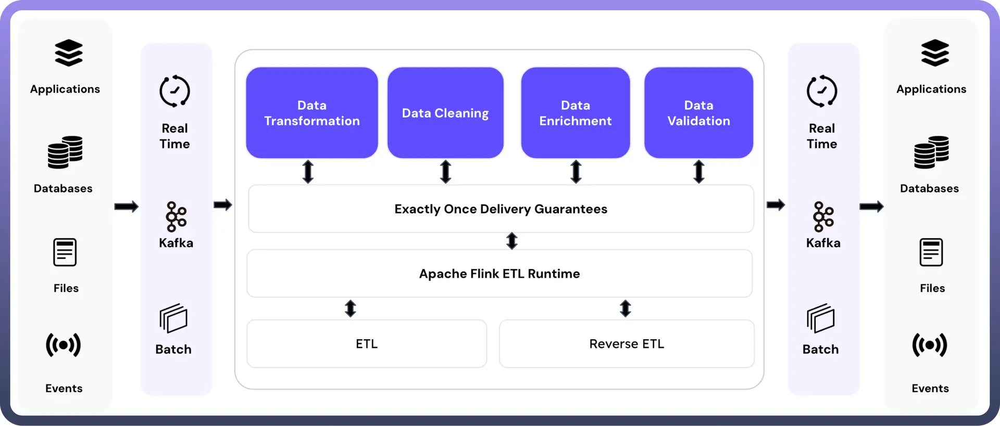
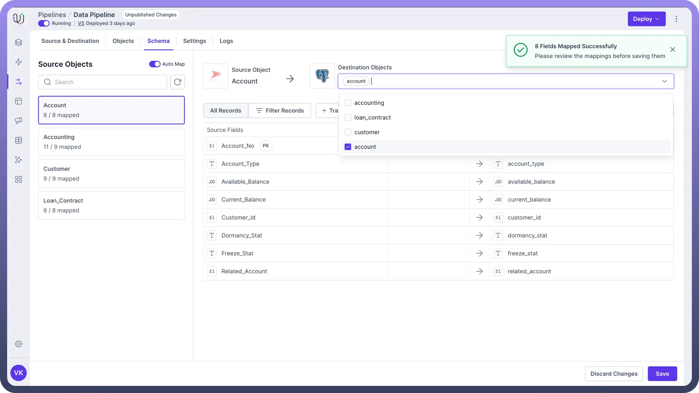
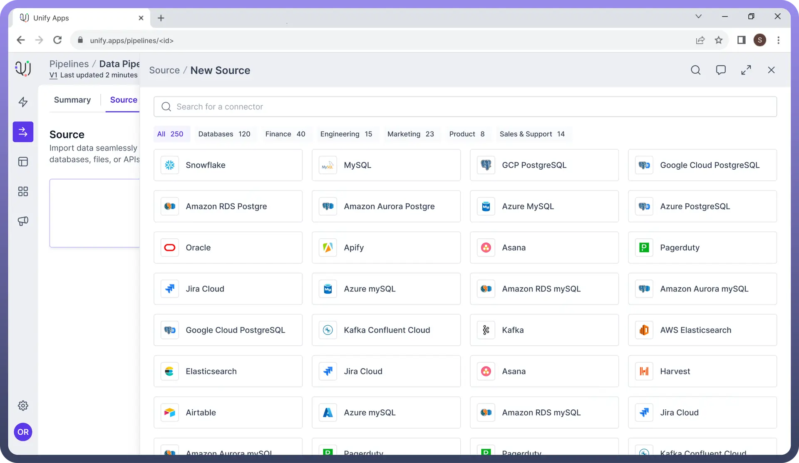
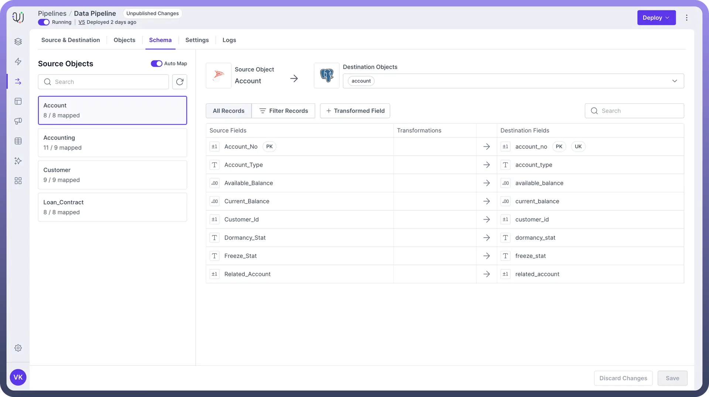
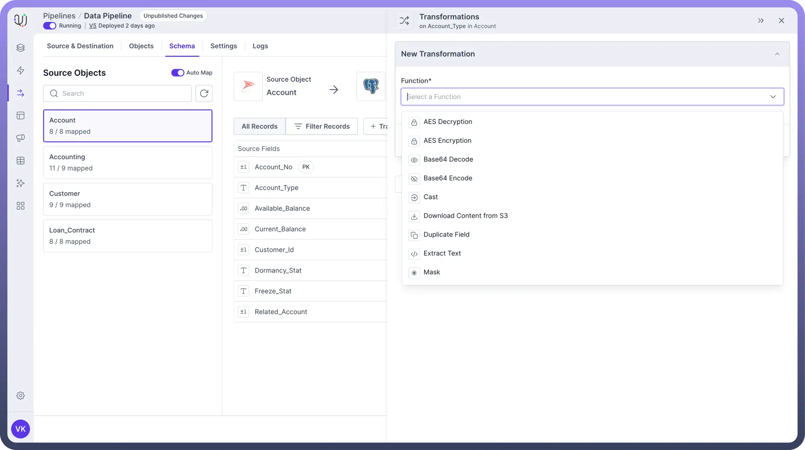
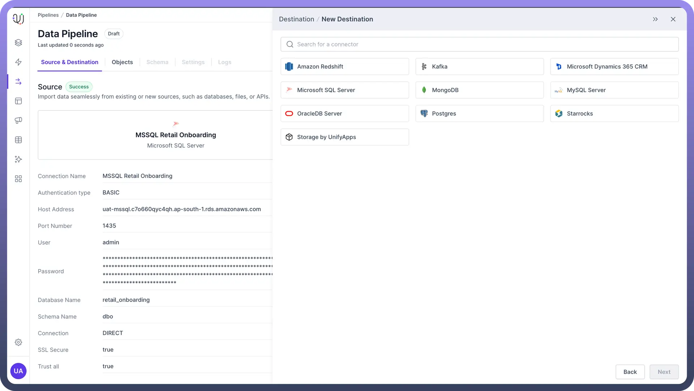

# Overview

Source: https://www.unifyapps.com/docs/unify-data/overview-pipeline
Section: data

---

UnifyData is a **data pipeline tool** designed to **simplify** and **streamline** your data movement processes. It acts as a **central hub** for your data, connecting various sources and destinations to ensure smooth data flow across your systems.

## Key Features

1. **Simplified Data Integration**: You can connect and manage data with a wide range of data warehouses and databases such as :
  - Relational databases (e.g., MySQL, PostgreSQL, Oracle)
  - NoSQL databases (e.g., MongoDB, Cassandra)
  - Cloud storage (e.g., Amazon S3, Google Cloud Storage)
  - Business applications (e.g., Salesforce, Microsoft Dynamics)
  - Analytics platforms (e.g., Google Analytics, Adobe Analytics)
  - File-based systems (e.g., CSV, JSON, XML files)
2. **Real-time Data Synchronization**: UnifyData uses CDC to efficiently replicate and synchronize data in real-time, ensuring that only new or modified data is processed. This reduces the load on your systems and ensures up-to-date information across all your data platforms.
3. **Pre-built Transformations Suite**: Transform your data using a wide range of ready-to-use data transformations and convert it into the desired format for your destination, saving significant time and effort in pipeline development.

  

4. **ETL & Reverse ETL**: UnifyData supports this by allowing you to extract data from your data warehouse or lake and load it into various business applications, enabling operational analytics and data-driven automations.

  

5. **Auto-Mapping**: You can automatically map source field to its corresponding destination field, saving you from the hassle of manually mapping each field.

  

## Building Blocks of a Data Pipeline

1. **Source Connector:** It involves connecting source database/application to your pipeline to ingest data.

  

2. **Schema Mapping:** It allows mapping source objects with the destination objects to ensure efficient transfer of source data to the desired destination.

  

3. **Data Transformation:** It acts as an intelligence layer between source and destination, which can help clean, restructure, or enrich the source data before loading it to the desired destination.

  

4. **Destination Connector:** It involves connecting destination databases/application, such as Kafka and Starrocks, for the pipeline, where the data needs to be loaded.

  
