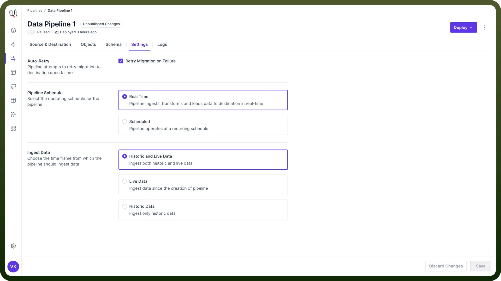
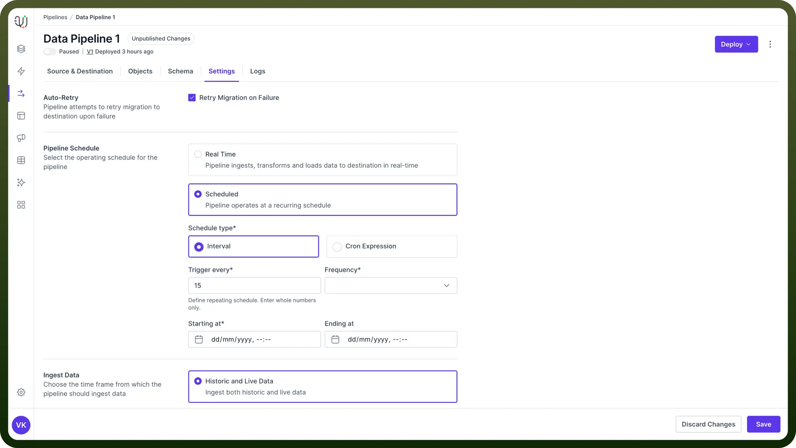
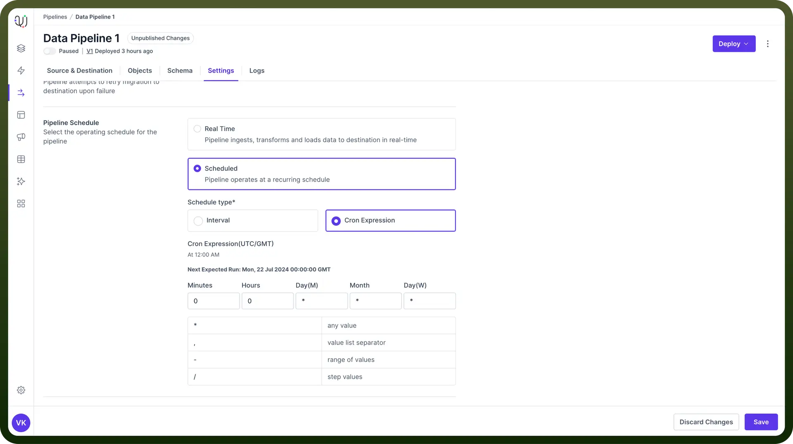
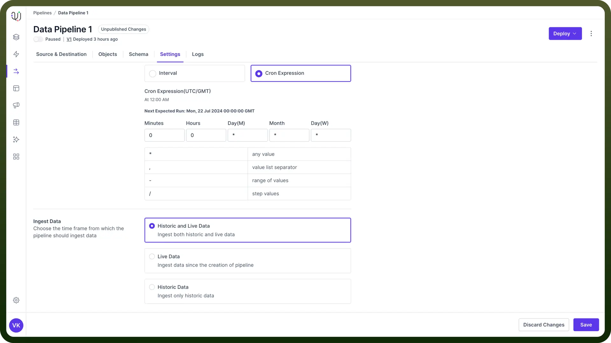

# Overview settings

Source: https://www.unifyapps.com/docs/unify-data/overview-settings
Section: data

---

## Introduction

Data pipeline settings determine how your data processing operations behave, when they run, and what data they handle. 

Proper configuration is essential for creating efficient and reliable data pipelines that meet your organization's needs.

## Pipeline Settings Retry on Failure

This setting allows the pipeline to automatically attempt **reprocessing of failed records** or operations, handling temporary issues without manual intervention.

### Pipeline Schedule

`Real-time` processing in data pipelines involves continuous data ingestion, transformation, and loading with minimal latency. 

This approach is ideal for scenarios where the most up-to-date information is critical for decision-making or operational processes.

`Use Cases` **:**

1. **Oracle to Kafka Streaming**:
  - Scenario: An e-commerce platform needs real-time inventory updates.
  - Implementation: Changes in Oracle database tables are immediately streamed to Kafka topics.
  - Outcome: Inventory levels are current across all sales channels, preventing overselling.
2. **Salesforce to PostgreSQL Sync**:
  - Scenario: A sales team requires up-to-date customer information.
  - Implementation: The pipeline continuously syncs Salesforce data to a PostgreSQL database.
  - Outcome: Sales representatives always have the latest customer data for their calls and meetings.

In case of `Interval`, you need to define the following conditions for your interval schedule

1. **Trigger every**: Define repeating schedule (whole numbers only).
2. **Frequency**: Select from options like minutes, hours, days, etc.
3. **Starting at**: Set the start time for the schedule.
4. **Ending at**: Set an end time (if applicable).

`Use Cases` **:**

1. **SQL Server to Redshift Daily Load**:
  - Configuration: Trigger every: 1, Frequency: Day, Starting at: 01:00 AM
  - Scenario: Daily transfer of transactional data to a Redshift data warehouse.
  - Outcome: Each morning, analysts have yesterday's complete data available for reporting.
2. **JIRA to MongoDB Weekly Sync**:
  - Configuration: Trigger every: 1, Frequency: Week, Starting at: Sunday 11:00 PM
  - Scenario: Weekly synchronization of project data from JIRA to a MongoDB database.
  - Outcome: Project managers have updated project statistics at the start of each week.

`CRON` This provides support for standard CRON syntax for more complex scheduling needs.

`Use Cases` **:**

1. **MS Dynamics to PostgreSQL Sync**:
  - CRON Expression: 0 */4 * * 1-5 (Every 4 hours, Monday to Friday)
  - Scenario: Regular updates of customer data from MS Dynamics to a PostgreSQL database.
  - Outcome: Customer service team has fresh data every four hours during the workweek.
2. **Google Sheets to Oracle Database Update**:
  - CRON Expression: 30 18 * * 5 (At 18:30 on Friday)
  - Scenario: Weekly import of manually updated forecast data from Google Sheets to Oracle.
  - Outcome: Finance team's weekly forecasts are automatically incorporated into the central database.

### Ingest Data

This setting essentially defines the time frame from which the pipeline should ingest data. There are two kinds of data available at data source

1. **Historical -** This is all the data present in the source before the pipeline was deployed.
2. **Live -** Live data consists of new data coming to the source after the pipeline has been deployed.

So currently, you have three modes of data ingestion available to configure in your data pipeline:

#### Historic and Live Data

This mode of ingestion will Ingest both historic and live data.
 `Use Case` :

**Salesforce to Redshift Migration**:

- Scenario: Moving from legacy data warehouse to Redshift, including all historical Salesforce data.
- Implementation: Pipeline ingests all historical Salesforce data and continues with real-time syncing.
- Outcome: Redshift contains complete historical context and stays current with ongoing Salesforce updates.

#### Live Data

This mode of ingestion will only Ingest the live data coming to your data source.

`Use Case` :

**MongoDB to Kafka Streaming for Real-time Analytics**:

- Scenario: Streaming current user activity data for real-time analytics.
- Implementation: Pipeline set to ingest and stream only new data from MongoDB to Kafka topics.
- Outcome: Analytics team can perform real-time analysis on current user behaviors.

#### Historic Data

This mode of ingestion will only Ingest the historical data present at the source. This will just be a one time run and the pipeline will be stopped after the historical data transfer is complete.

`Use Cases` :

**JIRA to PostgreSQL**:

- Scenario: Analyzing completed project data for a analytical review.
- Implementation: Pipeline configured to ingest JIRA data for a specific past time range into PostgreSQL.
- Outcome: Project managers can query and analyze historical project data for performance reviews.
