# Overview Transformations

Source: https://www.unifyapps.com/docs/unify-data/overview-transformations
Section: data

---

Data transformations act as an intelligence layer essential for **optimizing data transfer** from source to destination. 
UnifyData's transformation capabilities help you to :

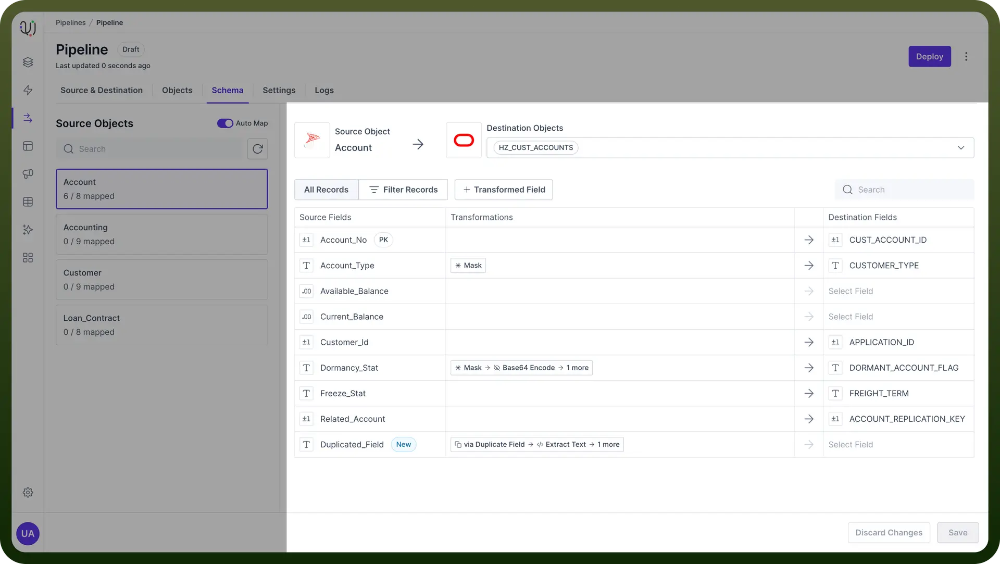

- **Clean** and **standardize** your data
- **Combine** information from multiple sources
- **Derive** new insights through calculated fields
- Ensure data quality and consistency
- **Comply** with data privacy and security requirements

> **Note:** These transformations are created in transit between source and destination, and it wouldn’t affect your source database.

## Why Use Data Transformations?

Data from source systems usually needs to be processed before it can be sent to destination databases or data warehouses. 

These transformations act as an intelligence layer, making sure the data is **clean**, **enriched**, and in the **right format**. This helps improve data quality and makes it easier to analyze.

## Transformations

UnifyData categorizes transformations into three main types based on their dependency on source fields:

## Independent of Fields

These transformations don't rely on any specific source fields and apply a predefined action.

- **Example**: `Add Static Value` maps a constant value to the destination field.
- **Usage**: Adding static or constant information to the data records.

  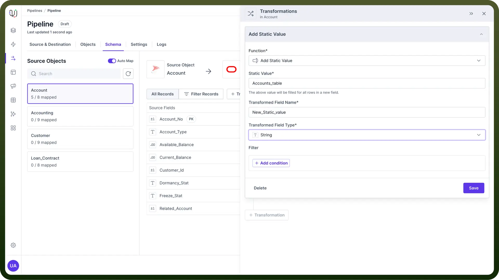

- **Use Case**: Adding metadata or default values to your dataset.
  - **Example**: Suppose you have a dataset of customer transactions and want to add a constant value representing the data source. You can use the `Add Static Value` transformation to append "`Accounts_table`" to each record.

> **Note:** Ideal for appending fixed values where no source data is needed. This can be particularly useful for adding **audit** or **trace** information to your records.

## Dependent on a Single Field

These transformations rely on the value of a single source field to perform their operation.

- **Example**: AES Encryption encrypts the values of a specific field, protecting sensitive data.
- **Usage**: Modifying or securing individual data elements.

  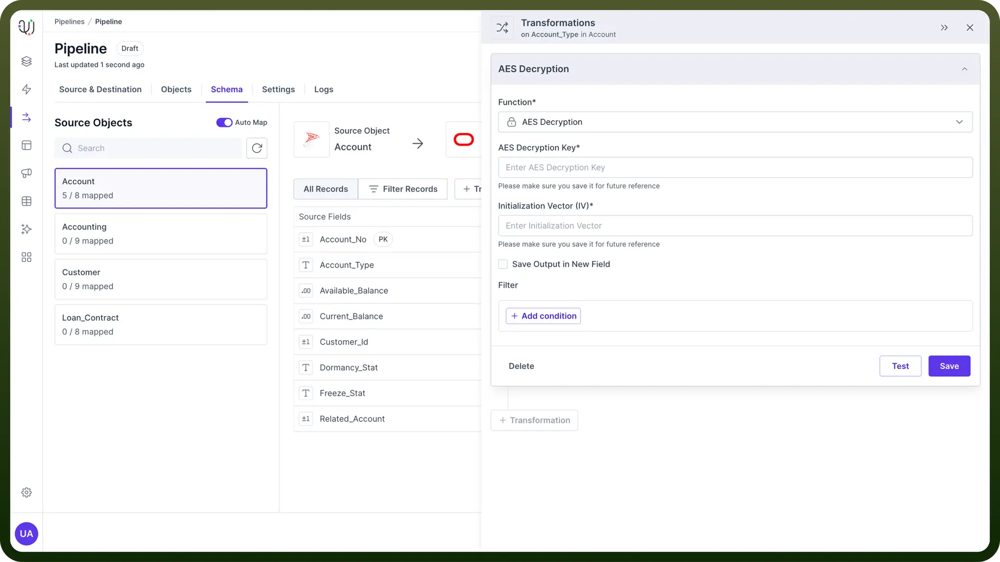

- **Use Case**: Encrypting personal identifiable information (**PII**) before storage.
  - **Example**: Encrypting credit card numbers in a customer dataset to ensure that sensitive information is protected before being stored in the database.

## Dependent on Multiple Fields

These transformations involve multiple source fields to derive the output.

- **Example**: Lookup transformations use multiple fields to retrieve and map additional information.
- **Usage**: Combining or deriving values based on multiple input fields.

  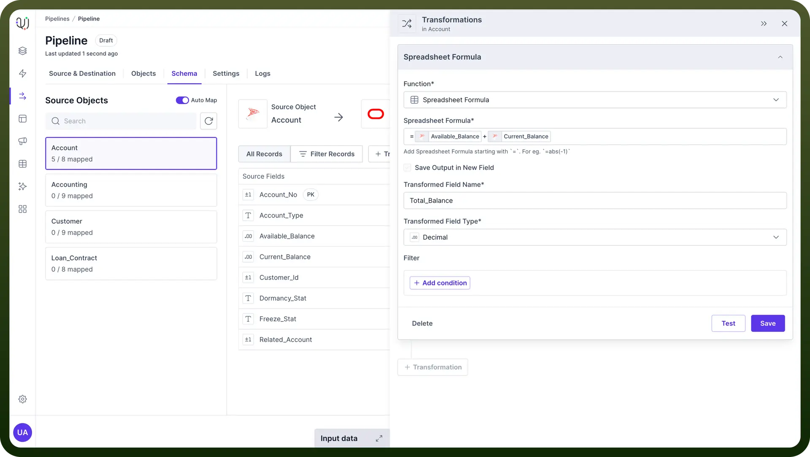

- **Use Case**: Enriching customer records by adding segmentation data based on multiple attributes.
  - **Example**: Using spreadsheet formula transformations to add the customer’s available balance and total balance.

## Applying Transformations

Follow these steps to apply a transformation in UnifyData:

1. **Select Source and Destination Objects**
  - Navigate to the source and destination objects you want to map within your data pipeline.
2. **Add Transformation**:
  - Hover over the middle Transformations column for the desired field and click the `+ Add Transformation` button.

    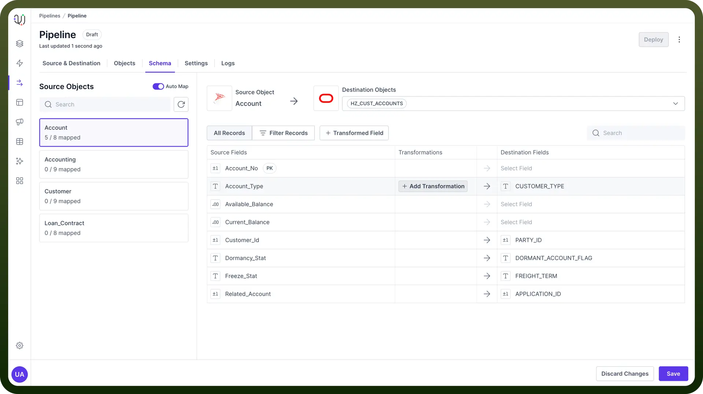

3. **Configure Transformation**:
  - In the New Transformation pane, select the function from the list of available transformations.
4. **Enter Details and Save**:
  - Fill in the required details for the selected transformation and click `Save`.

## New Field Creation

While creating a transformation, you can choose to either modify the existing field or create a new **transient** field with the transformed value.

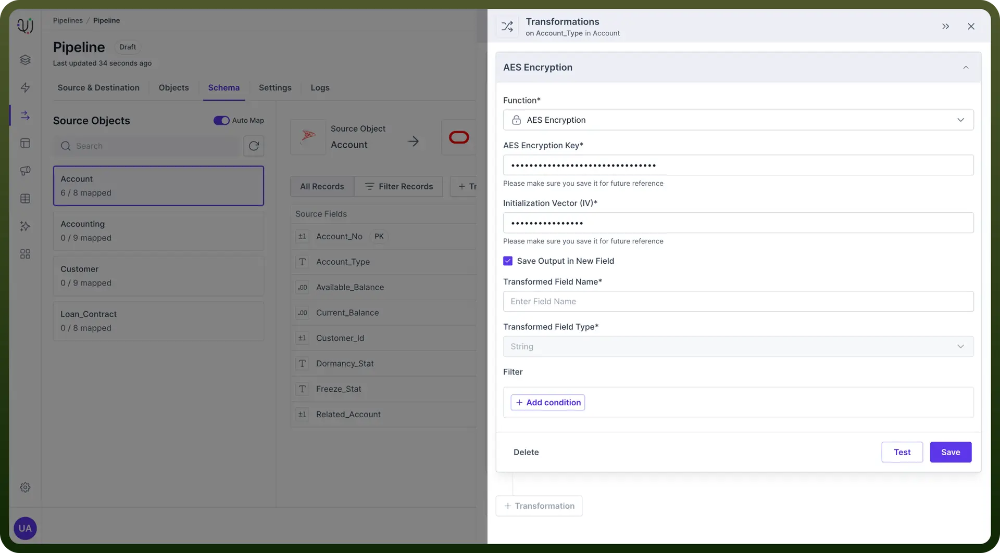

Transient fields are **temporary** and do not get stored in your source objects.

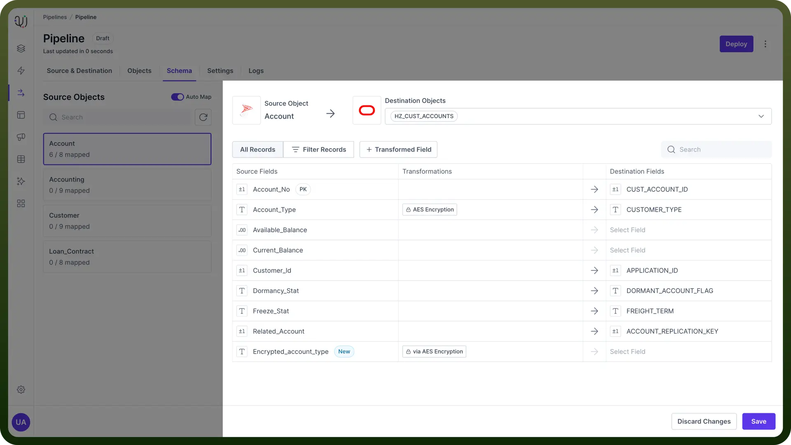

**Mandatory Creation**: Some transformations, like lookup or cast, require the creation of a new transient field. 
These cases generally occur when there is a datatype change in transformation or transformation is either dependent on multiple source fields or independent of source fields.

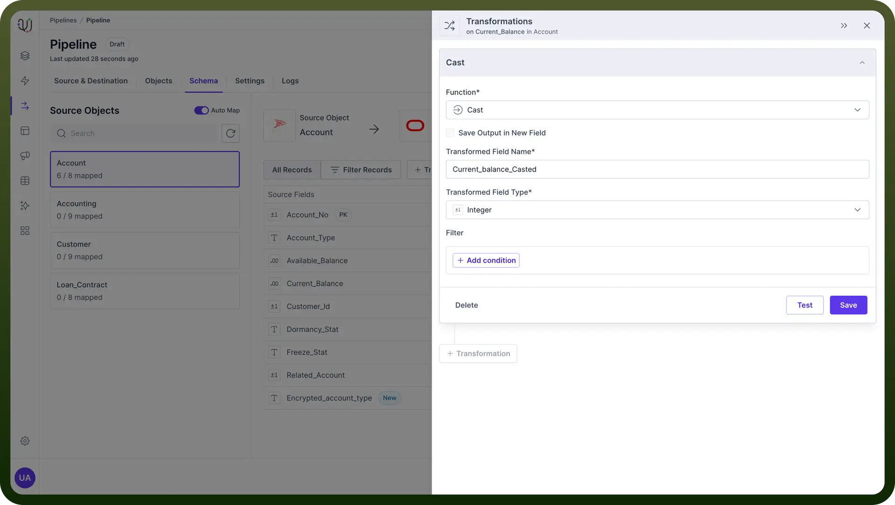

> **Note:** Use transient fields to keep the original data intact while applying transformations that generate new or derived values.

## Filtering Transformations

Pre-Transformation Filters allow you to set conditions for when a transformation should be executed.

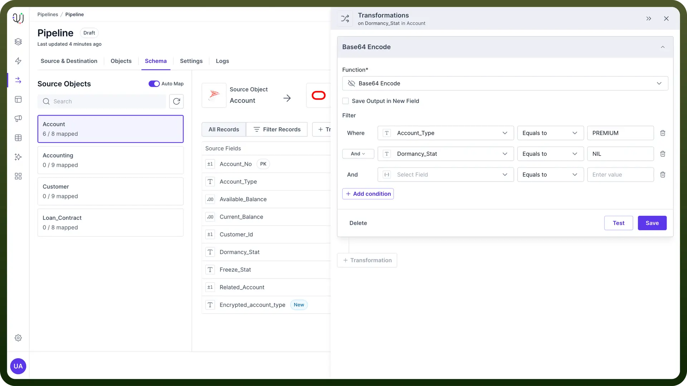

Apply these filters in the Filter section of the transformation configuration.

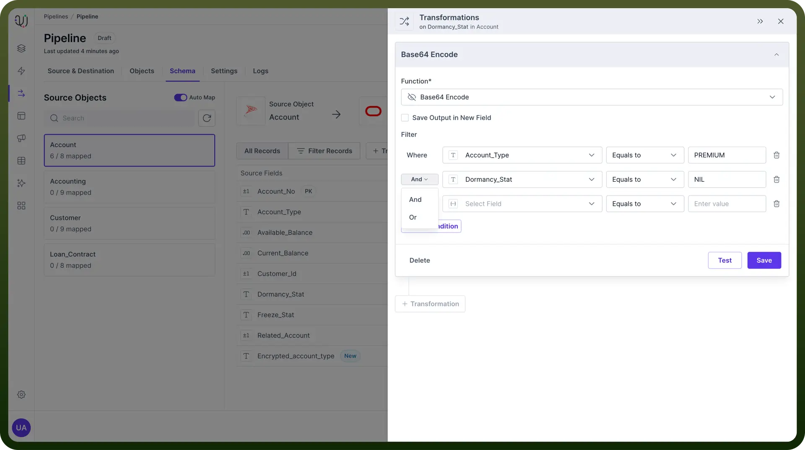

**Applying Filters**: Select filtering conditions and combine multiple conditions using AND or OR operators.

> **Note:** You can control the scope of transformations to apply them only to relevant data subsets.

## Chaining Transformations

UnifyData enables chaining multiple transformations on a single field.

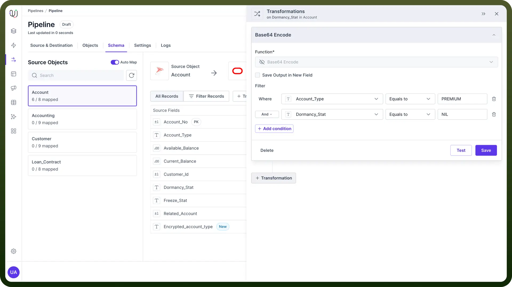

This can only be done when your previous transformation is not saved in a new field.

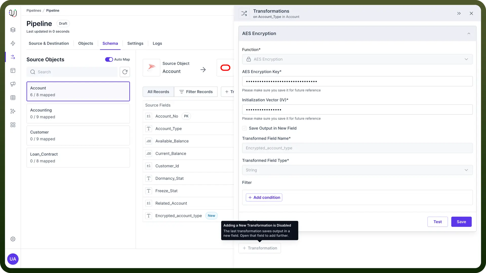

## Reordering of Transformations

If a chain of transformation is applied, then these can be reordered as per business requirements. You can drag and change the orders of transformations

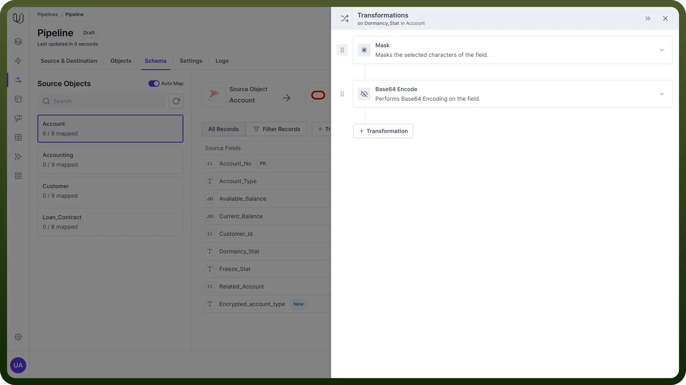

Transformations which have been used to create a new field **cannot be reordered** since the output in the new transient field is dependent on them.

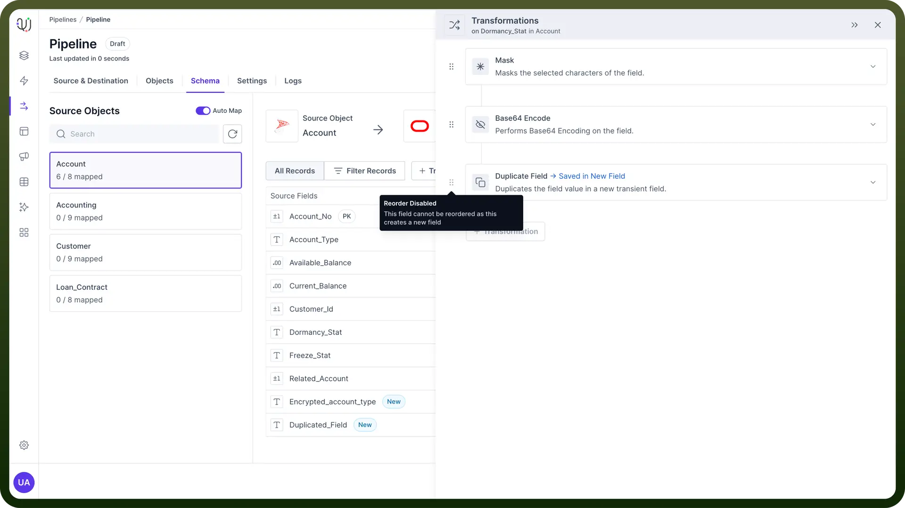

Similarly, if there is a chain of transformation in a newly created field using transformation, then the first transformation by which the field was created cannot be reordered.

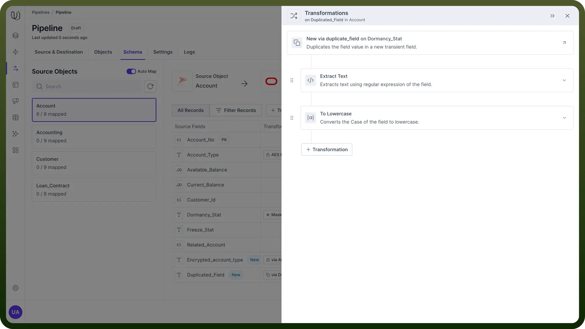

## Deleting Transformations

You can delete a transformation by either clicking the **delete** button on the transformation card or by clicking delete button inside the transformation.

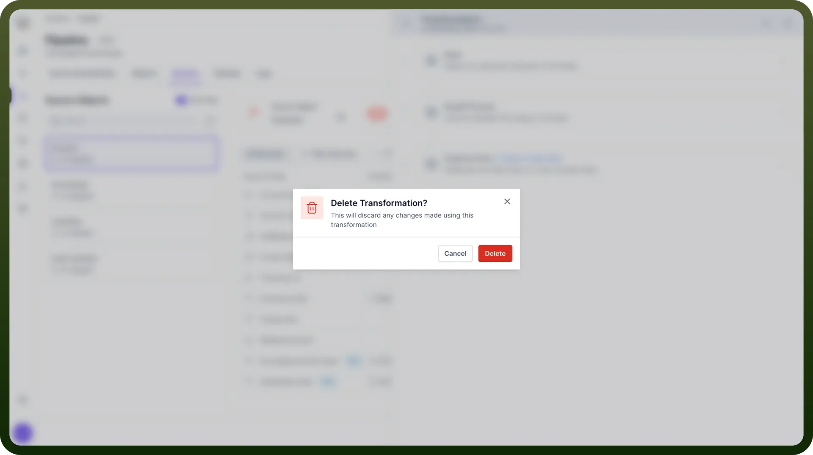

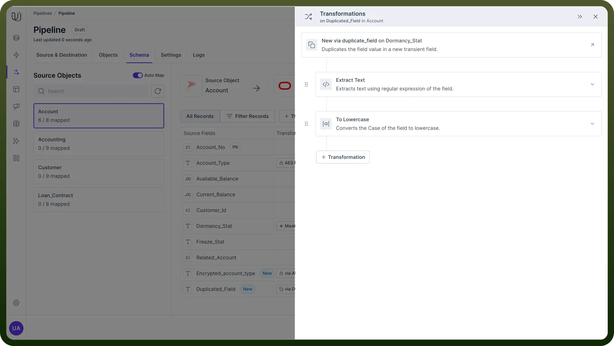

> **Note:** Deleting a transformation from which any new field(**s**) is created will also delete those new field(**s**).

## Best Practices

1. **Leverage Transformation Functions Effectively:**
  1. **Date Formatting**: Use date formatting functions to standardize date formats across different datasets.
  2. **String Manipulation**: Apply string manipulation functions to clean and standardize text fields.
2. **Ensure Data Quality with Validations:**
  - **Null Checks**: Use null check functions to handle missing data gracefully.
  - **Value Ranges**: Apply range checks to ensure numeric values fall within expected limits.
3. **Secure Sensitive Data:**
  - **Encryption**: Use AES encryption for sensitive fields to protect data privacy.
  - **Masking**: Apply data masking to anonymize personal information in non-production environments.
4. **Document Transformation Logic:**
  - **Detailed Documentation**: Maintain clear documentation for each transformation to facilitate troubleshooting and audits.
  - **Version Control**: Keep track of transformation changes using version control to manage updates and rollbacks.
