# Overview Unified data model

Source: https://www.unifyapps.com/docs/unify-data/overview-unified-data-model
Section: data

---

The Unified Data Model (UDM) in UnifyApps serves as the platform’s master data management (MDM) system, providing a comprehensive way to centralize, clean, deduplicate, and organize data from multiple sources into a single, high-quality ***Golden Repository***.

1. **Creating Entities:** Entities are the foundational tables (like Customer, Account, Transaction) in your data model. You can create them manually by adding fields or importing schema directly from a connected data source. Each entity is a table, and fields are its columns (with types, keys, and descriptions). Entities define your business objects and their attributes.

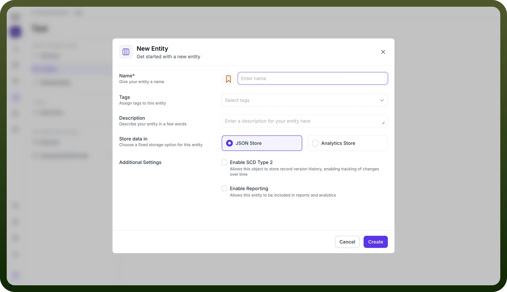

2. **Data Quality Rules**: There are three main categories: Validation (e.g., checking if a branch name is not null), Cleansing, and Enrichment. These rules ensure only high-quality data enters your system. When a record doesn’t meet these rules, actions like rejection or cleansing are triggered to maintain data integrity.

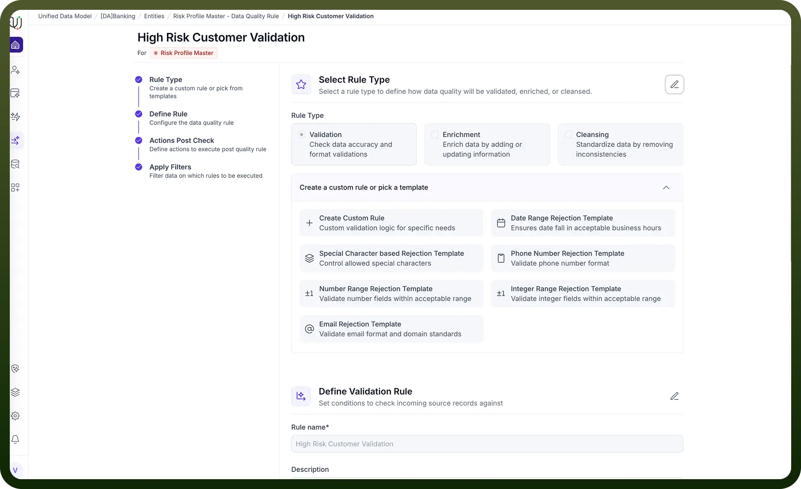

3. **Match rules:** Match rules help identify duplicate or similar records, using both exact and fuzzy matching (e.g., similarity in names). Based on similarity thresholds, you can configure rules to automatically merge, quarantine, or leave records as is. This deduplication process is crucial for building a unified dataset.

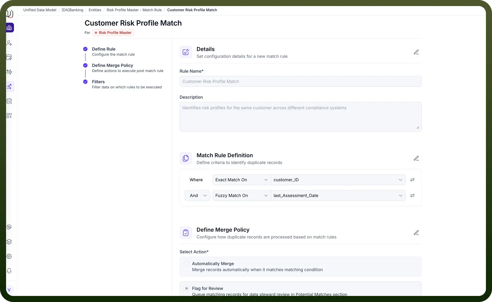

4. **Survivorship:**  Survivorship strategies determine how to merge conflicting information from duplicate records. You can prioritize by source system, recency, or use advanced strategies (like winner, crosswalk, min/max). Field-level custom merge rules are supported, and fallback strategies can be defined.

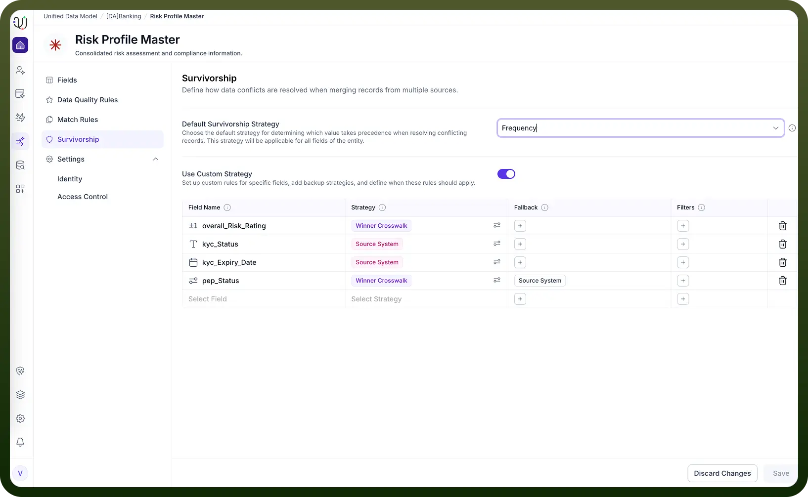

5. **Access Control:**  Access control policies let you restrict data at entity, record, or field level based on user roles. For example, a branch admin might only see active accounts, and some fields can be hidden entirely from certain roles. Access is managed via platform RBAC and policy filters.

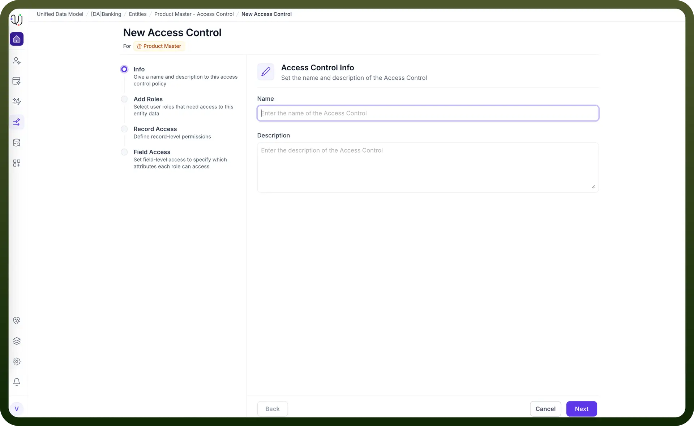

6. **Identity:** Identity settings control how each record is presented (e.g., using branch name as the display title). Composite identities (like combining branch name and ID) are supported, making it easier to recognize records across the platform

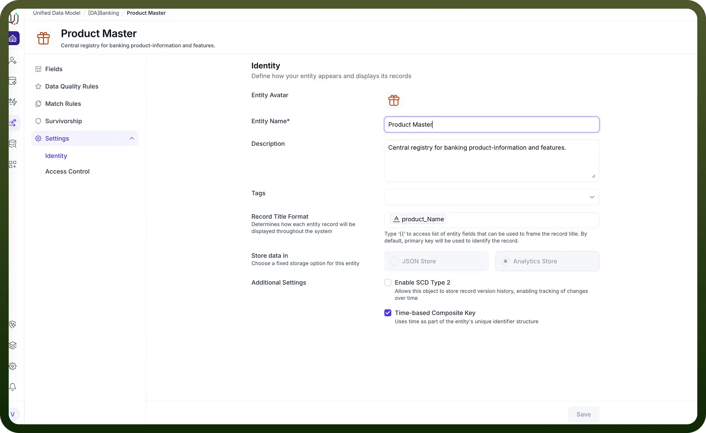

7. **Relationships:**  Entities are rarely isolated; they’re linked via relationships (one-to-one, one-to-many, many-to-many). For example, a Customer has Accounts, and a Branch services Customers. Relationships are configured by joining fields across entities, and visualized in ER diagrams and ontology graphs.

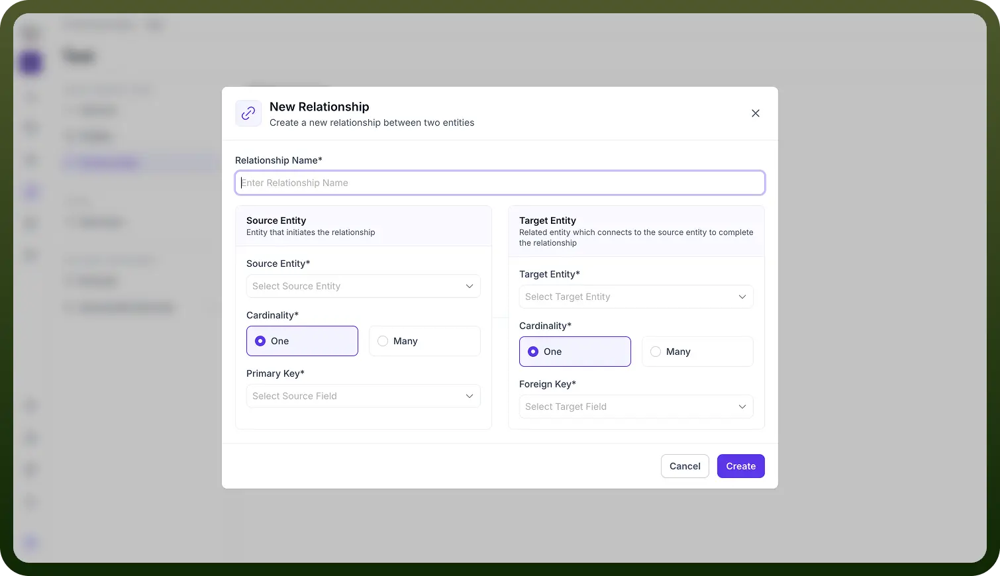

8. **Data Sync:**  Data sync is about moving data from sources (like Salesforce, Oracle) into your UDM model. You can use ETL pipelines or automations to map, transform, and load data. Automations can be scheduled, and data flows are monitored for quality throughout the sync process.

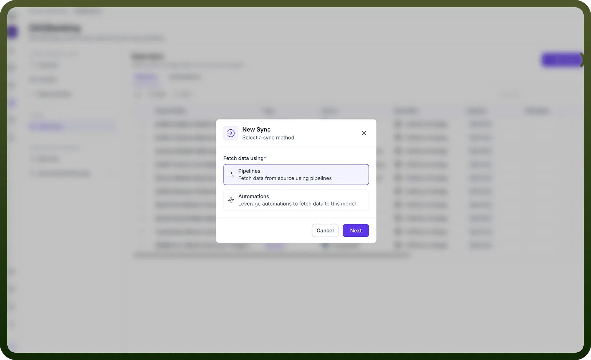

9. **Golden Records:** After passing through quality, match, and survivorship stages, records are merged into a single ‘golden’ record—the most accurate and complete version, stored in the golden repository. This provides a single source of truth for each entity.

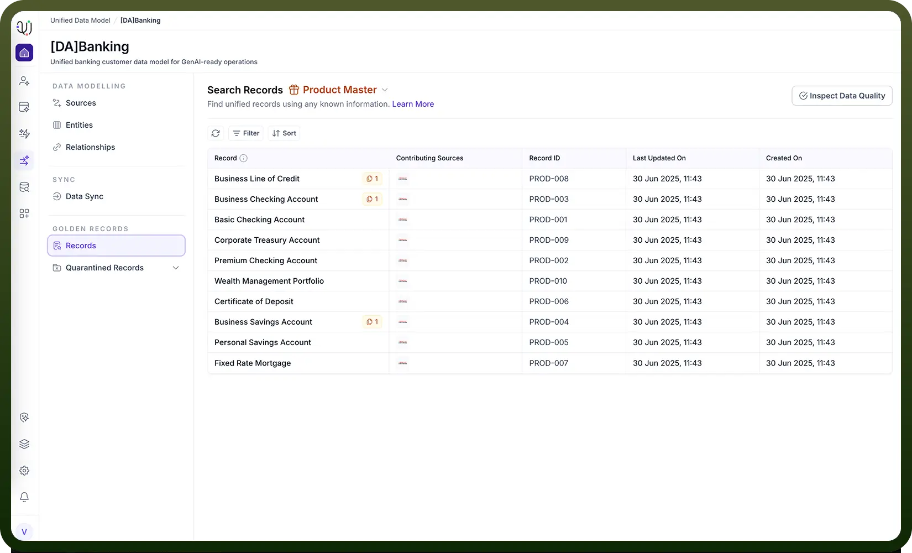

10. **Quarantined Records:**  Records that fail quality or match rules (e.g., potential duplicates below a confidence threshold) are quarantined for manual review by data stewards. Actions can include merging, rejecting, or editing these records to maintain quality.

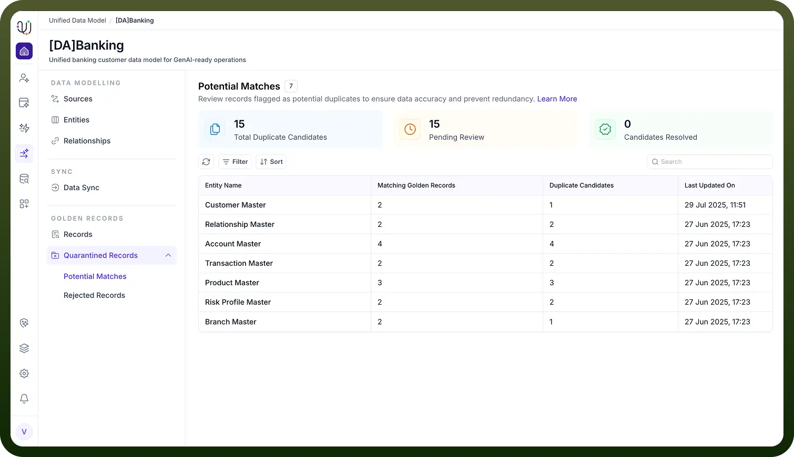

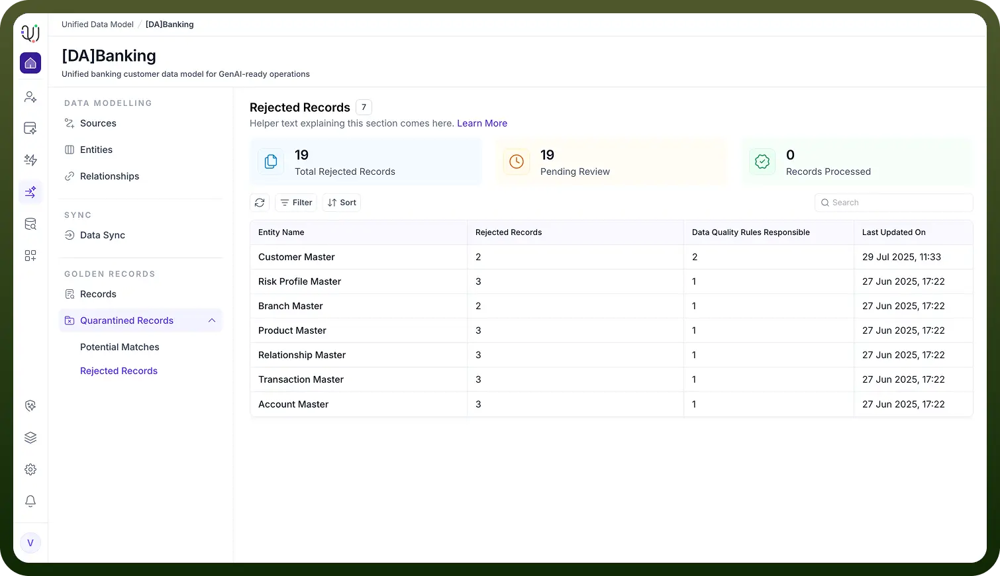
