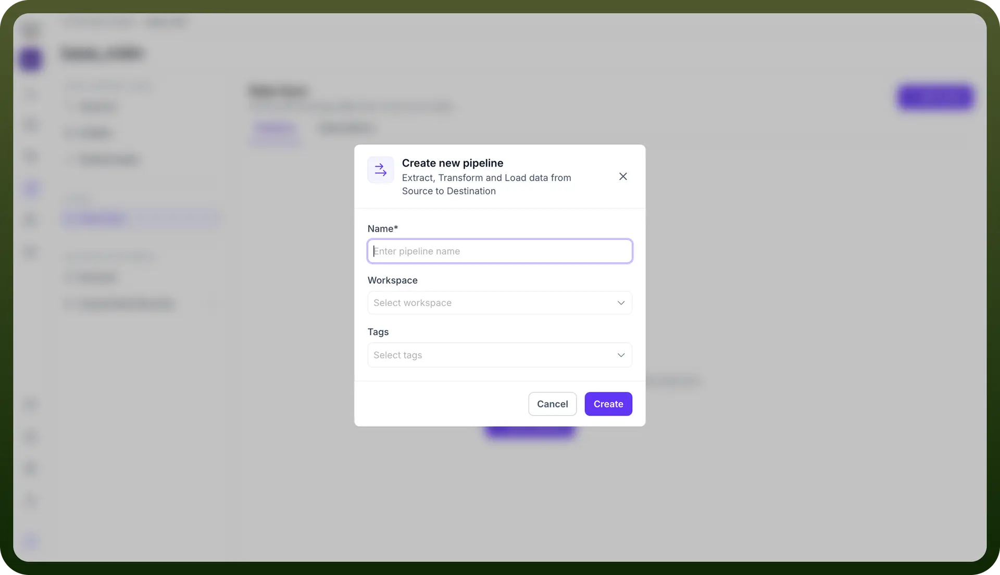

# Pipelines

Source: https://www.unifyapps.com/docs/unify-data/pipelines
Section: data

---

## **Overview**

In the UnifyApps Data Sync architecture, Pipelines serve as the primary mechanism for high-volume, structured data ingestion.

Following the standard ETL (Extract, Transform, Load) pattern, this method allows you to establish a robust data bridge between your external source systems and your internal Entities.

Unlike lightweight automations, Pipelines are optimized for handling bulk data transfer, ensuring that large datasets—such as historical customer records or product catalogs—are efficiently mapped and synchronized into your Unified Data Model.

## **The Configuration Process**

Setting up a pipeline sync involves a streamlined creation flow designed to link your data model to a source quickly:

1. **Initiate Sync** From the Data Sync dashboard, clicking Start Sync opens the selection modal. Select Pipelines to proceed with the ETL-based approach.
2. **Define Pipeline Identity** The Create new pipeline modal appears, requiring specific metadata to govern the data flow:
  - **Name:** A unique, descriptive identifier for the pipeline (e.g., Snowflake_to_Customer_Entity ).
  - **Workspace:** The specific environment where this pipeline will execute, allowing for segregation between development, staging, and production workspaces.
  - **Tags:** Metadata labels used to categorize the pipeline for easier search and management (e.g., finance , migration ).

    

3. **Pipeline Configuration** Choose your source from the supported and selected sources in the initial step then configure your ETL Pipeline as required refer to this link for the same
