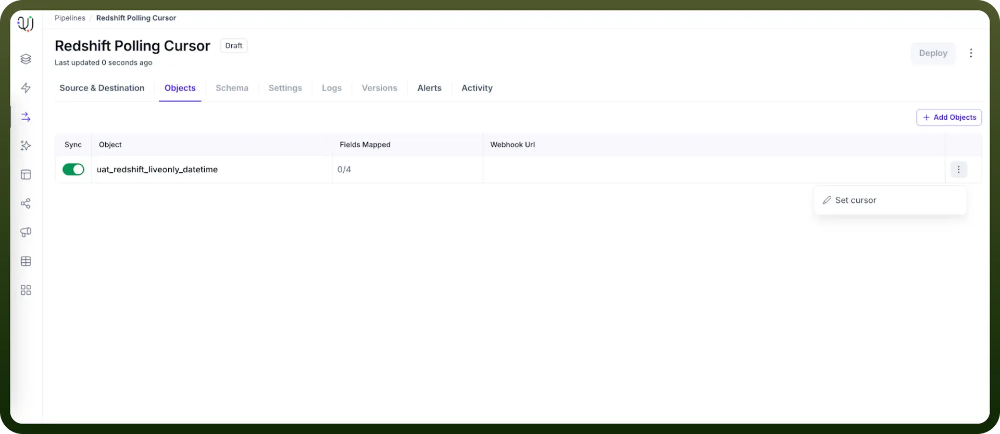
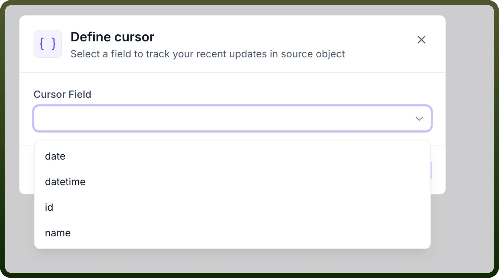

# Polling Cursor

Source: https://www.unifyapps.com/docs/unify-data/polling-cursor
Section: data

---

## Overview

The Polling Cursor is a specialized feature within UnifyApps Data Pipeline that optimizes data synchronization. This feature allows you to designate a specific field (typically a timestamp or sequential ID) as a "cursor" that tracks which records have already been processed, ensuring efficient incremental data loading.

## Supported Sources

Currently, the Polling Cursor feature is supported exclusively for:

- Redshift
- SAPOData

## What is a Polling Cursor?

A Polling Cursor acts as a pointer to a field in your selected object (typically a "last modified" timestamp or auto-incrementing ID), enabling the system to track exactly where it left off during previous data extraction cycles. This helps the pipeline efficiently identify and process only new or updated records.

## How It Works?

1. The system records the maximum value of your cursor field during each extraction cycle
2. In subsequent runs, only records with cursor values greater than the previously recorded maximum are processed
3. New or modified data is automatically captured based on changes to the cursor field
4. This creates an efficient incremental loading pattern that minimizes resource usage

## Example with Sample Data

Let's illustrate how Polling Cursor works with a sample EMPLOYEE_TEST table in Redshift:

**Initial EMPLOYEE_TEST table data:**

| **employee_id** | **first_name** | **last_name** | **department** | **salary** | **last_modified** |
|---|---|---|---|---|---|
| 1001 | John | Smith | Sales | 75000 | 2023-03-15 09:30:00 |
| 1002 | Maria | Garcia | Marketing | 82000 | 2023-03-15 10:15:00 |
| 1003 | Robert | Chen | IT | 95000 | 2023-03-15 11:45:00 |
| 1004 | Sarah | Johnson | HR | 70000 | 2023-03-15 14:20:00 |

In this scenario, you would set the Polling Cursor on the "`last_modified`" field. The system would record the maximum value during the initial sync: 2023-03-15 14:20:00.

**Later, when new data is added:**

| **employee_id** | **first_name** | **last_name** | **department** | **salary** | **last_modified** |
|---|---|---|---|---|---|
| 1001 | John | Smith | Sales | 75000 | 2023-03-15 09:30:00 |
| 1002 | Maria | Garcia | Marketing | 82000 | 2023-03-15 10:15:00 |
| 1003 | Robert | Chen | IT | 95000 | 2023-03-15 11:45:00 |
| 1004 | Sarah | Johnson | HR | 70000 | 2023-03-15 14:20:00 |
| 1005 | David | Kim | Finance | 88000 | 2023-03-16 09:10:00 |
| 1006 | Priya | Patel | IT | 92000 | 2023-03-16 10:30:00 |

In the next sync, the pipeline would only process records with "last_modified" values greater than 2023-03-15 14:20:00, which means only the records for employees David Kim and Priya Patel would be processed. The system would then update the maximum cursor value to 2023-03-16 10:30:00.

**When existing records are updated:**

If employee Robert Chen gets a salary update:

| **employee_id** | **first_name** | **last_name** | **department** | **salary** | **last_modified** |
|---|---|---|---|---|---|
| 1001 | John | Smith | Sales | 75000 | 2023-03-15 09:30:00 |
| 1002 | Maria | Garcia | Marketing | 82000 | 2023-03-15 10:15:00 |
| 1003 | Robert | Chen | IT | 98000 | 2023-03-17 11:20:00 |
| 1004 | Sarah | Johnson | HR | 70000 | 2023-03-15 14:20:00 |
| 1005 | David | Kim | Finance | 88000 | 2023-03-16 09:10:00 |
| 1006 | Priya | Patel | IT | 92000 | 2023-03-16 10:30:00 |

In the next sync, only Robert Chen's updated record would be processed since its "last_modified" value (2023-03-17 11:20:00) is greater than the previously recorded maximum cursor value (2023-03-16 10:30:00).

## Setting Up a Polling Cursor

To configure a Polling Cursor in your UnifyApps Data Pipeline:

1. Navigate to the Objects tab during pipeline creation
2. Add your desired object.
3. After adding the object, click on the three-dot menu (⋮) to the right of the object row
4. Select "`Set cursor`" from the dropdown menu
5. Choose an appropriate field from the object to serve as your cursor (in our example, "last_modified")
6. Save your configuration

## Key Benefits

- **Efficiency**: Processes only new or changed records rather than the entire dataset
- **Reduced Load**: Minimizes unnecessary data transfer and processing overhead
- **Real-time Updates**: Enables near real-time data synchronization as changes occur
- **Resource Optimization**: Conserves computing resources by focusing only on relevant data
- **Scalability**: Allows handling of large datasets with minimal performance impact

## Limitations and Considerations

- The chosen cursor field must have consistently increasing values (timestamps or sequential IDs)
- Records must not be backdated with older values in the cursor field
- Updates that don't modify the cursor field won't be detected.
