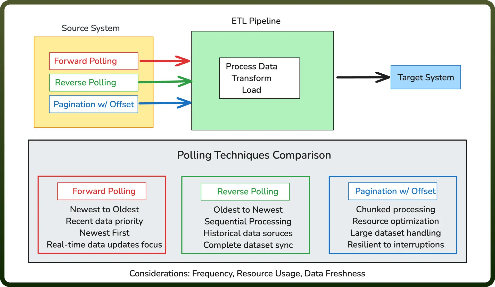

# Polling Techniques

Source: https://www.unifyapps.com/docs/unify-data/polling-techniques
Section: data

---

## Overview of Polling in ETL Systems

Polling is a foundational data extraction strategy in modern ETL (Extract, Transform, Load) platforms. This approach involves systematically querying source systems at defined intervals to identify and retrieve new or modified data. Effective polling mechanisms enable efficient data synchronization between disparate systems while balancing resource consumption, performance, and data freshness.

In enterprise data integration scenarios, the specific polling technique employed can significantly impact overall system performance, data timeliness, and processing efficiency. Understanding these techniques helps data engineers implement optimal data flow architectures.

## Common Polling Techniques

**Forward Polling** Forward Polling retrieves data in natural chronological order (newest to oldest). The process starts with the newest records and moves sequentially backward through time, handling records in the order they were modified.

**Reverse Polling** Reverse Polling handles data sources that return information in reverse chronological order (oldest first). This approach processes records starting from the oldest entries, requiring the system to traverse through the entire list to find latest data.

**Polling with Pagination and Offsets** Polling with Pagination and Offsets breaks large datasets into manageable chunks using pagination parameters. This technique allows for efficient processing through controlled batch sizes, preventing memory issues and enabling resilient data extraction.

## Implementation Considerations

Regardless of the specific technique employed, several factors influence polling implementation:

- **Polling Frequency**: How often the source system is queried, balancing data freshness against system load
- **Cursor Management**: How the system tracks which records have been processed
- **Error Handling**: Mechanisms for addressing connectivity issues or partial failures
- **Rate Limiting**: Strategies for respecting API quotas and system resource constraints
- **Incremental Extraction Logic**: Rules for identifying only new or changed records

## Emerging Trends

While traditional polling remains prevalent, several emerging patterns are gaining traction:

- **Change Data Capture (CDC)**: Direct monitoring of database transaction logs
- **Event-Driven Extraction**: Replacing polling with webhook notifications
- **Hybrid Approaches**: Combining polling with real-time notification systems
- **Intelligent Polling**: Dynamically adjusting frequency based on data change patterns

By selecting the appropriate polling technique and implementation approach, data engineers can build resilient, efficient pipelines that deliver timely and accurate data across the enterprise while respecting system constraints and business priorities.
