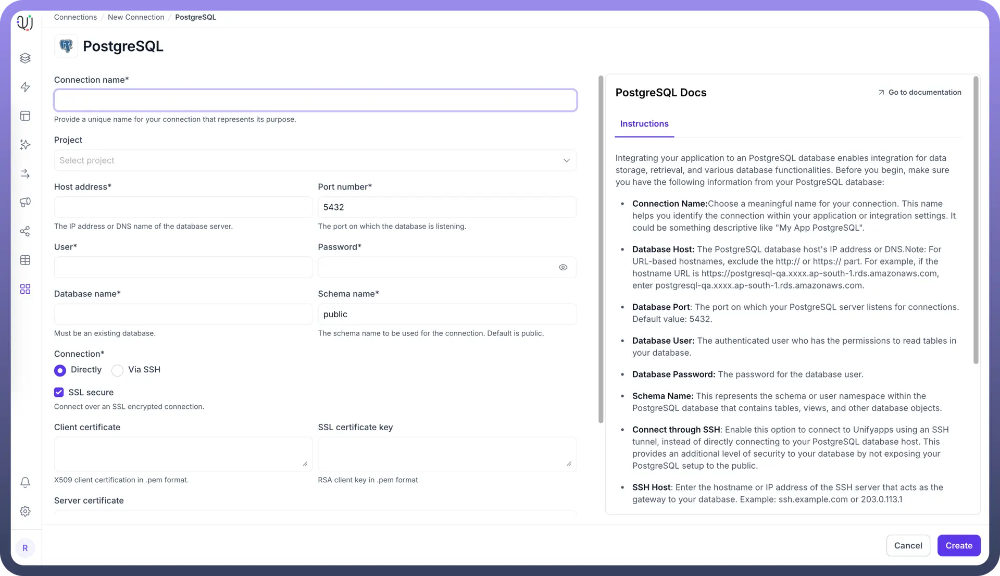
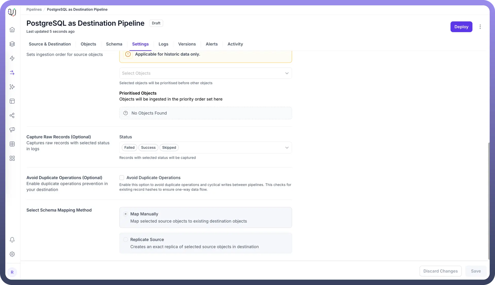

# PostgreSQL as Destination

Source: https://www.unifyapps.com/docs/unify-data/postgresql-as-destination
Section: data

---

UnifyApps enables seamless integration with PostgreSQL databases as a destination for your data pipelines. This article covers essential configuration elements and best practices for loading data into PostgreSQL destinations.

## Overview

PostgreSQL is a powerful, open-source relational database management system known for its reliability, feature robustness, and performance. UnifyApps provides native connectivity to load data into PostgreSQL environments efficiently and securely, making it an ideal destination for data warehousing, analytics, and operational data storage.

## Prerequisites

Before configuring PostgreSQL as your destination, ensure you have:

1. **PostgreSQL Server Instance**: Ensure you have access to an active PostgreSQL server instance.
2. **Connection Information**: Obtain the necessary connection details including server name/IP address, port number (default is 5432), and database name.
3. **Authentication Credentials**: Securely store the PostgreSQL authentication username and password.
4. **PostgreSQL User Privileges**: For PostgreSQL as a Destination, the user needs additional privileges to create and modify tables. The recommended privileges include `CREATE`, `INSERT`, `UPDATE`, and `DELETE` on the target schema. A database administrator can grant these privileges using:`GRANT CREATE ON DATABASE <database_name> TO <username>; GRANT USAGE, CREATE ON SCHEMA <schema_name> TO <username>; GRANT INSERT, UPDATE, DELETE ON ALL TABLES IN SCHEMA <schema_name> TO <username>;`
5. **Schema Information**: Specify the target schema where you want to load the data (default is often 'public').

## Connection Configuration

| **Parameter** | **Description** | **Example** |
|---|---|---|
| `Connection Name` | Descriptive identifier for your connection | "Data Warehouse PostgreSQL" |
| `Host Address` | PostgreSQL server hostname or IP address | "postgres-dw.example.com" |
| `Port Number` | Database listener port | 5432 (default) |
| `User` | Database username with write permissions | "unify_writer" |
| `Password` | Authentication credentials | "********" |
| `Database Name` | Name of the target PostgreSQL database | "data_warehouse" |
| `Schema Name` | Schema for loading destination tables | "staging" |
| `Connection Type` | Method of connecting to the database | Direct, SSH Tunnel, or SSL |

To set up a PostgreSQL destination, navigate to the Connections section, click New Connection, and select PostgreSQL as destination. Complete the form with your target database environment details.

## Authentication Options

### Basic Authentication

1. `Connection Name`**:** Choose a meaningful name for your connection. This name helps you identify the connection within your application or integration settings. It could be something descriptive like "Production Data Warehouse PostgreSQL".
2. `Database Host`**:** The PostgreSQL database host's IP address or DNS. Note: For URL-based hostnames, exclude the http:// or https:// part. For example, if the hostname URL is https://postgresql-prod.xxxx.ap-south-1.rds.amazonaws.com, enter postgresql-prod.xxxx.ap-south-1.rds.amazonaws.com.
3. `Database Port`**:** The port on which your PostgreSQL server listens for connections. Default value: 5432.
4. `Database User`**:** The authenticated user who has the permissions to create, insert, update, and delete tables in your database.
5. `Database Password`**:** The password for the database user.
6. `Schema Name`**:** This represents the schema or user namespace within the PostgreSQL database where tables will be created and data loaded.

## Schema Mapping

PostgreSQL as Destination in UnifyApps supports **Manual Mapping only**. This means you have full control over how source data fields map to destination table columns, allowing you to:

- Define custom column names and data types
- Apply data transformations during the mapping process
- Handle complex data structures with precision
- Ensure data quality through explicit mapping definitions

During pipeline configuration, you'll manually specify the mapping between source fields and PostgreSQL destination columns, providing flexibility for data transformation requirements.

## Supported Data Types

UnifyApps handles these PostgreSQL data types for destination loading, ensuring proper conversion from your source systems:

| **Category** | **Supported Types** |
|---|---|
| `Numeric` | bigint, integer, smallint, numeric[(p,s)], real, double precision, serial, bigserial, smallserial, money |
| `Text` | character[(n)], character varying[(n)], text |
| `Boolean` | boolean |
| `Date/Time` | date, time[(p)] [without time zone], time[(p)] with time zone, timestamp[(p)] [without time zone], timestamp[(p)] with time zone |
| `Network` | cidr, inet |
| `Binary` | bytea |
| `JSON` | json, jsonb |

## Common Business Scenarios

**Data Warehousing**

- Load transformed data from multiple sources into PostgreSQL
- Build dimensional models for business intelligence
- Enable complex analytical queries with optimized schema design

**Operational Data Store**

- Consolidate operational data from various systems
- Provide unified view for real-time operational reporting
- Support business processes with integrated data access

**Customer Data Platform**

- Centralize customer data from multiple touchpoints
- Enable 360-degree customer view for analytics
- Support personalization and segmentation initiatives

## Best Practices

**Performance Optimization**

- Use appropriate batch sizes for bulk loading (recommended: 1000-5000 records)
- Create indexes on frequently queried columns after data loading
- Implement table partitioning for large datasets
- Schedule heavy loads during off-peak hours

**Security Considerations**

- Create dedicated database users with minimal required permissions
- Use SSL encryption for sensitive data transmission
- Implement SSH tunneling for databases in protected networks
- Regularly rotate database credentials

**Data Quality Management**

- Implement data validation rules in your pipeline configuration
- Monitor for constraint violations and data type mismatches
- Set up alerts for pipeline failures or data quality issues
- Use staging tables for complex transformations before final loading

**Schema Management**

- Plan schema design to accommodate future data growth
- Use appropriate data types to optimize storage and performance
- Implement proper primary keys and foreign key constraints
- Document schema changes and maintain version control

## Monitoring and Maintenance

**Performance Monitoring**

- Track data loading times and throughput rates
- Monitor database resource utilization during pipeline execution
- Set up alerts for long-running or failed operations
- Regular performance tuning based on query patterns

**Database Maintenance**

- Schedule regular VACUUM and ANALYZE operations
- Monitor database size and plan for storage growth
- Implement backup and recovery procedures
- Maintain connection pool settings for optimal performance

PostgreSQL's robust architecture and reliability make it an excellent destination for data pipelines. By following these configuration guidelines and best practices, you can ensure reliable, efficient data loading that meets your business needs for performance, scalability, and data integrity.

Integrating our data pipeline with your PostgreSQL database facilitates seamless data ingestion from multiple sources, enhancing your data storage and query capabilities for analytics, reporting, and operational use cases.
