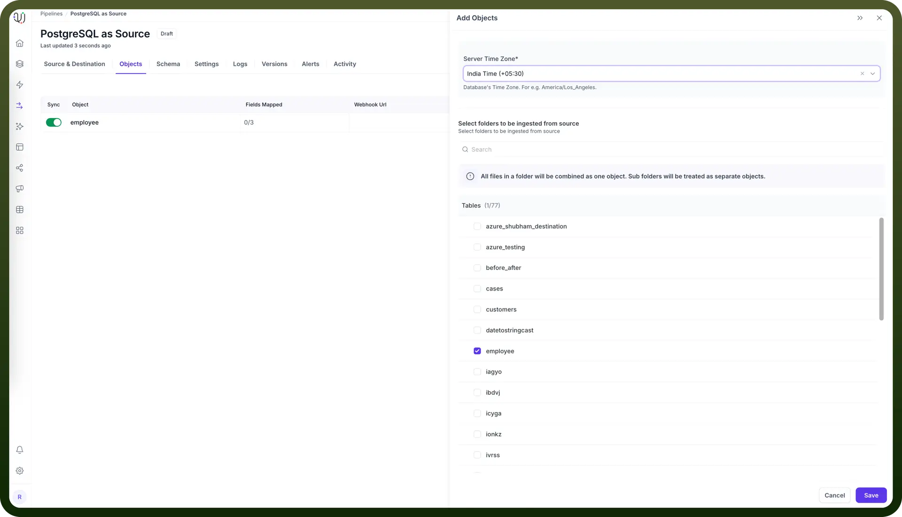
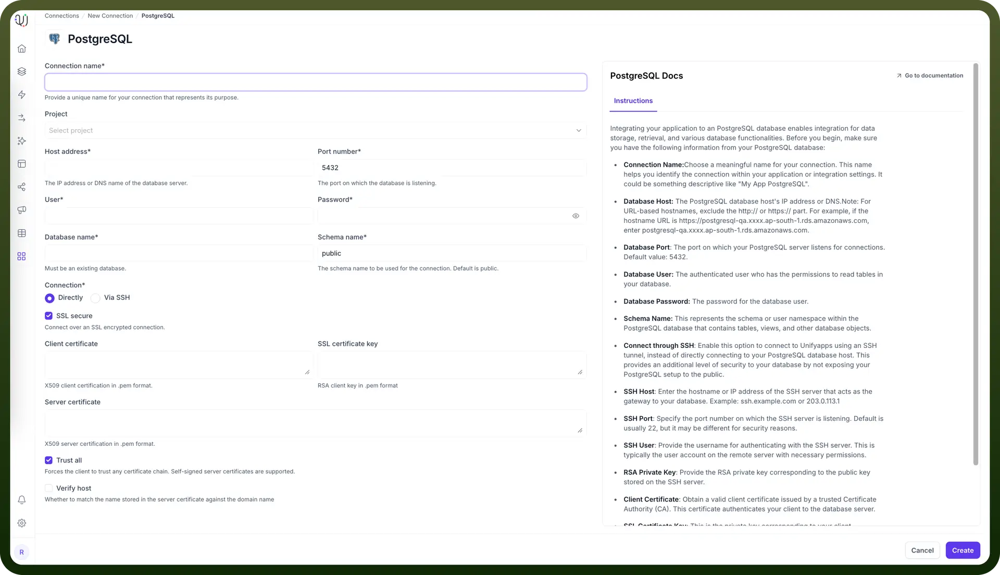

# PostgreSQL as Source

Source: https://www.unifyapps.com/docs/unify-data/postgresql-as-source
Section: data

---

UnifyApps enables seamless integration with PostgreSQL databases as a source for your data pipelines. This article covers essential configuration elements and best practices for connecting to PostgreSQL sources.

## Overview

PostgreSQL is a powerful, open-source relational database management system known for its reliability, feature robustness, and performance. UnifyApps provides native connectivity to extract data from PostgreSQL environments efficiently and securely.

## Connection Configuration

| **Parameter** | **Description** | **Example** |
|---|---|---|
| `Connection Name` | Descriptive identifier for your connection | "Production PostgreSQL" |
| `Host Address` | PostgreSQL server hostname or IP address | "postgres-db.example.com" |
| `Port Number` | Database listener port | 5432 (default) |
| `User` | Database username with read permissions | "unify_reader" |
| `Password` | Authentication credentials | "********" |
| `Database Name` | Name of the PostgreSQL database | "analytics" |
| `Schema Name` | Schema containing your source tables | "public" |
| `Connection Type` | Method of connecting to the database | Direct, SSH Tunnel, or SSL |

To set up a PostgreSQL source, navigate to the `Connections` section, click `New Connection`, and select `PostgreSQL`. Complete the form with your database environment details.

## Server Timezone Configuration

When adding objects from a PostgreSQL source, you'll need to specify the database server's timezone:

1. In the `Add Objects` dialog, find the `Server Time Zone` setting
2. Select your PostgreSQL server's timezone (e.g., "India Time (+05:30)")

This ensures all timestamp data is normalized to UTC during processing, maintaining consistency across your data pipeline.

## Ingestion Modes

| **Mode** | **Description** | **Business Use Case** |
|---|---|---|
| `Historical and Live` | Loads all existing data and captures ongoing changes | Customer data migration with continuous synchronization |
| `Live Only` | Captures only new data from deployment forward | Real-time analytics dashboard without historical data |
| `Historical Only` | One-time load of all existing data | Regulatory reporting or point-in-time analysis |

Choose the mode that aligns with your business requirements during pipeline configuration.

## Supported Data Types

UnifyApps handles these data types automatically, ensuring proper conversion between PostgreSQL and your destination system.

| **Category** | **Supported Types** |
|---|---|
| `Numeric` | bigint, integer, smallint, numeric[(p,s)], real, double precision, serial, bigserial, smallserial, money |
| `Text` | character[(n)], character varying[(n)], text |
| `Boolean` | boolean |
| `Date/Time` | date, time[(p)] [without time zone], time[(p)] with time zone, timestamp[(p)] [without time zone], timestamp[(p)] with time zone |
| `Network` | cidr, inet |
| `Binary` | bytea |
| `JSON` | json |

## CRUD Operations Tracking

All database operations from PostgreSQL sources are identified and logged as unique actions:

| **Operation** | **Description** | **Business Value** |
|---|---|---|
| `Create` | New record insertions | Monitor new product additions or user registrations |
| `Read` | Data retrieval actions | Track data access patterns and query frequency |
| `Update` | Record modifications | Audit changes to customer information or pricing data |
| `Delete` | Record removals | Ensure proper record deletion for compliance purposes |

This comprehensive logging supports audit requirements and troubleshooting efforts.

## Configuring CDC for PostgreSQL

To enable Change Data Capture (CDC) for real-time data synchronization:

1. **Enable Logical Replication** `ALTER SYSTEM SET wal_level = logical;`Restart PostgreSQL for changes to take effect.
2. **Create Publication for UnifyApps** `CREATE PUBLICATION unifyapps_publication FOR ALL TABLES;`Or for specific tables:`CREATE PUBLICATION unifyapps_publication FOR TABLE table1, table2;`
3. **Verify Configuration** `SHOW wal_level; SELECT * FROM pg_publication WHERE pubname = 'unifyapps_publication';`

## Required Database Permissions

| **Permission** | **Purpose** |
|---|---|
| `CONNECT ON DATABASE` | Required to connect to the database |
| `USAGE ON SCHEMA` | Required to access schema objects |
| `SELECT ON TABLES` | Needed for reading source data |
| `REPLICATION (for CDC)` | Required for change data capture features |

## Common Business Scenarios

1. **Analytics and Business Intelligence**
  - Connect to PostgreSQL OLTP databases to extract transactional data
  - Transform and load into analytics platforms
  - Enable real-time dashboards with continuous synchronization
2. **Customer Data Platform**
  - Centralize customer data from PostgreSQL application databases
  - Consolidate user profiles across multiple systems
  - Enable segment creation and audience targeting
3. **Operational Data Store**
  - Replicate operational data to support business processes
  - Provide data for reporting without impacting production systems
  - Enable cross-functional data access with appropriate security

## Best Practices

| **Category** | **Recommendations** |
|---|---|
| `Performance` | • Use primary keys on source tables to optimize replication, Apply appropriate filtering for large tables, Schedule bulk historical loads during off-hours |
| `Security` | • Create dedicated read-only database users, Consider using SSL encryption for sensitive data, Implement SSH tunneling for databases in protected networks |
| `CDC Setup` | • Ensure tables have primary keys for efficient change tracking, Monitor WAL generation to prevent disk space issues, Test CDC setup thoroughly before production use |
| `Data Quality` | • Monitor replication lag for time-sensitive applications, Implement data validation checks in your pipeline, Set up alerts for pipeline failures or anomalies |

PostgreSQL's robust architecture makes it an excellent source for data pipelines. By following these configuration guidelines and best practices, you can ensure reliable, efficient data extraction that meets your business needs for timeliness, completeness, and security.

By properly configuring your PostgreSQL source connections, you can leverage your existing data infrastructure to feed analytics, reporting, and operational systems with minimal impact on your production databases.
