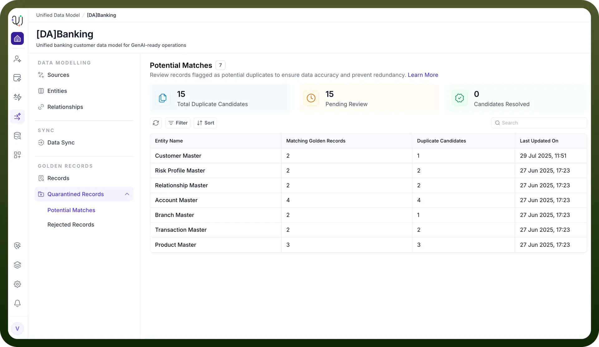
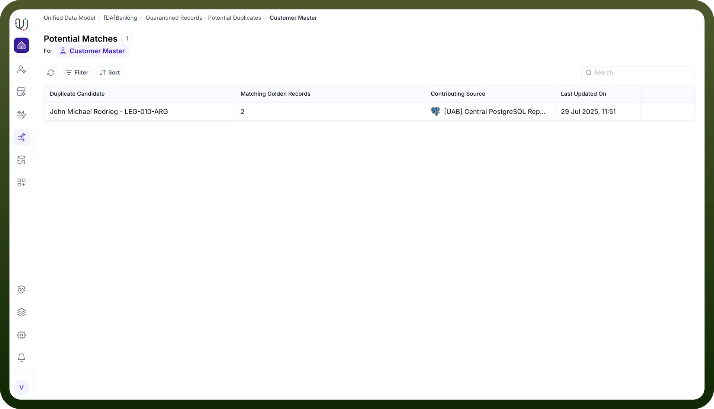
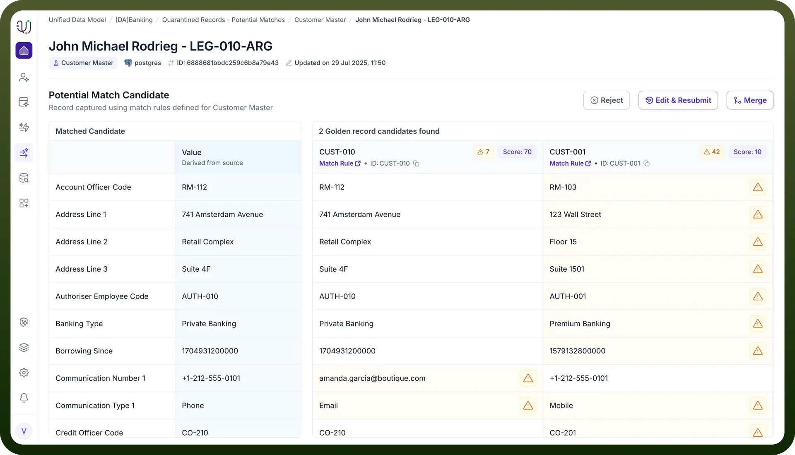

# Potential Matches

Source: https://www.unifyapps.com/docs/unify-data/potential-matches
Section: data

---

Potential Matches are records that the UnifyApps platform identifies as possible duplicates during the data ingestion, transformation, and deduplication process. These records are not immediately merged or rejected; instead, they are flagged for further review because the system detects a significant similarity with existing records but cannot confidently determine if they are true duplicates.

## **How Are Potential Matches Identified?**

**Match Rules Configuration:**

The system uses configurable match rules to compare incoming records with those already present in the golden repository.

Match rules can be:

**Exact Match:** e.g., identical branch codes, customer IDs, or other unique identifiers.

**Fuzzy Match:** e.g., similar names, addresses, or other fields where minor differences may exist (like typos or formatting).

**Scoring and Thresholds:**

Each potential match is assigned a similarity score (typically between 0 and 1).

Administrators can set thresholds to determine what constitutes a potential match versus an automatic match or a non-match.

For example, a score above 0.8 might be considered a strong match (auto-merge), while a score between 0.5 and 0.8 is flagged as a potential match for manual review .

## **What Happens When a Potential Match Is Detected?**

**Merge Policy Application:**

The system applies a merge policy to decide the next step for the flagged record:

**Automatic Merge**: If the match score is very high, the system can automatically merge the records using survivorship rules (e.g., most recent data wins).

**Flag for Review**: If the match score is moderate, the record is flagged as a potential match and placed in a review queue for manual intervention.

**Relevance-Based Action**: The system can use a relevance-based approach, where different actions are taken based on the similarity score (e.g., auto-merge for >80%, quarantine for 50–80%, reject for <50%) .

**Quarantine Section:**

Potential matches are often moved to a quarantine or review section within the MDM module.

## **Manual Review and Actions**

**Review Process:**

Data stewards examine the details of both the incoming and existing records.

They can compare field values, review the similarity score, and check the audit trail for each record.

**Available Actions:**

**Merge:** Combine the records, selecting which field values to retain (using survivorship strategies such as recency, max/min value, or custom rules).

**Reject**: Decide that the records are not duplicates and keep them separate.

## **Audit and Traceability:**

All actions taken on potential matches are logged for compliance, traceability, and future audits .

**Why Are Potential Matches Important?**

**Data Quality**: Prevents duplicate or conflicting records from polluting the golden repository.

**Human Oversight:** Allows ambiguous cases to be resolved by knowledgeable data stewards rather than relying solely on automated rules.

**Compliance:** Ensures that all decisions regarding data merging or rejection are auditable and traceable.

**Flexibility**: Supports complex business scenarios where not all duplicates can be detected or resolved automatically.
