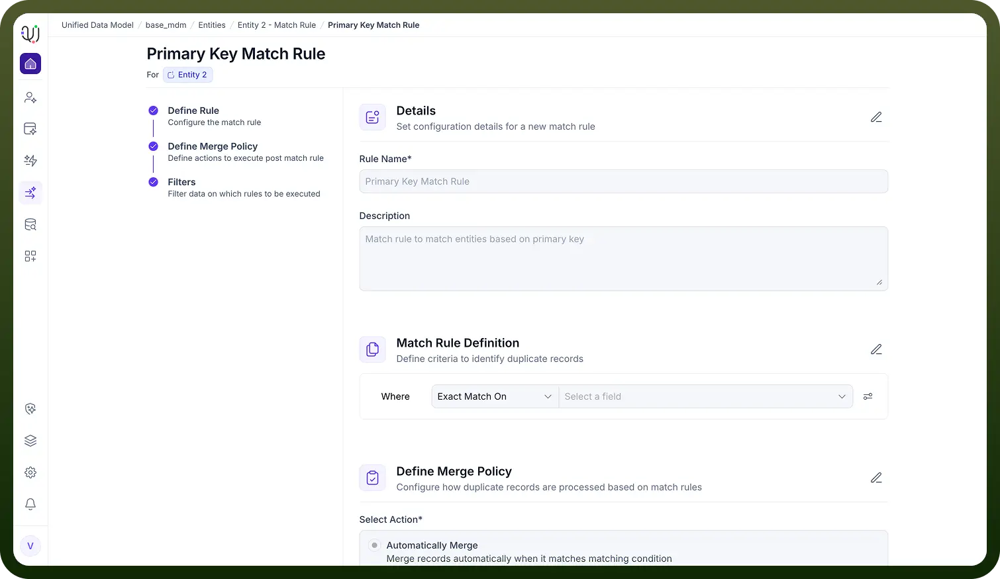

# Primary Key Match Rule

Source: https://www.unifyapps.com/docs/unify-data/primary-key-match-rule
Section: data

---

**Overview**

The Primary Key Match Rule is the most fundamental and high-confidence deduplication strategy within UnifyApps.

Unlike fuzzy matching rules that rely on probability (e.g., similar names or addresses), this rule identifies duplicate records based on exact matches of unique identifiers (such as ID, Email, or SSN).

Because primary keys are definitive sources of truth, this rule is typically configured to trigger automatic actions, serving as the first line of defense in maintaining a clean Golden Record. 
 The **Primary Key Match Rule** in UnifyApps is automatically generated when an Entity includes a field marked as the **Primary Key (PK)**. Because primary keys guarantee record uniqueness, this rule is fully preconfigured, cannot be modified, and always remains active for that Entity.

### **How the Primary Key Match Rule Works**

#### **1. Rule Criteria (Fixed)**

- The rule is automatically bound to the field designated as the Primary Key.
- Matching logic is permanently set to **Exact Match**, ensuring any records sharing the same PK value are treated as duplicates.
- No additional fields or conditions can be configured.

#### **2. Merge Policy (Fixed)**

- The merge action is always **Automatically Merge**.
- When two records have the same Primary Key value, they are immediately consolidated without manual review.
- This policy is fixed and cannot be changed because PK conflicts are definitive duplicates.

#### **3. Filters (Not Applicable)**

- Filters **cannot be configured** for the Primary Key Match Rule.
- The rule operates globally across all records in the Entity.
- It also **cannot be disabled** for any Entity containing a Primary Key.
