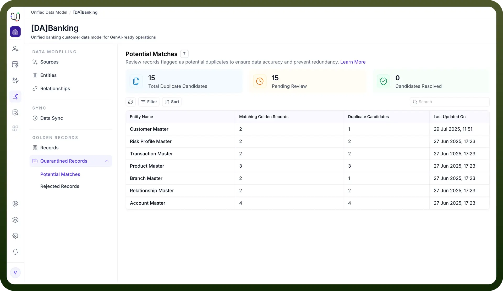
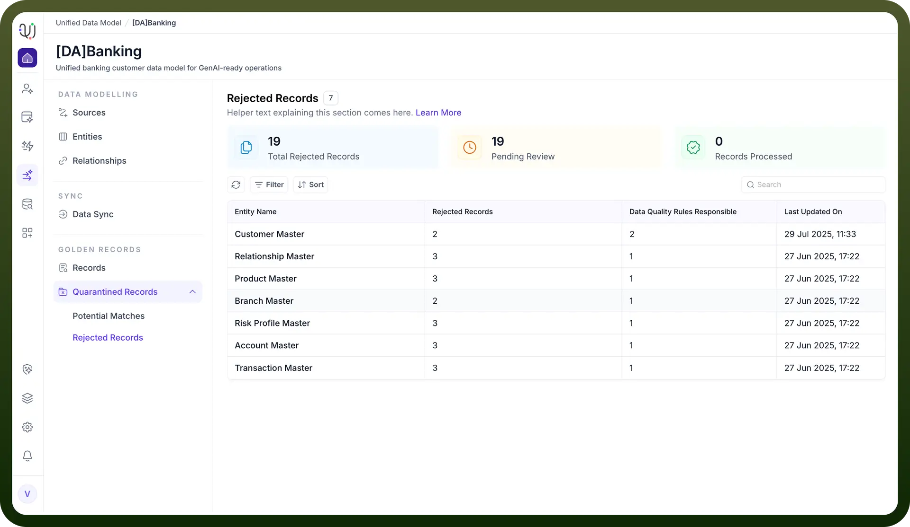

# Quarantined Records

Source: https://www.unifyapps.com/docs/unify-data/quarantined-records
Section: data

---

## **What Are Quarantined Records?**

Quarantined records are data entries that have been flagged during MDM processes because they do not meet certain data quality rules, validation checks, or are identified as potential duplicates.Instead of being loaded into the main (golden) repository, these records are isolated in a special quarantine section for further review and action by data stewards or administrators. 
 There are two types of Quarantined records: 
 1. Potential matches 
 2. Rejected records

## **Potential matches**

Potential matches are records that the system identifies as possible duplicates during the data ingestion and deduplication process. This is based on configured match rules, which can be exact (e.g., same code) or fuzzy (e.g., similar names).

How They Are Handled:

When a record is flagged as a potential match, the system can:

1. Automatically merge it with an existing record (if confidence is high),
2. Flag it for manual review (so a data steward can decide whether to merge or reject),

Or use a relevance-based action (e.g., merge if similarity score is above a threshold, otherwise quarantine for review).

## **Rejected records**

Rejected records are those that fail to meet data quality rules or validation checks during MDM process. This could be due to missing required fields, invalid data formats, or business rule violations.

How They Are Handled:

Such records are not loaded into the main data repository. They are typically moved to a quarantine or rejected records section for further review. Data stewards can review the reason for rejection, correct the data, and attempt to reprocess the record if needed.

## **How Are Records Quarantined?**

During data ingestion or transformation, the system applies a set of data quality rules and match/merge policies.

If a record fails validation (e.g., missing required fields, invalid formats, or business rule violations), it is rejected and moved to quarantine.

Similarly, if the system detects potential duplicates based on match rules, those records are also quarantined for manual review rather than being automatically merged or loaded.

## **Purpose and Benefits:**

**Data Quality Assurance**: Quarantine acts as a safeguard, ensuring only high-quality, validated data enters the main system.

**Error Investigation**: Quarantined records allow data stewards to investigate why a record was rejected—common reasons include missing values, format errors, or failed business logic.

**Duplicate Management**: The quarantine area is also used to manage and resolve potential duplicate records, allowing for manual intervention and decision-making on merges or deletions.

**Audit and Debugging**: The system provides detailed logs and metadata for each quarantined record, including the reason for rejection, event IDs, timestamps, and the failed query, which aids in auditing and debugging data issues.

## **Actions on Quarantined Records:**

Data stewards can review quarantined records, correct errors, and reprocess them for ingestion.

They can also decide to permanently reject, merge, or accept records with warnings, depending on the business context and data governance policies.

## **Visibility and Tracking:**

The UnifyApps platform offers object-level breakdowns and event logs, allowing users to see which records are quarantined, the reasons, and all associated metadata for traceability and compliance.
