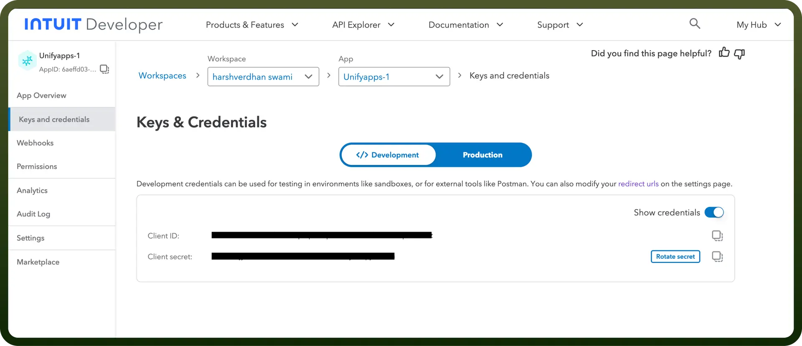
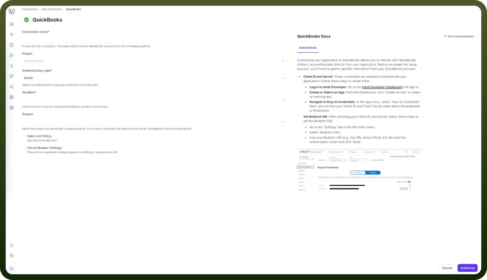

# QuickBooks as Source

Source: https://www.unifyapps.com/docs/unify-data/quickbooks-as-source
Section: data

---

## Overview

QuickBooks Online is a cloud-based accounting software widely used by small and medium businesses for financial management, invoicing, and bookkeeping. UnifyApps provides native connectivity to extract data from QuickBooks environments efficiently and securely, supporting historical data synchronization and continuous change tracking.

## Connection Configuration

| **Parameter** | **Description** | **Example** |
|---|---|---|
| `Connection Name`* | Descriptive identifier for your connection | "Production QuickBooks Accounting" |
| `Authentication Method`* | OAuth authentication type | OAuth or OAuth with Client Credentials |
| `Client ID`* | Application identifier from Intuit Developer | "your_client_id" |
| `Client Secret`* | Application secret from Intuit Developer | "your_client_secret" |
| `Redirect URI`* | OAuth callback URL | "https://your-app.com/callback" |
| `Company ID`* | QuickBooks company identifier | "123456789012345" |

To set up a QuickBooks source, navigate to the Connections section, click New Connection, and select QuickBooks. Complete the form with your QuickBooks application credentials.

## Prerequisites and Setup

Before configuring QuickBooks as your source, ensure you have:

**Client ID and Secret Setup**

These credentials are needed to authenticate your application. Follow these steps to obtain them:

1. **Log in to Intuit Developer**
  - Go to the **Intuit Developer Dashboard** and sign in
  - Access your developer account at [https://developer.intuit.com](https://developer.intuit.com)
2. **Create or Select an App**
  - From the Dashboard, click '`Create an App`' or select an existing app
  - Choose the appropriate app type for your integration needs
3. **Navigate to Keys & Credentials**
  - In the app menu, select '`Keys & Credentials`'
  - Here, you will find your Client ID and Client Secret under either Development or Production environment
  - Use Development credentials for testing and Production credentials for live environments

**Set Redirect URI**

After obtaining your Client ID and Secret, follow these steps to set the Redirect URI:

1. **Access App Settings**
  - Go to the '`Settings`' tab in the left-hand menu of your Intuit Developer app
2. **Configure Redirect URIs**
  - Select '`Redirect URIs`'
  - Add your Redirect URI (e.g., the URL where OAuth 2.0 will send the authorization code)
  - Click 'Save' to apply the changes
3. **Verify Configuration**
  - Ensure the redirect URI matches exactly with your application's callback endpoint
  - Multiple redirect URIs can be configured for different environments

    

## Authentication Methods

### OAuth Authentication

Standard OAuth 2.0 flow for QuickBooks Online integration:

1. **Authorization Request**: User is redirected to QuickBooks for authorization
2. **Authorization Grant**: User grants permission to access their QuickBooks data
3. **Access Token**: Application receives access token for API calls
4. **API Access**: Use access token to make authenticated requests to QuickBooks API

Required fields:

- `Client ID`: Your application's client identifier
- `Client Secret`: Your application's client secret
- `Redirect URI`: The callback URL for OAuth flow

### OAuth with Client Credentials

Enhanced OAuth flow with additional client credential validation:

1. **Client Authentication**: Application authenticates using client credentials
2. **Authorization Flow**: Standard OAuth authorization process
3. **Token Exchange**: Secure token exchange with client credential verification
4. **API Access**: Authenticated access to QuickBooks data

Required fields:

- `Client ID`: Your application's client identifier
- `Client Secret`: Your application's client secret
- `Redirect URI`: The callback URL for OAuth flow
- `Additional Credentials`: Enhanced client credential parameters

## Ingestion Mode

QuickBooks as Source supports **Historical and Live** ingestion mode only:

| **Mode** | **Description** | **Business Use Case** |
|---|---|---|
| `Historical and Live` | Loads all existing data and captures ongoing changes | Complete accounting data migration with continuous synchronization |

This mode ensures comprehensive data extraction from your QuickBooks account, including all historical records and real-time updates to maintain data consistency across your pipeline.

## Data Synchronization Capabilities

**Supported Operations**

| **Operation** | **Support** | **Description** |
|---|---|---|
| `Historical Sync` | ✓ Supported | Complete extraction of existing QuickBooks data |
| `Insert Records` | ✓ Supported | New record creation is detected and synchronized |
| `Update Records` | ✓ Supported | Record modifications are captured and processed |
| `Delete Records` | ✗ Not Supported | Delete operations cannot be detected |

### Important Notes on Updates

- **Updates as Inserts**: When records are updated in QuickBooks, these changes are detected and ingested as new insert events in the destination
- **Change Tracking**: The system tracks modifications but presents them as new records rather than update operations
- **Data Integrity**: This approach ensures all changes are captured while maintaining data lineage

## Supported QuickBooks Objects

UnifyApps can extract data from the following QuickBooks Online objects:

| **Object** | **Description** |
|---|---|
| `Account` | Chart of accounts and account details |
| `Bill` | Vendor bills and payables |
| `BillPayment` | Payments made against vendor bills |
| `Budget` | Budget information and allocations |
| `Class` | Class tracking for transactions |
| `Customer` | Customer information and profiles |
| `Department` | Department classifications |
| `Employee` | Employee records and details |
| `Estimate` | Sales estimates and quotes |
| `Invoice` | Customer invoices and receivables |
| `Item` | Products and services catalog |
| `JournalEntry` | Manual journal entries |
| `PurchaseOrder` | Purchase orders to vendors |
| `Transaction` | General transaction records |
| `Vendor` | Vendor information and profiles |

These objects cover comprehensive financial and operational data from your QuickBooks Online account, enabling complete business intelligence and reporting capabilities.

## Common Business Scenarios

**Financial Data Integration**

- Extract chart of accounts, transactions, and financial statements
- Synchronize customer and vendor information
- Integrate invoice and payment data for comprehensive financial reporting

**Business Intelligence Analytics**

- Consolidate QuickBooks data with other business systems
- Create unified dashboards combining financial and operational metrics
- Enable cross-functional reporting and analysis

**Compliance and Auditing**

- Maintain historical records of all financial transactions
- Track changes to accounting data for audit trails
- Ensure regulatory compliance with comprehensive data retention

**Customer Relationship Management**

- Synchronize customer data between QuickBooks and CRM systems
- Integrate invoice and payment history for customer insights
- Enable unified customer service with complete financial context

## Best Practices

**Authentication Security**

- Store OAuth credentials securely using encrypted storage
- Implement proper token refresh mechanisms for long-running integrations
- Use HTTPS for all OAuth redirect URIs and API communications
- Regularly rotate client secrets as per security policies

**Data Extraction Optimization**

- Schedule data synchronization during off-peak business hours
- Implement incremental sync strategies to minimize API calls
- Use appropriate filtering to extract only necessary data
- Monitor API rate limits and implement proper throttling

**Error Handling and Monitoring**

- Implement comprehensive error handling for OAuth token expiration
- Set up monitoring for failed synchronization attempts
- Create alerts for quota exceeded or permission denied errors
- Maintain logs for troubleshooting and audit purposes

**Data Quality Management**

- Validate data integrity during extraction process
- Implement data cleansing rules for inconsistent records
- Handle duplicate records appropriately in destination systems
- Monitor for missing or incomplete data synchronization

## Troubleshooting Common Issues

**Authentication Problems**

- **Invalid Client Credentials**: Verify Client ID and Secret from Intuit Developer Dashboard
- **Redirect URI Mismatch**: Ensure redirect URI in app settings matches configuration
- **Token Expiration**: Implement proper token refresh logic for expired access tokens

**Data Synchronization Issues**

- **Missing Records**: Check API permissions and data access scope
- **Incomplete Updates**: Verify that update detection is working as insert events
- **Rate Limiting**: Implement proper API call throttling and retry mechanisms

**Connection Failures**

- **Network Connectivity**: Verify internet connection and firewall settings
- **API Endpoint Changes**: Monitor QuickBooks API documentation for endpoint updates
- **Service Outages**: Check QuickBooks Online service status during connection issues

QuickBooks Online's comprehensive API and OAuth security make it an excellent source for financial data pipelines. By following these configuration guidelines and best practices, you can ensure reliable, secure data extraction that meets your business requirements for financial reporting, analytics, and compliance.

The Historical and Live synchronization mode ensures complete data coverage while the OAuth authentication provides secure, authorized access to sensitive financial information.
