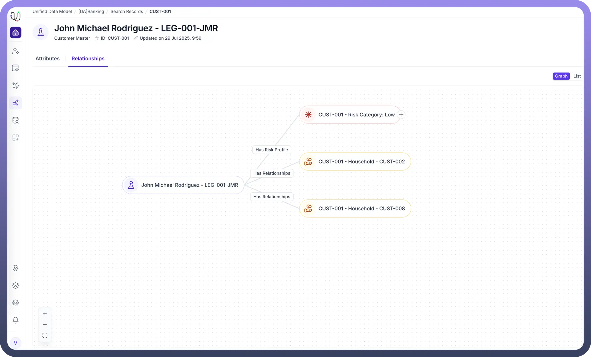

# Record Level Ontology

Source: https://www.unifyapps.com/docs/unify-data/record-level-ontology
Section: data

---

## **Overview**

While "Entity Relationships" define the abstract rules of your data model (e.g., "A Customer can have Orders"), the Record Level Ontology represents the concrete reality of your data (e.g., "Customer CUST509 actually has Order #123").

In UnifyApps, this is where the schema comes to life. By navigating the Record Level Ontology, you move from designing data structures to exploring the actual, interconnected knowledge graph of your enterprise.

## **Accessing the Ontology**

The entry point for exploring specific data instances is located within Golden Records Section in the primary navigation sidebar.

## **Exploring a Node (Record Instance)**

When you select a specific record (e.g., CUST509) within this view, you are inspecting a single "Node" in your enterprise ontology.

The detailed view provides the specific ontological properties of that node:

- **Identity:** The unique key that distinguishes this node from all others in the graph (e.g., CUST509 ).
- **Property Values:** The specific data points associated with this node, such as names, dates ( 21 Nov 2025 ), or status codes ( 23000 ).
- **Provenance:** The lineage links connecting this node to its origins, indicated by the **Contributing Source** icons (e.g., MySQL).

## **The Knowledge Graph Context**

Viewing data through the AI Ontology lens transforms a flat list of records into a dynamic network.

By establishing relationships between entities (e.g., linking Entity 1 to Entity 2 via keys), the Record Level Ontology allows the system to understand context.

This enables advanced capabilities such as Graph Search and AI Agents, which rely on traversing these specific record-to-record connections to answer complex business questions (e.g., "Find all tickets related to the customer CUST509").

