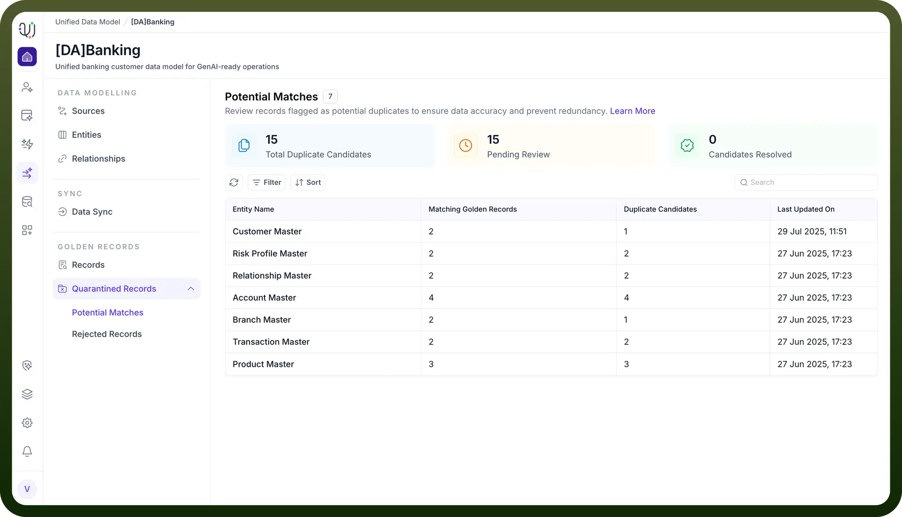
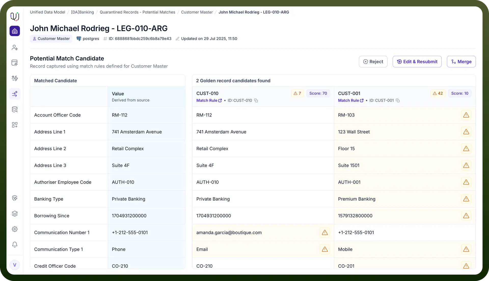

# Reject Record

Source: https://www.unifyapps.com/docs/unify-data/reject-record
Section: data

---

When the Unified Data Model (UDM) identifies a record as a potential match (i.e., a possible duplicate of an existing record), it is flagged for manual review. During this review, a data steward or administrator may determine that the flagged record is not actually a duplicate or should not be merged with the existing record. In such cases, the steward can choose to **reject** the record from the potential matches list.

## **Why Would You Reject a Record in Potential Matches?**

**False Positives:** Sometimes, the match rules (exact or fuzzy) may flag records as potential duplicates even though they represent different real-world entities (e.g., two customers with similar names but different addresses).

**Business Context**: The user may have additional business knowledge or context that the automated system does not, allowing them to make a more informed decision.

**Data Integrity:** Rejecting incorrect matches ensures that unique records are not mistakenly merged, preserving the accuracy and integrity of the golden repository .

## **The Process of Rejecting a Record in Potential Matches**

**Manual Review:**

The user reviews the details of both the incoming (potential match) and existing records.

**Decision to Reject:**

If the user determines that the records are not true duplicates, they select the Reject action for the flagged record.
