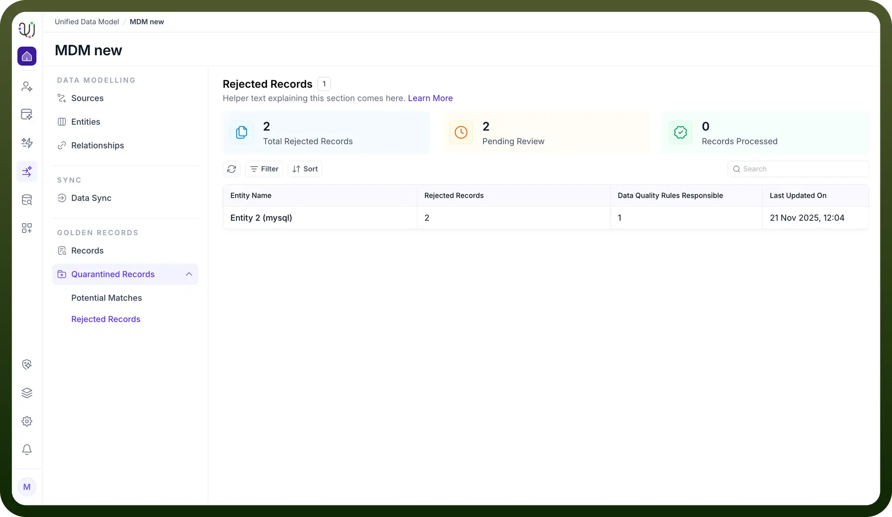
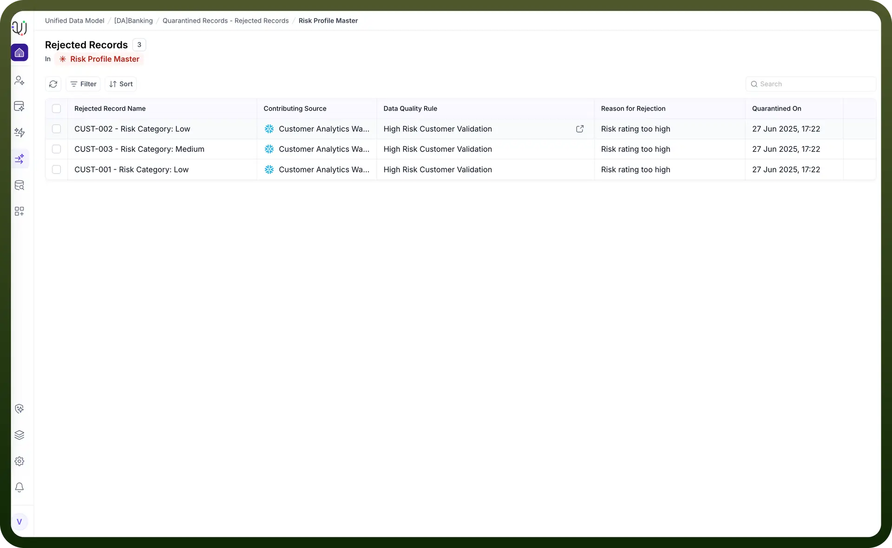

# Rejected records

Source: https://www.unifyapps.com/docs/unify-data/rejected-records
Section: data

---

## **Overview**

In a robust Master Data Management (MDM) system, maintaining high data quality is paramount.

Rejected Records function as a safety valve for your data pipeline. When incoming data fails to meet the strict criteria defined in your Data Quality Rules, the system intercepts these records and places them into quarantine.

Instead of polluting your Golden Records with invalid data or being silently discarded, these records are stored here for audit, review, and potential remediation.

## **The Dashboard View**

Accessing the Rejected Records tab provides a high-level operational summary of your data health.

The dashboard is designed to help Data Stewards prioritize their workload through key metrics:

- **Total Rejected Records:** The cumulative count of records currently in quarantine.
- **Pending Review:** The number of records requiring active attention.
- **Records Processed:** A counter of records that have been successfully resolved (either fixed or deleted).

Beneath the metrics, the system groups rejections by **Entity**. This allows you to identify if a specific data domain (e.g., "Entity 2 (mysql)") is experiencing systemic quality issues.

## **Detailed Inspection & Resolution**

Clicking on a specific Entity in the list opens the detailed record view. Here, you can investigate the root cause of the rejection and take action.

## **Diagnostic Information:**

Selecting a specific rejected record opens a sidebar containing critical context:

- **Basic Details:** Identifies the **Contributing Source** (e.g., mysql ) and explicitly names the **Data Quality Rule** that was violated (e.g., Customer id validation rule ).
- **Record Attributes:** Displays the raw data payload (e.g., branch_code , customer_name , is_active ) exactly as it was received. This allows you to verify the error visually (e.g., noticing a missing amount or incorrect format).

## **Remediation Actions:**

Once reviewed, you can resolve the quarantine status using the action buttons at the bottom of the panel:

- **Delete:** Permanently remove the bad record if it is deemed irrelevant or junk data.
- **Re-Submit:** Send the record back into the processing pipeline. This is typically used after the underlying issue has been corrected or if the rule logic has been adjusted.
