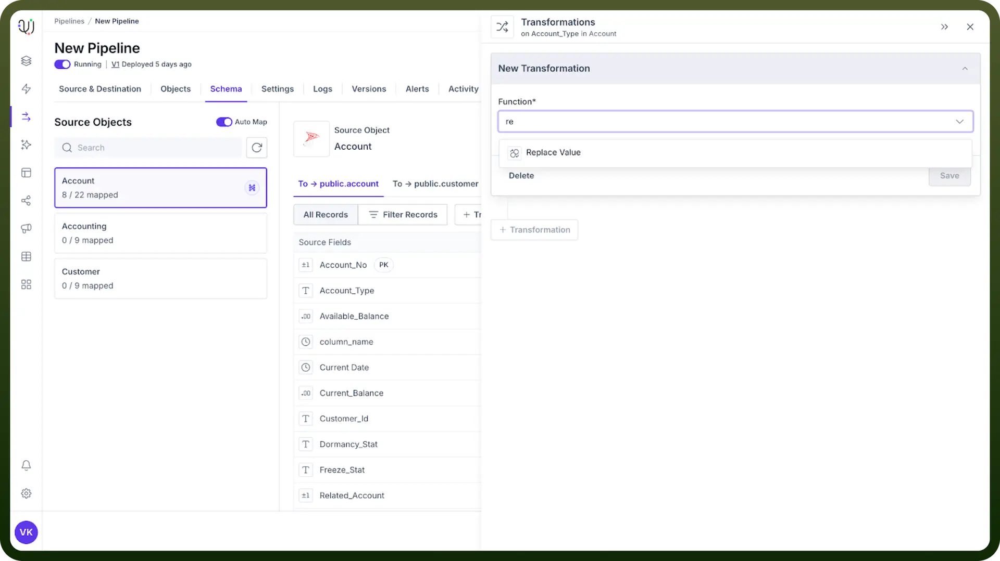
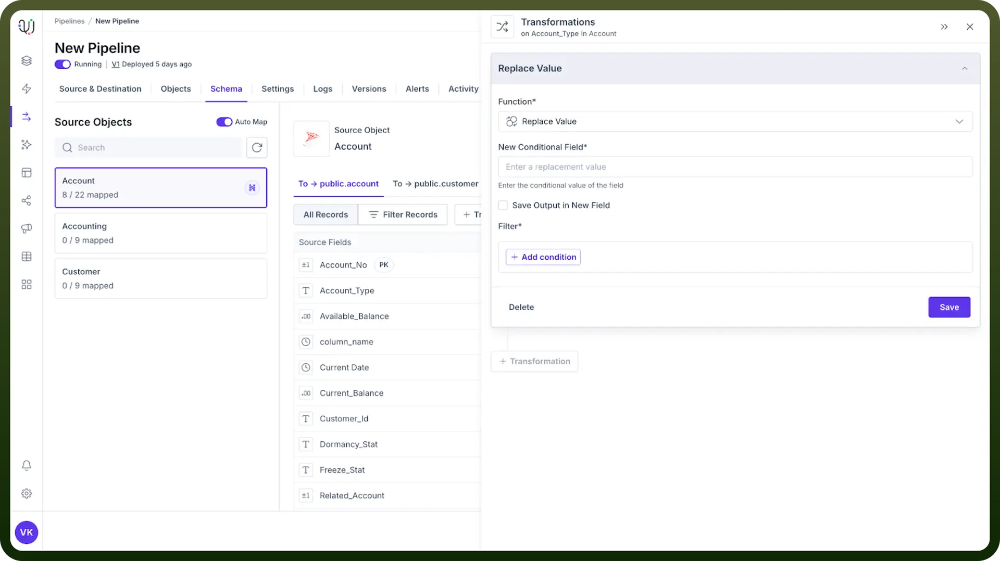
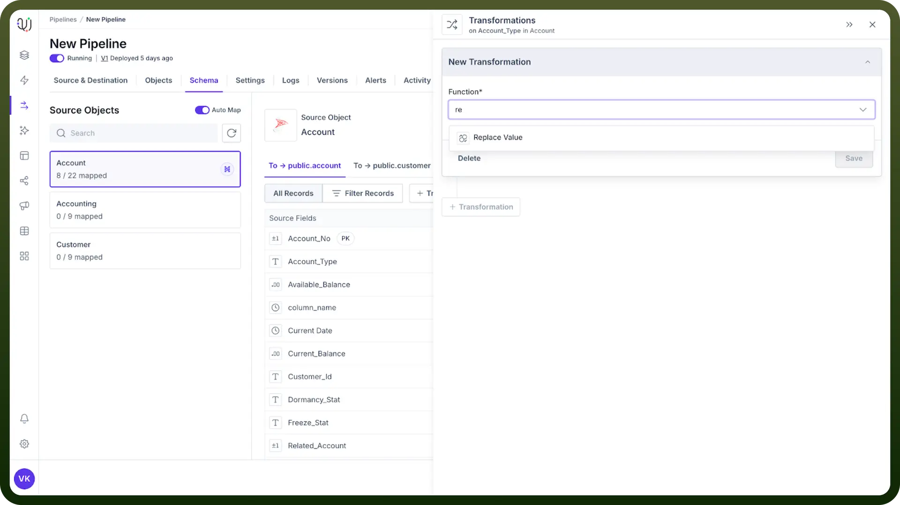

# Replace value

Source: https://www.unifyapps.com/docs/unify-data/replace-value
Section: data

---

The Replace Value transformation is a powerful tool that swaps out field values based on conditions you define. This simple yet versatile function helps clean data, standardize formats, and handle missing values—solving common data quality challenges with minimal effort.

## Why Use Replace Value?

- **Clean Messy Data** - Replace incorrect values with accurate alternatives
- **Handle Missing Data** - Substitute null values with meaningful defaults
- **Standardize Information** - Create consistency across varied data sources
- **Fix Known Errors** - Automatically correct recurring issues in your datasets

> **Note:** Before implementing replacements, analyze a sample of your data to identify patterns of inconsistency or quality issues that need addressing.

## How to Apply Replace Value?

1. Navigate to your field and click "`+New Transformation`"
2. Select "`Replace Value`" from the transformation menu
3. Configure your replacement options (see below)
4. Preview the results with test data
5. Click "`Save`" to apply the transformation

  

## Configuration Options

- **Conditional Value** The new value that will appear in your data when conditions are met. **Examples:**
  - Replace missing product categories with "Uncategorized"
  - Standardize ***"***N/A", "n.a.", and "not applicable" to "Not Applicable"
  - Convert old product codes to new format (e.g., "PRD-001" to "PRODUCT-001")
- **Filtering Criterion** The condition that triggers the replacement to occur. **Common Criteria:**

  

  - **IS NOT PRESENT** - Target empty or missing values
  - **EQUALS** - Replace exact matches only
  - **CONTAINS** - Replace values that include specific text
  - **MATCHES PATTERN** - Replace values matching a regex pattern

## Real-World Examples

| **Scenario** | **Filter Criterion** | **Conditional Value** | **Result** |
|---|---|---|---|
| Fix incomplete phone numbers | LENGTH LESS THAN 10 | "Invalid Phone" | Identify problematic contact data |
| Standardize state codes | EQUALS "California" | "CA" | Normalize location data |
| Handle missing names | IS NULL | "Anonymous User" | Ensure no blank name fields |
| Correct typos | EQUALS "Neew York" | "New York" | Fix common data entry errors |

## Best Practices

- **Start Simple** - Begin with the most common issues before addressing edge cases.
- **Document Changes** - Keep a record of all replacements for future reference.
- **Test Thoroughly** - Verify replacements work correctly with diverse test data.
- **Consider Impacts** - Ensure downstream processes can handle your standardized values.
