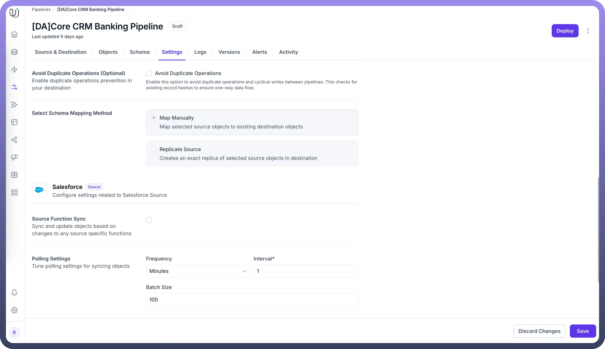

# Salesforce as Source Polling Tuning

Source: https://www.unifyapps.com/docs/unify-data/salesforce-as-source-polling-tuning
Section: data

---

Polling settings in UnifyApps data pipelines allow you to optimize how frequently your pipeline checks for and processes new or changed data from Salesforce. Proper tuning of these settings ensures efficient data synchronization while minimizing API usage and system resource consumption.

## Understanding Salesforce Source Polling

When configuring Salesforce as a source in your data pipeline, the polling mechanism:

- Periodically queries Salesforce for new or modified records
- Processes these records in controlled batches
- Synchronizes the data to your destination system
- Manages API usage within Salesforce's rate limits

## Configuring Polling Settings for Salesforce

To configure polling settings for your Salesforce source:

1. Navigate to the `Settings` tab in your pipeline
2. Locate the `Polling Settings` section
3. Configure the following parameters:
  - **Frequency**: The time unit for polling intervals (seconds, minutes, hours)
  - **Interval**: The number of units between polling operations
  - **Batch Size**: The maximum number of records processed in each polling cycle

## How Polling Settings Impact Performance: Example

Let's examine how different polling configurations affect a Salesforce to PostgreSQL pipeline:

**Example: Banking CRM Data Synchronization**

**Scenario: Customer Data Integration**

- Salesforce contains customer account information
- Updates occur throughout the business day at varying rates
- Pipeline synchronizes data to a banking database

**Configuration Options and Impacts:**

**High-Frequency Polling (1 minute interval, 100 batch size)**

**Benefits:**

- Near real-time data availability
- Smaller, more frequent batches reduce processing spikes

**Considerations:**

- Higher Salesforce API consumption
- More frequent connection overhead
- May exceed API limits during peak times

**Medium-Frequency Polling (15 minute interval, 250 batch size)**

**Benefits:**

- Balanced approach for most use cases
- Reasonable data latency
- Moderate API consumption

**Considerations:**

- Some data synchronization delay acceptable
- Good for steady, moderate update volumes

**Low-Frequency Polling (60 minute interval, 1000 batch size)**

**Benefits:**

- Minimizes API consumption
- Fewer connection cycles
- Efficiently processes larger batches

**Considerations:**

- Longer data latency
- Potential for larger processing spikes
- Better for systems with infrequent updates

## Optimizing Salesforce Polling Settings

1. **Analyze Update Patterns** Monitor when and how frequently your Salesforce data changes: **Morning**: High update volume during business start**Midday**: Moderate, steady updates**Evening**: Low update activityAdjust polling frequency accordingly, with more frequent polling during high-activity periods.
2. **Consider Salesforce API Limits** Salesforce enforces API request limits per 24-hour period:
  - Enterprise Edition: 1,000,000 calls
  - Professional Edition: 25,000 calls
  - Developer Edition: 15,000 calls Calculate your polling impact:**(24 hours / polling interval) × number of objects synced = daily API calls**
3. **Balance Latency vs. Resource Usage** For different data types: **Customer contact updates:** Higher frequency (5-15 minutes)**Transaction records:** Medium frequency (15-30 minutes)**Reference data:** Lower frequency (hourly or daily)
4. **Batch Size Considerations** Optimize batch size based on: **Small batches (50-100):** For complex records with many fields**Medium batches (100-500):** For standard business objects**Large batches (500-1000+):** For simple, high-volume data

## Best Practices for Salesforce Polling

1. **Stagger Multiple Pipeline Schedules** If running multiple Salesforce pipelines, offset their polling schedules to avoid simultaneous API load: Pipeline 1: Start at :00 minutesPipeline 2: Start at :15 minutesPipeline 3: Start at :30 minutesPipeline 4: Start at :45 minutes
2. **Implement Off-Hours Processing for Large Volumes** Schedule intensive historical loads during off-peak hours: Initial data loads: Weekends or overnightLarge batch synchronizations: Early morning (2-5 AM)
3. **Monitor and Adjust** Regularly review pipeline performance metrics:
  - Processing time per batch
  - API usage trends
  - Error rates at different polling frequencies
  - Data latency requirements vs. actual performance

By carefully tuning your polling settings for Salesforce source pipelines, you can achieve an optimal balance between data freshness, system performance, and API efficiency. Regular monitoring and adjustment of these settings ensure your data integration remains robust as your business needs evolve.
