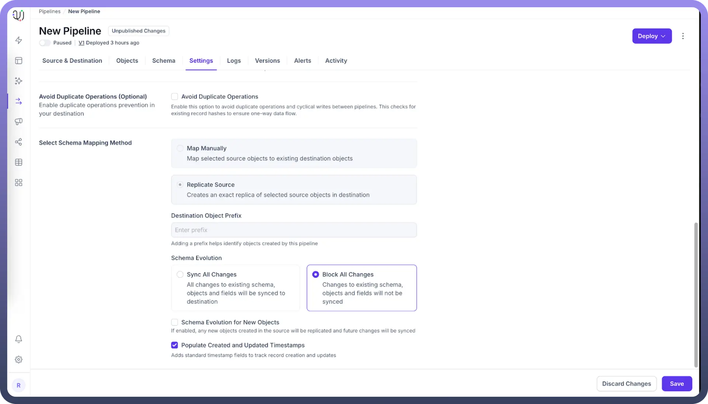

# SCD Type 2 Settings

Source: https://www.unifyapps.com/docs/unify-data/scd-type-2-settings
Section: data

---

SCD (Slowly Changing Dimension) Type 2 is a methodology for tracking historical changes in data over time. Within UnifyApps data pipelines, special timestamp fields can be configured to automatically track when records are created and modified during source replication operations.

## Timestamp Fields for Historical Data Tracking

When configured, UnifyApps implements these timestamp fields:

- `__unifyapps__created_at`: Records when a row was first created
- `__unifyapps__modified_at`: Tracks when a row was last modified

## How These Fields Work: Example

Let's walk through a simple example to demonstrate how these timestamp fields operate during data replication:

**Example: Product Catalog Source Table**

**Source Table (PRODUCTS) - Initial Data**

| **PRODUCT_ID** | **NAME** | **PRICE** |
|---|---|---|
| 101 | Laptop | 999 |
| 102 | Smartphone | 699 |
| 103 | Headphones | 199 |

**Day 1: Initial Data Load**

When the pipeline runs the first time with SCD Type 2 timestamps enabled:

**Destination Table (After Initial Load)**

| **PRODUCT_ID** | **NAME** | **PRICE** | **__unifyapps__created_at** | **__unifyapps__modified_at** |
|---|---|---|---|---|
| 101 | Laptop | 999 | 2025-05-01T10:00:00Z | 2025-05-01T10:00:00Z |
| 102 | Smartphone | 699 | 2025-05-01T10:00:00Z | 2025-05-01T10:00:00Z |
| 103 | Headphones | 199 | 2025-05-01T10:00:00Z | 2025-05-01T10:00:00Z |

Notice that both timestamp fields are initially set to the same value - the time of the initial data load.

**Day 3: Price Updates and New Product**

Two days later, prices are updated and a new product is added to the source:

**Source Table (PRODUCTS) - Updated Data**

| **PRODUCT_ID** | **NAME** | **PRICE** |
|---|---|---|
| 101 | Laptop | 899 |
| 102 | Smartphone | 699 |
| 103 | Headphones | 149 |
| 104 | Tablet | 499 |

**Day 3: After Pipeline Execution**

When the pipeline runs again:

**Destination Table (After Update)**

| **PRODUCT_ID** | **NAME** | **PRICE** | **__unifyapps__created_at** | **__unifyapps__modified_at** |
|---|---|---|---|---|
| 101 | Laptop | 899 | 2025-05-01T10:00:00Z | 2025-05-03T15:00:00Z |
| 102 | Smartphone | 699 | 2025-05-01T10:00:00Z | 2025-05-01T10:00:00Z |
| 103 | Headphones | 149 | 2025-05-01T10:00:00Z | 2025-05-03T15:00:00Z |
| 104 | Tablet | 499 | 2025-05-03T15:00:00Z | 2025-05-03T15:00:00Z |

Notice the key differences:

- Products 101 (Laptop) and 103 (Headphones): The __unifyapps__modified_at timestamp is updated to reflect the price changes, but the __unifyapps__created_at remains the same
- Product 102 (Smartphone): Both timestamps remain unchanged as there were no updates
- Product 104 (Tablet): Both timestamp fields are set to the current time since this is a new record

**Day 5: Product Name Change**

Two days later, a product name is changed:

**Source Table (PRODUCTS) - Latest Data**

| **PRODUCT_ID** | **NAME** | **PRICE** |
|---|---|---|
| 101 | Laptop Pro | 899 |
| 102 | Smartphone | 699 |
| 103 | Headphones | 149 |
| 104 | Tablet | 499 |

**Destination Table (After Final Update)**

| **PRODUCT_ID** | **NAME** | **PRICE** | **__unifyapps__created_at** | **__unifyapps__modified_at** |
|---|---|---|---|---|
| 101 | Laptop Pro | 899 | 2025-05-01T10:00:00Z | 2025-05-05T11:30:00Z |
| 102 | Smartphone | 699 | 2025-05-01T10:00:00Z | 2025-05-01T10:00:00Z |
| 103 | Headphones | 149 | 2025-05-01T10:00:00Z | 2025-05-03T15:00:00Z |
| 104 | Tablet | 499 | 2025-05-03T15:00:00Z | 2025-05-03T15:00:00Z |

Note that:

- Product 101 (Laptop Pro): The __unifyapps__modified_at timestamp is updated again to reflect the name change
- All other products: Timestamps remain unchanged as there were no updates

## Practical Use Cases for These Timestamp Fields

- **Identifying Recently Added Products**`SELECT * FROM products_destination WHERE __unifyapps__created_at > '2025-05-02T00:00:00Z';`

**Result:**

| **PRODUCT_ID** | **NAME** | **PRICE** | **__unifyapps__created_at** | **__unifyapps__modified_at** |
|---|---|---|---|---|
| 104 | Tablet | 499 | 2025-05-03T15:00:00Z | 2025-05-03T15:00:00Z |

- **Finding Recently Modified Products**`SELECT * FROM products_destination WHERE __unifyapps__modified_at > '2025-05-04T00:00:00Z';`

**Result:**

| **PRODUCT_ID** | **NAME** | **PRICE** | **__unifyapps__created_at** | **__unifyapps__modified_at** |
|---|---|---|---|---|
| 101 | Laptop Pro | 899 | 2025-05-01T10:00:00Z | 2025-05-05T11:30:00Z |

- **Identifying Unchanged Products Since Initial Load**

```
SELECT * FROM products_destination 
WHERE __unifyapps__created_at = __unifyapps__modified_at;
```

**Result:**

| **PRODUCT_ID** | **NAME** | **PRICE** | **__unifyapps__created_at** | **__unifyapps__modified_at** |
|---|---|---|---|---|
| 102 | Smartphone | 699 | 2025-05-01T10:00:00Z | 2025-05-01T10:00:00Z |
| 104 | Tablet | 499 | 2025-05-03T15:00:00Z | 2025-05-03T15:00:00Z |

## Configuring SCD Type 2 Settings in Pipeline Configuration

To enable these timestamp fields in your UnifyApps data pipeline:

1. Choose Source Replication as your mapping method
2. Go to `Settings` Tab.
3. Tick the **”**`Populate Created and Updated Timestamps`**”** option.
4. Click on `Save` to save your pipeline configuration.



By implementing these timestamp fields, you gain valuable insights into the lifecycle of your data and ensure proper tracking of when records were created and last modified in your data pipelines.
