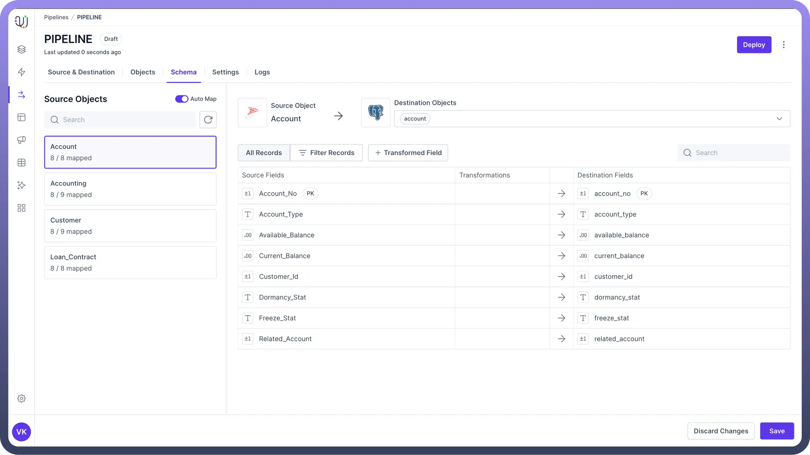
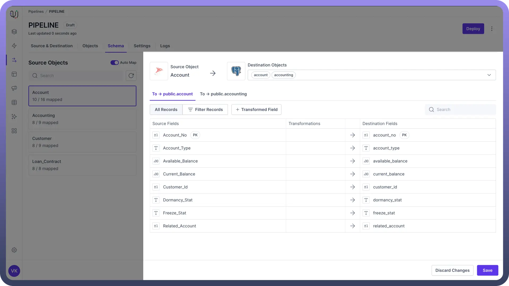
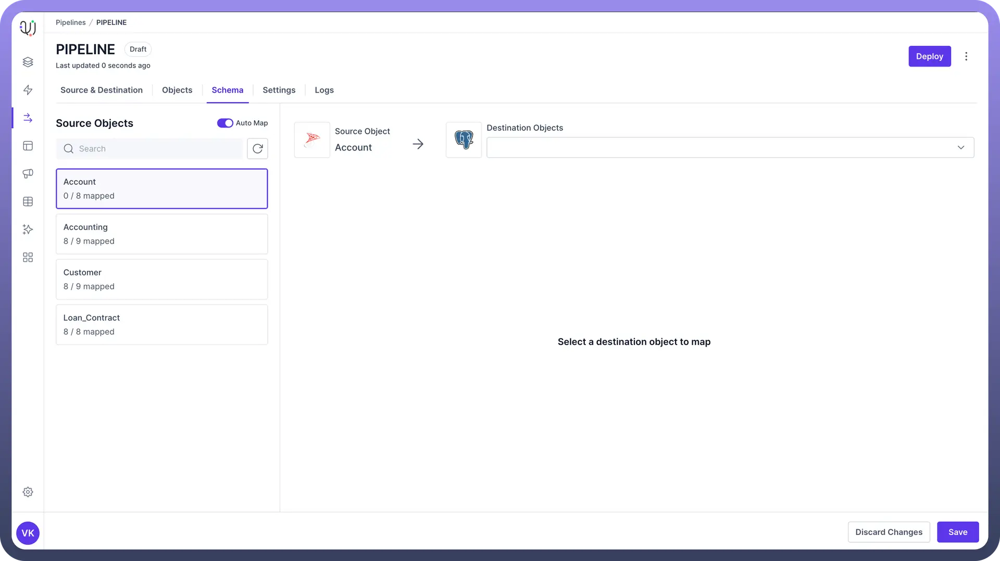
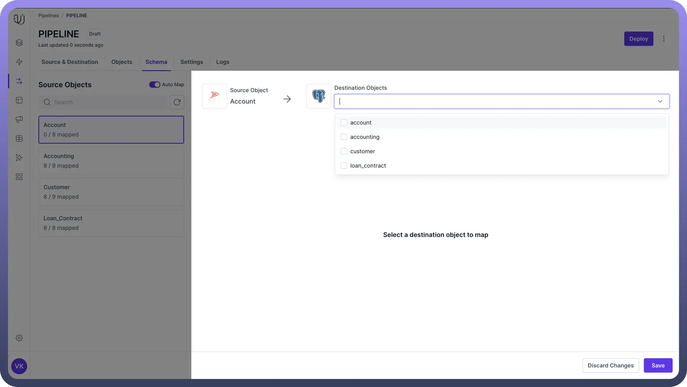
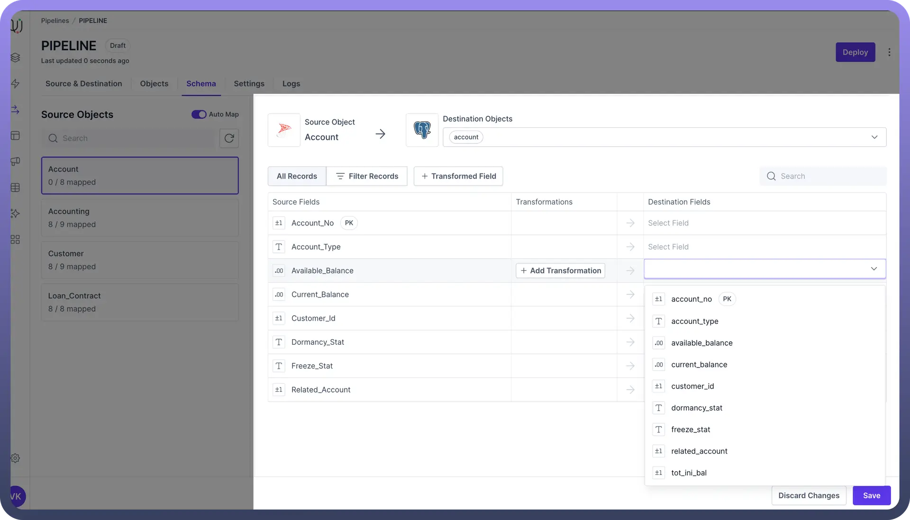
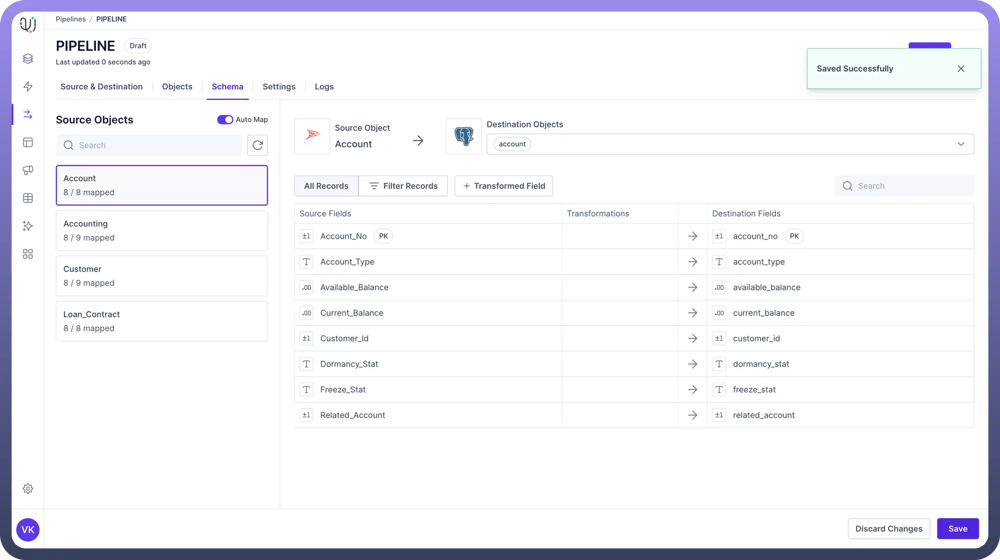
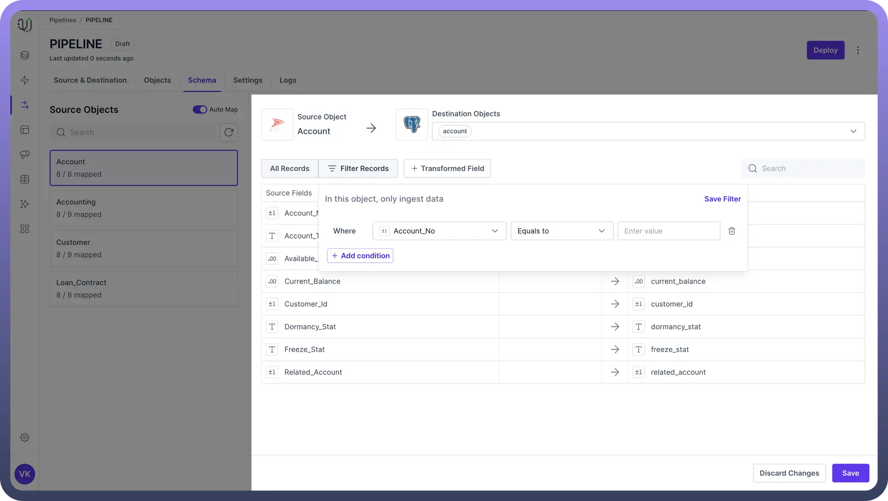

# Schema Mapping

Source: https://www.unifyapps.com/docs/unify-data/schema-mapping1
Section: data

---

## Overview

Schema mapping is a fundamental process in data pipelines, serving as the **bridge** between your **source data** and your **target systems**. It's the blueprint that defines how data should flow and transform as it moves through your data pipeline.

Effective schema mapping ensures that your data lands in the right place, in the right format, ready for analysis or further processing.

## What is Schema Mapping?

Schema mapping is the process of creating relationships between the schema of a source database and the schema of a target database.

In the context of ETL, it involves defining how data from one or more source systems should be transformed and loaded into a target system.

## Types of Schema Mapping

UnifyData supports three types of schema mapping to accommodate various data mapping scenarios:

1. **One-to-One Mapping**
2. **One-to-Many Mapping**
3. **Many-to-One Mapping**

Let's explore each of these in detail.

## One-to-One Mapping

One-to-One mapping is the simplest form of schema mapping. It involves mapping fields from `one source` object directly to fields in `one destination` object.

**Example:** Source Object: Customer Destination Object: Client

| **Source Field** | **Destination Field** |
|---|---|
| CustomerID | ClientID |
| FirstName | FirstName |
| LastName | LastName |
| Email | EmailAddress |

In this example, each field from the Customer object is mapped to a corresponding field in the Client object. Note that field names don't have to be identical (e.g., Email to EmailAddress).

## One-to-Many Mapping

One-to-Many mapping involves mapping `one source` object to `multiple destination` objects. This is useful when you need to distribute data from a single source across multiple tables or objects in the destination system.

**Example:** Source Object: Order Destination Objects: SalesOrder, OrderDetails

**SalesOrder Mapping:**

| **Source Field** | **Destination Field** |
|---|---|
| OrderID | SalesOrderID |
| CustomerID | CustomerID |
| OrderDate | OrderDate |
| TotalAmount | TotalAmount |

**OrderDetails Mapping:**

| **Source Field** | **Destination Field** |
|---|---|
| OrderID | SalesOrderID |
| ProductID | ProductID |
| QuantityOrdered | Quantity |
| UnitPrice | UnitPrice |

In this example, data from the Order object is split between two destination objects: SalesOrder for order-level information and OrderDetails for line-item details.

## Many-to-One Mapping

Many-to-One mapping involves combining data from `multiple source` objects into a `single destination` object. This is useful for consolidating data from multiple sources or creating denormalized views of data.

**Example:** Source Objects: Customer, Address Destination Object: CustomerProfile

| **Source Object** | **Source Field** | **Destination Field** |
|---|---|---|
| Customer | CustomerID | CustomerID |
| Customer | FirstName | FirstName |
| Customer | LastName | LastName |
| Customer | Email | Email |
| Address | Street | StreetAddress |
| Address | City | City |
| Address | State | State |
| Address | ZipCode | PostalCode |

In this example, data from both the Customer and Address objects are combined into a single CustomerProfile object in the destination system.

## Choosing the Right Mapping

The choice of mapping type depends on your specific data integration requirements:

" Use **One-to-One mapping** for straightforward data transfers between similar schemas."

"Use **One-to-Many mapping** when you need to distribute or normalize your data in the destination system."

"Use **Many-to-One mapping** when you want to consolidate data or create comprehensive views of related information."

## Steps for Schema Mapping

1. **Select Source Object**
  - In the left panel, you'll see a list of available source objects
  - Use the Search bar at the top of this panel to quickly find specific objects
  - Click on the desired source object to select it

    

2. **Choose Destination Object(s)**
  - After selecting a source object, a dropdown or selection panel for destination objects will appear.

    

  - For One-to-One or Many-to-One mapping, select a single destination object
  - For One-to-Many mapping, you can select multiple destination objects
3. **Map Fields**
  - Once source and destination objects are selected, you'll see a table or interface showing source fields
  - For each source field, there will be a dropdown in the "`Destination Field`" column

    

  - Click on this dropdown to see available destination fields
  - Select the appropriate destination field for each source field
  - Use the Search bar within each object view to quickly locate specific fields if dealing with many columns **Note:** Pay attention to data types when mapping fields. UnifyData will often highlight potential type mismatches.
4. **Save or Discard Changes**
  - Once you're satisfied with your mapping, click "`Save`" or "`Apply`" to confirm your mappings
  - If you've made errors or want to start over, click "`Discard Changes`" to remove all recent mapping changes

## Filter Records in Schema Mapping

Unifydata allows you to apply filters during the schema mapping process to selectively **migrate data**. This feature is particularly useful when you only need a subset of your source data in the destination system.

Data filtering in schema mapping allows you to:

- Migrate only the most relevant data
- Reduce data transfer volume and processing time
- Create targeted datasets for specific use cases

### Setting Up Filters

Follow these steps to set up filters in UnifyData's schema mapping interface:

1. Navigate to the schema mapping section of your pipeline configuration.
2. Look for a "`Filters`" or "`Conditions`" option, typically near your field mappings.
3. Click to add a new filter.
4. **Define Filter Criteria**
  - Select the source field you want to filter on
  - Choose a filtering operator (e.g., Equals, Contains, Greater Than)
  - Enter the filter value
5. **Combine Multiple Filters**
  - You can add multiple filtering criteria
  - Use AND/OR operators to combine these criteria:
    - **AND**: All criteria must be met for a record to be loaded
    - **OR**: At least one criterion must be satisfied for a record to be loaded

### Filter Configuration

Let's walk through an example of setting up filters for a Customer object:

**Scenario**: You want to migrate only North American customers who have made a purchase in the last year.

| **Filter 1** | **Filter 2** |
|---|---|
| Field: Region
Operator: Equals
Value: "North America" | Field: LastPurchaseDate
Operator: Greater Than
Value: [Current Date - 1 Year] |

**Combination**: Filter 1 **AND** Filter 2

"This configuration will **only migrate** North American customers who have made a purchase within the last year."

## Best Practices

1. **Plan Your Data Schema**
  - Before implementing schema mapping, define your data sources and destination schema
  - Create a data dictionary or schema documentation for both source and destination systems
  - Identify any potential data type conflicts or structural differences between source and destination
2. **Use Consistent Naming Conventions**
  - Establish and follow a consistent naming convention for mapped fields
  - Example: Convert all field names to *camelCase* or use prefixes to indicate data origins
3. **Document Your Mappings**
  - Keep detailed records of your schema mappings
  - Include explanations for any complex transformations or business rules applied during mapping.
