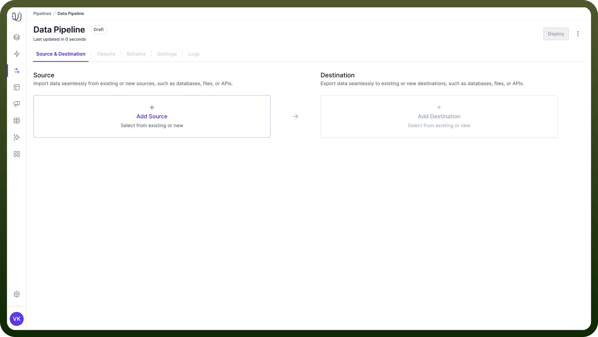
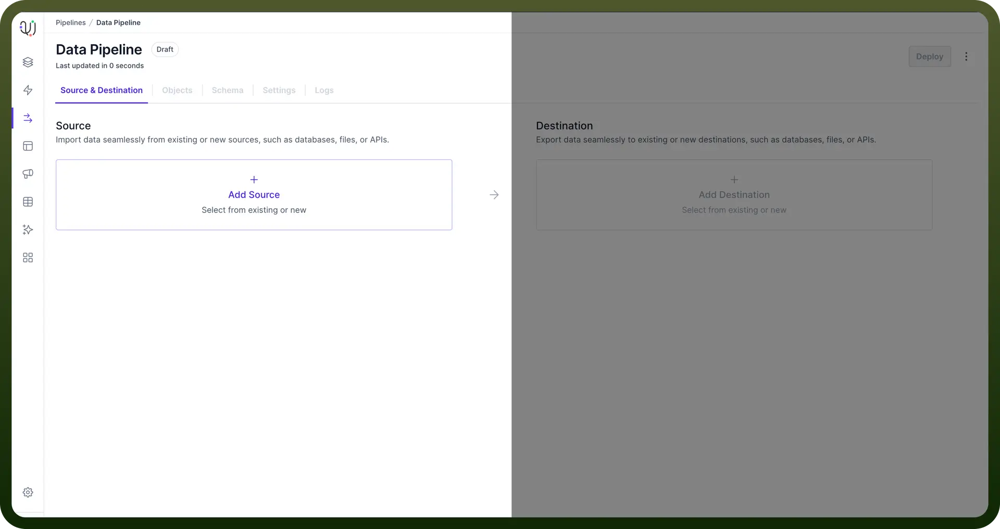
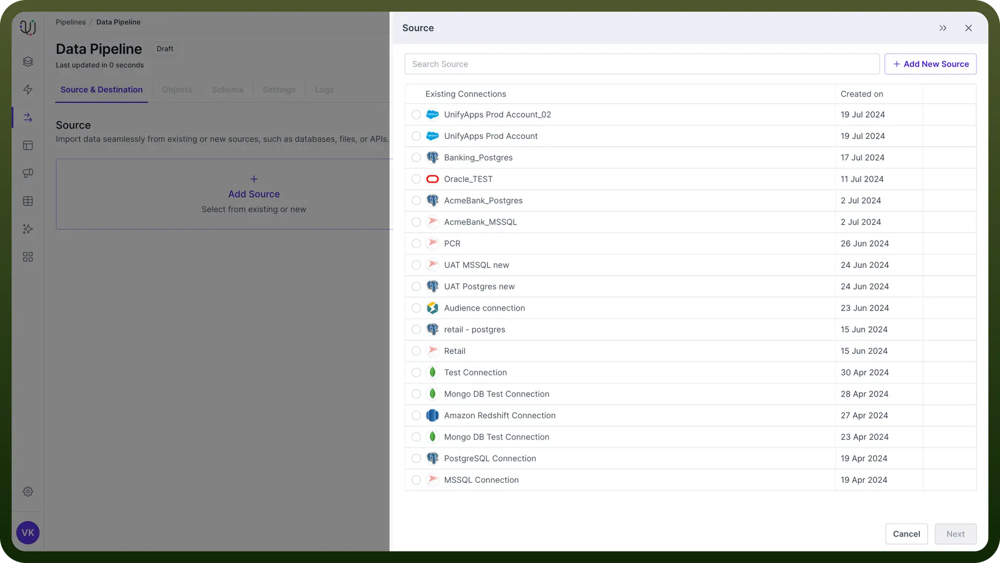
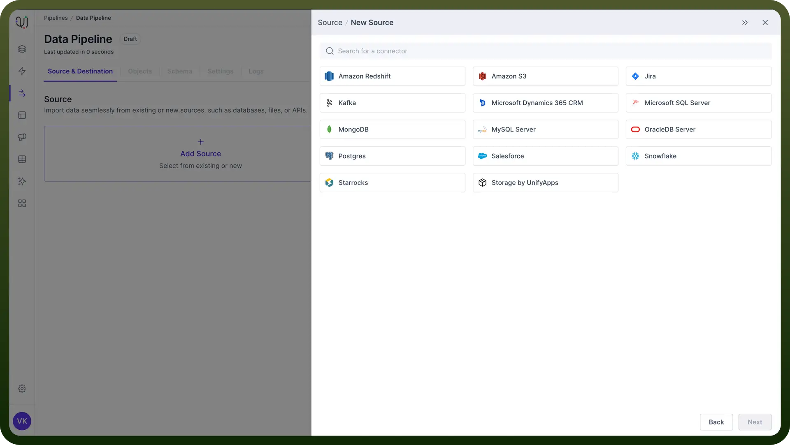
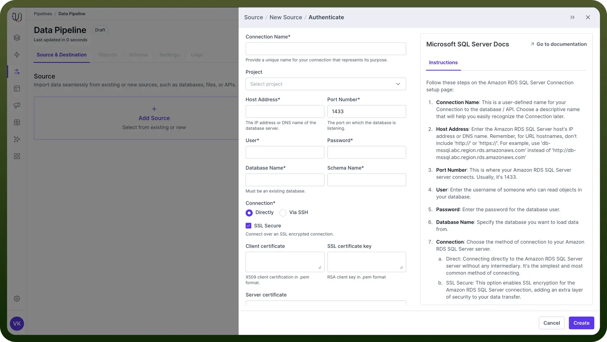
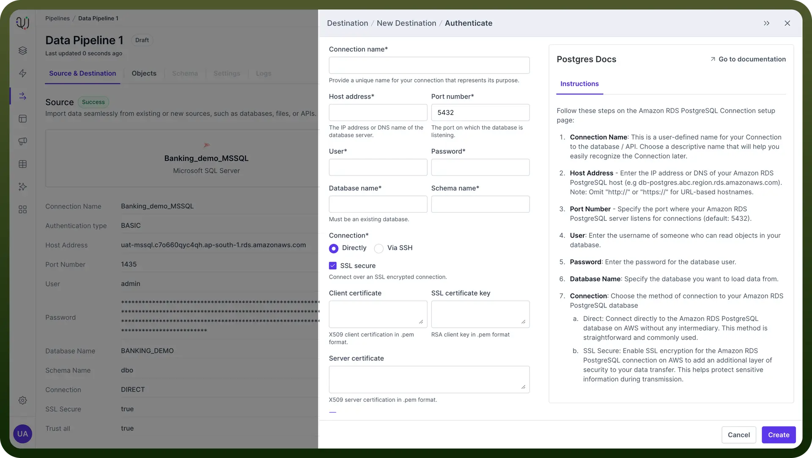

# Set up the Source & Destination

Source: https://www.unifyapps.com/docs/unify-data/set-up-the-source-and-destination
Section: data

---

## Overview

To create a data pipeline, you need to set up the source and destination of your data pipeline.

**Setting up the source** involves configuring secure connections, providing necessary authentication details, and ensuring access to the relevant data.

Similarly, **setting up the destination** requires configuring the connection and ensuring that the data can be accurately transferred and stored in the desired format.

Proper configuration and testing of these connections are important to maintain data integrity and accuracy throughout the entire pipeline.

## Set up the Source

This is where your data originates. It could be a database, cloud service, API, or even flat files.

To create a source connection, follow these steps -

1. Navigate to the "`Source & Destination`" tab in the UnifyData interface.
2. Click on "`Add Source`".

  

3. Choose one of two options:
  - Select from `existing connections`
  - Add a `new source`

    

4. If adding a new source, select a connection type from the list of supported databases or services.
5. Click "`Next`" to proceed to the Authentication form.

  

6. For example, for MSSQL, fill in the required details in the Authentication form. This typically includes:
  - Server address or endpoint URL
  - Port number
  - Username
  - Password
  - Database name (if applicable)

    

7. Click the "`Create`" button to validate the connection.
8. If the validation fails, review the error message, make necessary corrections, and click "`Create`" again.

## Set up the Destination

This is where your data will end up after being processed. It could be another database, a data warehouse, or a business intelligence tool.

After setting up your source, follow these steps to set up your destination:

1. In the same "`Source & Destination`" tab, click on "`Add Destination`".
2. Choose to either select from existing connections or add a new destination.
3. If adding a new destination, select from the list of supported connection types.
4. Click "`Next`" to proceed to the Authentication form.

  

5. Fill in the required details in the Authentication form.
6. Click the "`Create`" button to validate the connection.
7. If validation fails, review the error message, make necessary corrections, and retry.

> **Note:** Do add an appropriate name for your source and destination connection since you can use the same connections in multiple data pipelines.
