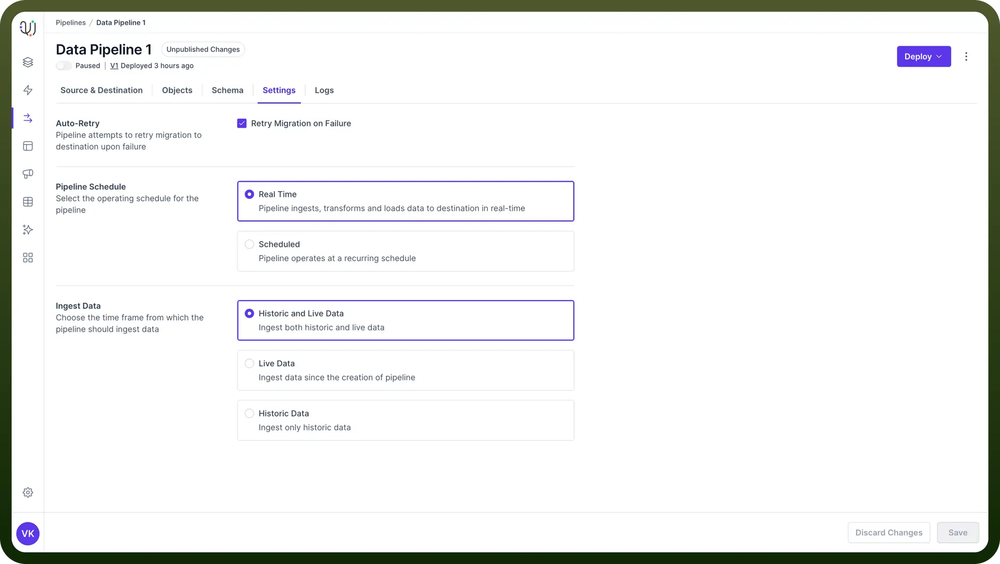

# Settings & Deployment

Source: https://www.unifyapps.com/docs/unify-data/settings-and-deployment
Section: data

---

After completing the object selection and schema mapping, the final steps in creating your data pipeline are configuring the pipeline settings and deploying it. 
These steps are crucial for determining how your pipeline will operate and making it live.

## Configure Pipeline Settings

Navigate to the "`Settings`" tab in the UnifyData interface. Here, you'll find several important options to configure:

1. **Auto Retry**
  - When enabled, UnifyData will automatically retry processing any records that fail during the pipeline execution. Enable this for more robust pipelines, especially when dealing with **unstable data sources** or **network connections**.
2. **Data Ingestion Mode** This setting determines what data will be processed by your pipeline.
  - **Historic and Live Data**Processes all existing data and continues to process new data.Best for initial data migrations or when you need a full data sync.
  - **Live Data Only**Only processes new data from the moment the pipeline is activated.Useful for ongoing data synchronization after an initial data load.
  - **Historic Data Only**Processes only existing data up to the point of pipeline activation.Useful for one-time data migrations or creating point-in-time snapshots.

    

3. **Load Schedule** This setting defines how often your pipeline will run.
  - `Real Time` Continuously processes data as it becomes available. Best for use cases requiring **up-to-the-minute** data accuracy.
  - `Interval` Allows you to set a specific frequency for the pipeline to run (e.g., hourly, daily, weekly). Useful for batch processing or when real-time data is not necessary.

## Deployment

This is the process of making your configured pipeline live and operational.Once you've configured your settings, you're ready to deploy your pipeline.

1. Review all your configurations. Check your **source** and **destination connections**, object selections, schema mappings, and settings.
2. Click the "`Deploy`" button, located in the top right corner of the screen.
3. It will perform a **final validation** of your pipeline configuration. If any issues are detected, you'll be notified and you can make corrections.
4. Once deployed, you'll see an **ON/OFF** toggle appear, usually at the top left of the screen. This toggle allows you to activate or pause your pipeline as needed.

## Monitor Your Deployed Pipeline

After deployment and activation, it's crucial to monitor your pipeline's performance:

1. Check the pipeline logs regularly for any errors or warnings.
2. Monitor the data in your destination to ensure it's being populated as expected.
3. Keep monitoring system resources, especially for real-time or frequently running pipelines.
