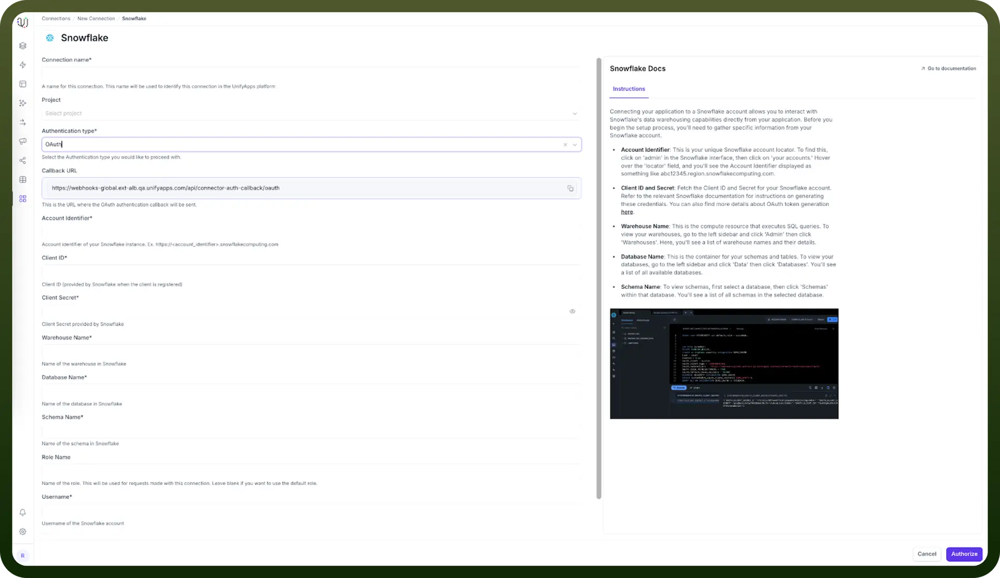
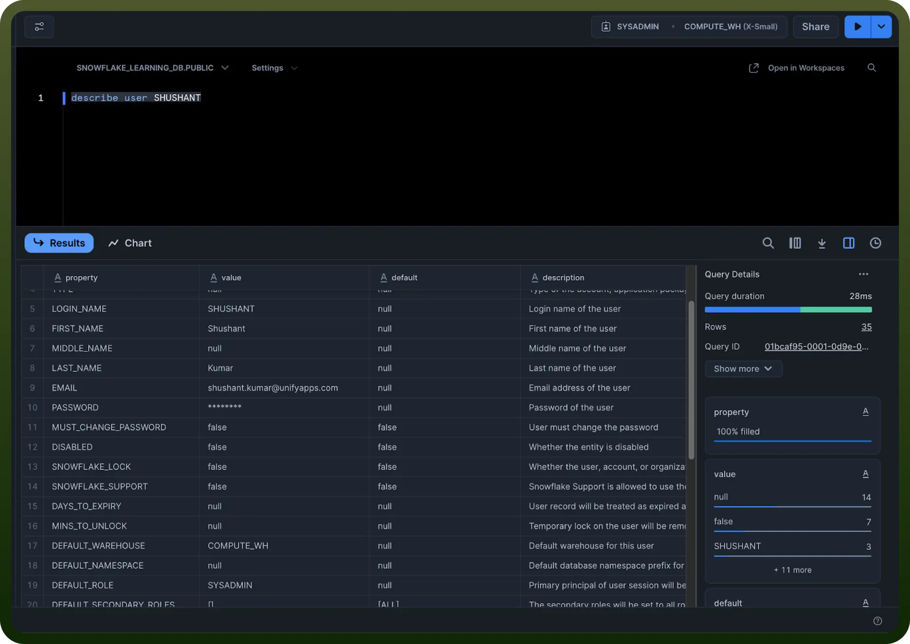
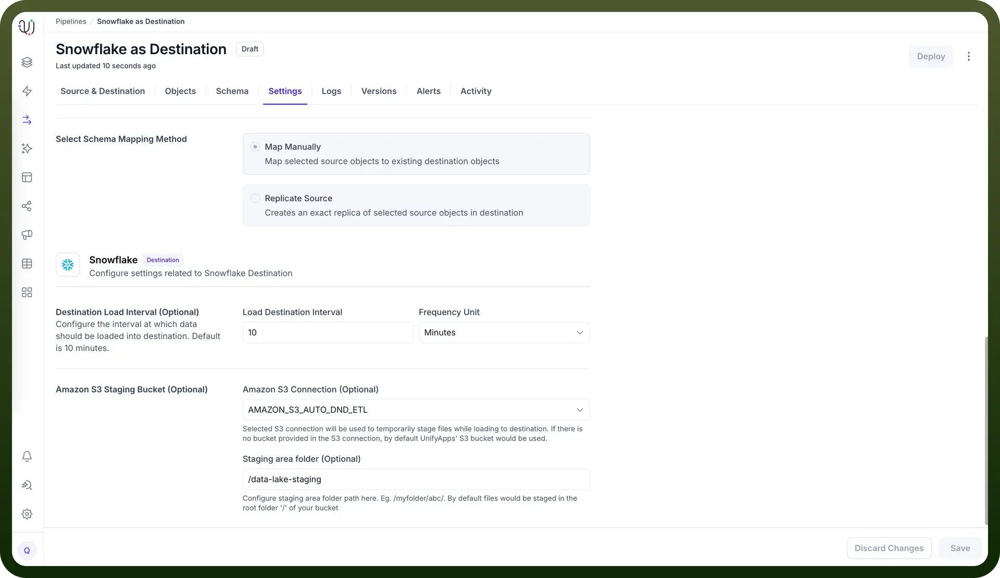

# Snowflake as Destination

Source: https://www.unifyapps.com/docs/unify-data/snowflake-as-destination
Section: data

---

UnifyApps enables seamless integration with Snowflake databases as a destination for your data pipelines. This article covers essential configuration elements and best practices for connecting to Snowflake destinations.

## Overview

Snowflake is a cloud-native data warehouse platform known for its scalability, performance, and ease of use. UnifyApps provides native connectivity to load data into Snowflake environments efficiently and securely, making it ideal for analytics, data science, and business intelligence workflows.

## Connection Configuration



| **Parameter** | **Description** | **Example** |
|---|---|---|
| `Connection Name` | Descriptive identifier for your connection | "Production Snowflake DW" |
| `Account Identifier` | Snowflake account identifier | "myorg-myaccount" |
| `Warehouse` | Snowflake compute warehouse | "COMPUTE_WH" |
| `Database` | Name of the Snowflake database | "ANALYTICS_DB" |
| `Schema` | Schema containing your destination tables | "PUBLIC" |
| `User` | Snowflake username | "unify_writer" |
| `Role` | Snowflake role for the connection | "UNIFYAPPS_ROLE" |
| `Authentication Method` | OAuth or JWT | OAuth/JWT |

To set up a Snowflake destination, navigate to the Connections section, click New Connection, and select Snowflake. Complete the form with your Snowflake environment details.

## Authentication Methods

### OAuth Authentication

OAuth provides secure, token-based authentication for Snowflake connections.

**Prerequisites:**

- ACCOUNTADMIN or SECURITYADMIN role access
- Callback URL configured

**Setup Steps:**

```
USE ROLE ACCOUNTADMIN;
CREATE SECURITY INTEGRATION <integration_name>
  TYPE = OAUTH
  ENABLED = TRUE
  OAUTH_CLIENT = CUSTOM
  OAUTH_CLIENT_TYPE = 'CONFIDENTIAL'
  OAUTH_REDIRECT_URI = '<https://your-callback-uri>'
  OAUTH_ISSUE_REFRESH_TOKENS = TRUE
  OAUTH_REFRESH_TOKEN_VALIDITY = 7776000;
```

**Getting OAuth Client Secret and Client ID:**

```
SELECT SYSTEM$SHOW_OAUTH_CLIENT_SECRETS('<integration_name>');
```

This command returns Client ID, Client Secret, and Client Secret 2 values.

**To get OAuth Information:**

```
DESCRIBE SECURITY INTEGRATION <integration_name>;
```

This shows:

- Client ID (OAUTH_CLIENT_ID)
- Configuration parameters
- OAuth Endpoint URLs (Authorization, Token, Revoke URLs)

### JWT (Key Pair) Authentication



JWT authentication uses public-private key pairs for secure connection.

**Prerequisites:**

- Generated public-private key pair
- Public key assigned to Snowflake user
- Private key file (e.g., rsa_key.p8)

**Setup Process:**

1. **Generate Key Pair:** Create a public-private key pair using OpenSSL: `openssl genrsa 2048 | openssl pkcs8 -topk8 -inform PEM -out rsa_key.p8 -nocrypt openssl rsa -in rsa_key.p8 -pubout -out rsa_key.pub`
2. **Assign Public Key to User:** Assign the generated public key to your Snowflake user: `ALTER USER <USER> SET RSA_PUBLIC_KEY='<YOUR RSA PUBLIC KEY>';`
3. **Verify Setup:** Check the user configuration and get the public key fingerprint: `DESC USER <USER>; SELECT SUBSTR((SELECT "value" FROM TABLE(RESULT_SCAN(LAST_QUERY_ID())) WHERE "property" = 'RSA_PUBLIC_KEY_FP'), LEN('SHA256:') + 1);`
4. **Test Connection:** Use SnowSQL to verify the connection: `snowsql -a <account_identifier> -u <user> --private-key-path <path>/rsa_key.p8`

## Destination Settings Configuration



UnifyApps provides flexible configuration options for Snowflake destinations through the Settings tab in Data Pipelines:

**Load Destination Interval**

The Load Destination Interval setting allows you to control how frequently data is loaded into your Snowflake destination. This setting helps optimize performance and manage warehouse costs by batching data loads at appropriate intervals based on your business requirements.

**Custom S3 Staging Bucket**

For enhanced control over your data loading process, you can configure a custom S3 bucket for staging:

- **S3 Bucket Connection:** Choose from your configured S3 bucket connections
- **Optional Path Specification:** Specify a custom path within the S3 bucket for staging files
- **Benefits:** Improved data governance, cost optimization, and compliance with organizational policies

This staging configuration is particularly useful for organizations with specific data residency requirements or those wanting to optimize cross-cloud data transfer costs.

## Role and User Management

**Custom Role Creation**

Create a dedicated role for UnifyApps connections:

```
CREATE ROLE UNIFYAPPS_ROLE;
GRANT USAGE ON WAREHOUSE <warehouse_name> TO ROLE UNIFYAPPS_ROLE;
GRANT USAGE ON DATABASE <database_name> TO ROLE UNIFYAPPS_ROLE;
GRANT USAGE ON SCHEMA <schema_name> TO ROLE UNIFYAPPS_ROLE;
```

### Table Permissions

For writing to existing tables:

```
GRANT INSERT, UPDATE, DELETE ON ALL TABLES IN SCHEMA <schema_name> TO ROLE UNIFYAPPS_ROLE;
```

For writing to future tables:

```
GRANT INSERT, UPDATE, DELETE ON FUTURE TABLES IN SCHEMA <schema_name> TO ROLE UNIFYAPPS_ROLE;
```

For creating tables and managing schema objects:

```
GRANT CREATE TABLE ON SCHEMA <schema_name> TO ROLE UNIFYAPPS_ROLE;
GRANT CREATE VIEW ON SCHEMA <schema_name> TO ROLE UNIFYAPPS_ROLE;
```

For accessing stored procedures:

```
GRANT USAGE ON ALL PROCEDURES IN SCHEMA <schema_name> TO ROLE UNIFYAPPS_ROLE;
```

For accessing user-defined functions:

```
GRANT USAGE ON ALL FUNCTIONS IN SCHEMA <schema_name> TO ROLE UNIFYAPPS_ROLE;
```

### User Creation and Assignment

```
CREATE USER IF NOT EXISTS UNIFYAPPS_USER
  PASSWORD = '<secure_password>'
  DEFAULT_ROLE = UNIFYAPPS_ROLE;
GRANT ROLE UNIFYAPPS_ROLE TO USER UNIFYAPPS_USER;
```

### Role Usage Guidelines

- **Without Custom Role:** If not using a custom role, specify your default role explicitly in the connection configuration unless it's SYSADMIN.
- **With Custom Role:** When using a custom role, explicitly mention the specific role name in the connection settings.

## Supported Data Types

UnifyApps handles these Snowflake data types automatically:

| **Category** | **Supported Types** |
|---|---|
| `Numeric` | DECIMAL, NUMERIC, BIGINT, TINYINT, BYTEINT, FLOAT, FLOAT4, DOUBLE, DOUBLE PRECISION, REAL, INT, INTEGER, SMALLINT, FLOAT8 |
| `Text` | VARCHAR, STRING, CHAR, CHARACTER, TEXT |
| `Date/Time` | DATETIME, TIME, DATE, TIMESTAMP, TIMESTAMP_LTZ, TIMESTAMP_NTZ, TIMESTAMP_TZ |
| `Binary` | BINARY, VARBINARY |
| `Boolean` | BOOLEAN |
| `Semi-structured` | ARRAY |

## CRUD Operations Support

All database operations to Snowflake destinations are supported and logged:

| **Operation** | **Description** | **Business Value** |
|---|---|---|
| `Create` | New record insertions | Enable data growth and pipeline expansion |
| `Read` | Data retrieval for validation | Support data quality checks and monitoring |
| `Update` | Record modifications | Maintain data accuracy and freshness |
| `Delete` | Record removals | Support data lifecycle management and compliance |

## Common Business Scenarios

**Data Warehouse Loading**

- Load transformed data into dimensional and fact tables
- Support ETL/ELT processes with efficient bulk loading
- Enable real-time data warehouse updates

**Analytics and BI Integration**

- Populate data marts for business intelligence tools
- Support self-service analytics with clean, structured data
- Enable cross-functional reporting and dashboards

**Data Lake to Data Warehouse Migration**

- Transform and load data from data lakes into structured warehouse
- Support hybrid architectures with both batch and streaming loads
- Enable advanced analytics on structured data

## Best Practices

**Performance Optimization**

- Configure appropriate Load Destination Intervals for your use case
- Use clustering keys on frequently queried columns
- Leverage Snowflake's auto-scaling capabilities
- Optimize warehouse sizes for loading workloads
- Use custom S3 staging buckets for improved transfer performance

**Security Considerations**

- Use OAuth or JWT authentication for enhanced security
- Create dedicated roles with minimum required permissions
- Implement network policies and IP whitelisting
- Enable MFA for administrative accounts
- Secure staging S3 buckets with appropriate access controls

**Cost Management**

- Monitor warehouse usage during data loading operations
- Use auto-suspend and auto-resume for cost optimization
- Configure Load Destination Intervals to balance cost and latency
- Size warehouses appropriately for loading volumes
- Leverage custom S3 staging to optimize cross-cloud transfer costs

**Data Governance**

- Document data lineage and loading patterns
- Implement data classification and tagging policies
- Set up monitoring and alerting for pipeline health
- Maintain audit logs for compliance requirements
- Use staging bucket paths for organized data management

Snowflake's cloud-native architecture and scalability make it an excellent destination for data pipelines. By following these configuration guidelines and best practices, you can ensure reliable, efficient data loading while optimizing for performance, security, and cost-effectiveness.

UnifyApps integration with Snowflake enables you to leverage your cloud data warehouse as a powerful destination for analytics, machine learning, and operational intelligence workflows.
