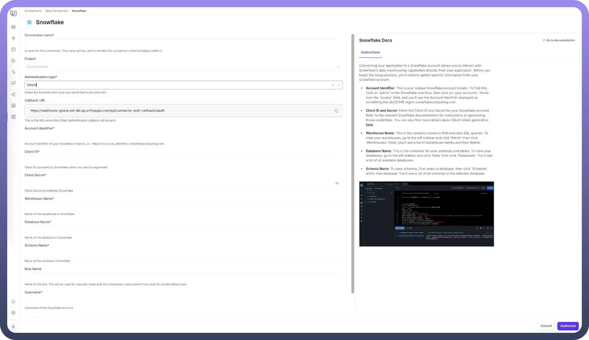
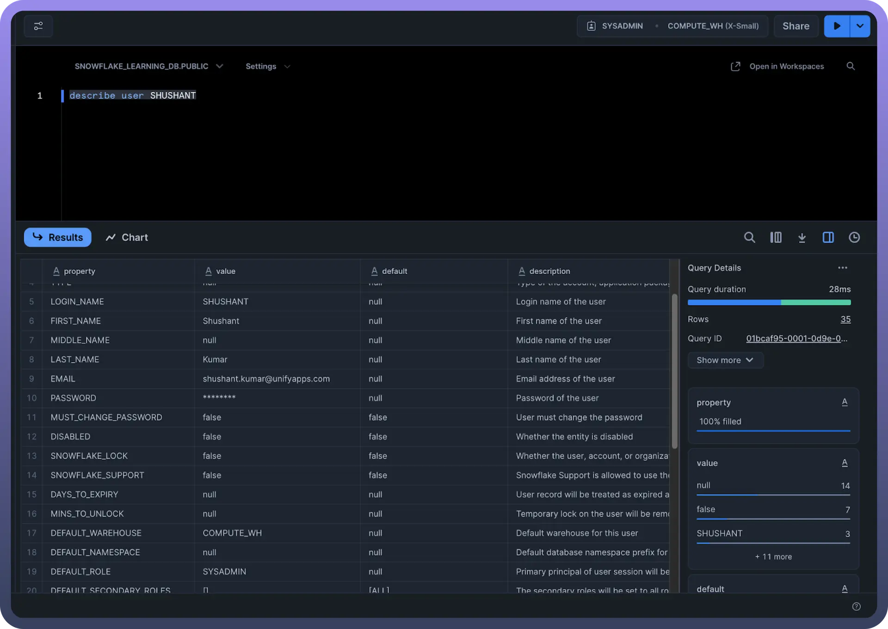

# Snowflake as Source

Source: https://www.unifyapps.com/docs/unify-data/snowflake-as-source
Section: data

---

UnifyApps enables seamless integration with Snowflake databases as a source for your data pipelines. This article covers essential configuration elements and best practices for connecting to Snowflake sources.

## Overview

Snowflake is a cloud-native data warehouse platform known for its scalability, performance, and ease of use. UnifyApps provides native connectivity to extract data from Snowflake environments efficiently and securely, making it ideal for analytics, data science, and business intelligence workflows.

## Connection Configuration



| **Parameter** | **Description** | **Example** |
|---|---|---|
| `Connection Name` | Descriptive identifier for your connection | "Production Snowflake DW" |
| `Account Identifier` | Snowflake account identifier | "myorg-myaccount" |
| `Warehouse` | Snowflake compute warehouse | "COMPUTE_WH" |
| `Database` | Name of the Snowflake database | "ANALYTICS_DB" |
| `Schema` | Schema containing your source tables | "PUBLIC" |
| `User` | Snowflake username | "unify_reader" |
| `Role` | Snowflake role for the connection | "UNIFYAPPS_ROLE" |
| `Authentication Method` | OAuth or JWT | OAuth/JWT |

To set up a Snowflake source, navigate to the Connections section, click New Connection, and select Snowflake. Complete the form with your Snowflake environment details.

## Authentication Methods

### OAuth Authentication

OAuth provides secure, token-based authentication for Snowflake connections.

**Prerequisites:**

- `ACCOUNTADMIN` or `SECURITYADMIN` role access
- Callback URL configured

**Setup Steps:**

```
USE ROLE ACCOUNTADMIN;
CREATE SECURITY INTEGRATION <integration_name>
  TYPE = OAUTH
  ENABLED = TRUE
  OAUTH_CLIENT = CUSTOM
  OAUTH_CLIENT_TYPE = 'CONFIDENTIAL'
  OAUTH_REDIRECT_URI = '<https://your-callback-uri>'
  OAUTH_ISSUE_REFRESH_TOKENS = TRUE
  OAUTH_REFRESH_TOKEN_VALIDITY = 7776000;
```

**Getting OAuth Client Secret and Client ID:**

```
SELECT SYSTEM$SHOW_OAUTH_CLIENT_SECRETS('<integration_name>');
```

This command returns `Client ID`, `Client Secret`, and `Client Secret 2` values.

**To get OAuth Information:**

```
DESCRIBE SECURITY INTEGRATION <integration_name>;
```

This shows:

- Client ID (`OAUTH_CLIENT_ID`)
- Configuration parameters
- OAuth Endpoint URLs (`Authorization`, `Token`, `Revoke URLs`)

### JWT (Key Pair) Authentication

JWT authentication uses public-private key pairs for secure connection.



**Prerequisites:**

- Generated public-private key pair
- Public key assigned to Snowflake user
- Private key file (e.g., `rsa_key.p8`)

**Setup Process:**

1. **Generate Key Pair**: Create a public-private key pair using OpenSSL: `openssl genrsa 2048 | openssl pkcs8 -topk8 -inform PEM -out rsa_key.p8 -nocrypt openssl rsa -in rsa_key.p8 -pubout -out rsa_key.pub`
2. **Assign Public Key to User**: Assign the generated public key to your Snowflake user: `ALTER USER <USER> SET RSA_PUBLIC_KEY='<YOUR RSA PUBLIC KEY>';`
3. **Verify Setup**: Check the user configuration and get the public key fingerprint: `DESC USER <USER>; SELECT SUBSTR((SELECT "value" FROM TABLE(RESULT_SCAN(LAST_QUERY_ID())) WHERE "property" = 'RSA_PUBLIC_KEY_FP'), LEN('SHA256:') + 1);`
4. **Test Connection**: Use SnowSQL to verify the connection: `snowsql -a <account_identifier> -u <user> --private-key-path <path>/rsa_key.p8`

## Ingestion Modes

| **Mode** | **Description** | **Business Use Case** |
|---|---|---|
| `Historical and Live` | Loads all existing data and captures ongoing changes | Data warehouse migration with continuous updates |
| `Live Only` | Captures only new data from deployment forward | Real-time analytics without historical backfill |
| `Historical Only` | One-time load of all existing data | Data migration or point-in-time analysis |

Choose the mode that aligns with your business requirements during pipeline configuration.

## Change Data Capture (CDC) Configuration

For Historical and Live or Live Only modes that require real-time data tracking, enable CDC on source tables:

**Prerequisites:**

- Table ownership or admin privileges
- Snowflake Enterprise Edition or higher
- Adequate storage for change tracking

**Enable CDC Command:**

```
ALTER TABLE <table_name>
SET CHANGE_TRACKING = TRUE
CHANGE_TRACKING_COLUMNS = ALL;
```

> **Note:** CDC on Snowflake databases and schemas is internally managed and doesn't require separate commands.

## Role and User Management

### Custom Role Creation

Create a dedicated role for UnifyApps connections:

```
CREATE ROLE UNIFYAPPS_ROLE;
GRANT USAGE ON WAREHOUSE <warehouse_name> TO ROLE UNIFYAPPS_ROLE;
GRANT USAGE ON DATABASE <database_name> TO ROLE UNIFYAPPS_ROLE;
GRANT USAGE ON SCHEMA <schema_name> TO ROLE UNIFYAPPS_ROLE;
```

### Table Permissions

**For reading existing tables:**

```
GRANT SELECT ON ALL TABLES IN SCHEMA <schema_name> TO ROLE UNIFYAPPS_ROLE;
```

**For reading future tables:**

```
GRANT SELECT ON FUTURE TABLES IN SCHEMA <schema_name> TO ROLE UNIFYAPPS_ROLE;
```

**For accessing stored procedures:**

```
GRANT USAGE ON ALL PROCEDURES IN SCHEMA <schema_name> TO ROLE UNIFYAPPS_ROLE;
```

**For accessing user-defined functions:**

```
GRANT USAGE ON ALL FUNCTIONS IN SCHEMA <schema_name> TO ROLE UNIFYAPPS_ROLE;
```

### User Creation and Assignment

```
CREATE USER IF NOT EXISTS UNIFYAPPS_USER
  PASSWORD = '<secure_password>'
  DEFAULT_ROLE = UNIFYAPPS_ROLE;
GRANT ROLE UNIFYAPPS_ROLE TO USER UNIFYAPPS_USER;
```

### Role Usage Guidelines

**Without Custom Role:** If not using a custom role, specify your default role explicitly in the connection configuration unless it's `SYSADMIN`.

**With Custom Role:** When using a custom role, explicitly mention the specific role name in the connection settings.

## Supported Data Types

UnifyApps handles these Snowflake data types automatically:

| **Category** | **Supported Types** |
|---|---|
| `Numeric` | DECIMAL, NUMERIC, BIGINT, TINYINT, BYTEINT, FLOAT, FLOAT4, DOUBLE, DOUBLE PRECISION, REAL, INT, INTEGER, SMALLINT, FLOAT8 |
| `Text` | VARCHAR, STRING, CHAR, CHARACTER, TEXT |
| `Date/Time` | DATETIME, TIME, DATE, TIMESTAMP, TIMESTAMP_LTZ, TIMESTAMP_NTZ, TIMESTAMP_TZ |
| `Binary` | BINARY, VARBINARY |
| `Boolean` | BOOLEAN |
| `Semi-structured` | ARRAY |

## CRUD Operations Tracking

All database operations from Snowflake sources are identified and logged:

| **Operation** | **Description** | **Business Value** |
|---|---|---|
| `Create` | New record insertions | Track data growth and pipeline health |
| `Read` | Data retrieval actions | Monitor extraction patterns and performance |
| `Update` | Record modifications | Audit data changes for compliance |
| `Delete` | Record removals | Ensure proper data lifecycle management |

## Common Business Scenarios

**Data Warehouse Integration**

- Extract dimensional and fact tables from Snowflake
- Enable data transformation and enrichment pipelines
- Support business intelligence and analytics workflows

**Data Science Pipelines**

- Extract feature datasets for machine learning models
- Enable real-time model scoring with live data feeds
- Support experimental data analysis workflows

**Cross-Platform Analytics**

- Consolidate Snowflake data with other sources
- Enable unified analytics across multiple data platforms
- Support hybrid cloud data architectures

## Best Practices

**Performance Optimization**

- Use appropriate warehouse sizes for extraction workloads
- Apply clustering keys on frequently filtered columns
- Implement result caching for repeated queries
- Schedule bulk extractions during off-peak hours

**Security Considerations**

- Use OAuth or JWT authentication for enhanced security
- Create dedicated roles with minimum required permissions
- Implement network policies and IP whitelisting
- Enable MFA for administrative accounts

**Cost Management**

- Monitor warehouse usage and costs during extractions
- Use auto-suspend and auto-resume for cost optimization
- Size warehouses appropriately for extraction volumes
- Implement query timeout settings

**Data Governance**

- Document data lineage and extraction patterns
- Implement data classification and masking policies
- Set up monitoring and alerting for pipeline health
- Maintain audit logs for compliance requirements

Snowflake's cloud-native architecture and scalability make it an excellent source for data pipelines. By following these configuration guidelines and best practices, you can ensure reliable, efficient data extraction while optimizing for performance, security, and cost-effectiveness.

UnifyApps integration with Snowflake enables you to leverage your cloud data warehouse as a powerful source for analytics, machine learning, and operational intelligence workflows.
