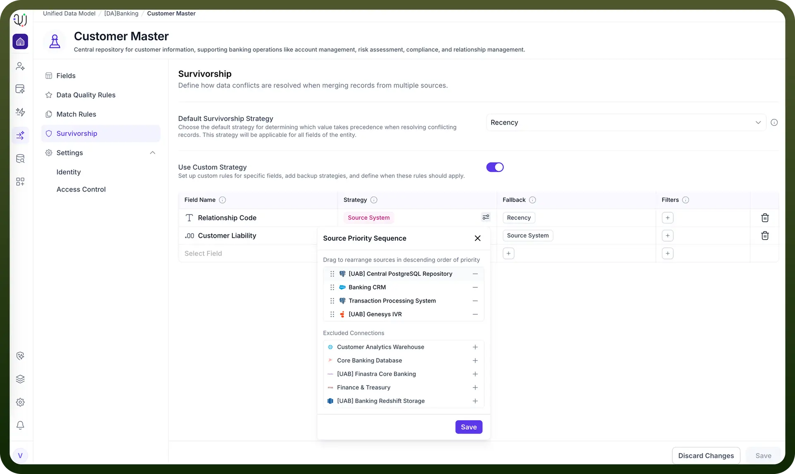

# Source system

Source: https://www.unifyapps.com/docs/unify-data/source-system
Section: data

---

The Source System strategy is one of the most fundamental and widely used survivorship methods in Master Data Management.

Instead of evaluating the data values themselves (e.g., looking for the longest string or most recent date), this strategy evaluates the origin of the data.

It allows you to designate specific external systems as "sources of truth" for your entity, ensuring that data from your most trusted platforms takes precedence over less reliable sources.

## **The Logic: Hierarchy of Trust**

This strategy operates on a user-defined Priority Sequence.

You establish a ranked hierarchy of your connected systems. When the UnifyApps platform constructs a Golden Record, it iterates through this list from top to bottom:

1. It checks the **highest-priority source** (Rank 1).
2. If that source has a non-null value for the field, that value "wins" and is written to the master record.
3. If the first source is empty (null), the system moves to the **second source** (Rank 2), and so on.

## **Configuration Process**

Implementing this strategy involves two key steps:

1. **Select the Strategy** In the survivorship table, select Source System from the strategy dropdown menu for your target field (e.g., BRANCH_CODE).
2. **Define the Sequence** Once selected, a configuration icon appears next to the strategy name. Clicking this opens the Source Priority Sequence modal. Here, you can manage your connections (such as sap_connection_new or Snowflake Connection). You can include or exclude specific connections and arrange the active ones to match your business's trust model.
