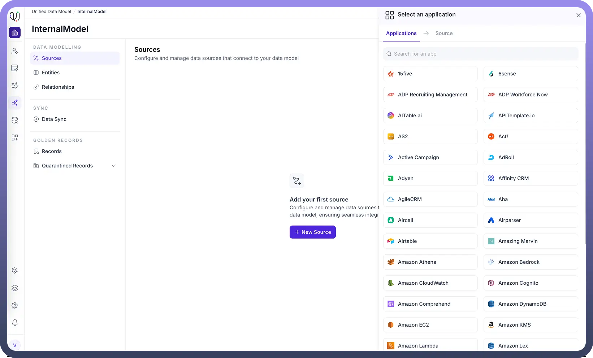

# Sources

Source: https://www.unifyapps.com/docs/unify-data/sources
Section: data

---

### **Overview**

Sources refer to the external systems, databases, and applications from which data is ingested, validated, and unified within the Unify Data Model (UDM).

When configuring a UDM, users can simply select **“Add Source”** and choose from more than **600 supported applications, databases, and data warehouses**. Each source can be individually configured with connection credentials, schema imports, and field mappings—enabling organizations to unify data from multiple disparate systems into a consistent, governed model.

## **Steps for Adding a Source to the UDM**

### **1. Access the Data Platform and Open the UDM/MDM Module**

Navigate to the UnifyApps Data Platform and open the **Unified Data Model (MDM)** module. This serves as the centralized workspace for managing master data across all connected systems.

### **2. Create or Select a Unified Data Model**

Create a new model (e.g., *“Banking Model”*) or choose an existing one to which you want to add data sources.

### **3. Add a Data Source**

Click **“Add Source”** or **“New Source.”**
 Search for the application, database, or API you wish to integrate. UnifyApps supports a wide range of connectors—including Salesforce, Microsoft SQL Server, Oracle, Snowflake, and many others.

Select the desired source (e.g., Oracle DB, Redshift, Salesforce) to continue.

### **4. Configure Connection Details**

If a connection already exists in **Connection Manager**, simply select it. 
 Otherwise, create a new connection by providing:

- Host address (for databases)
- Port number
- Username and password or other authentication credentials
- Any additional configuration required by the selected source Once created, the connection is stored in the **Connection Manager** for future reuse.
