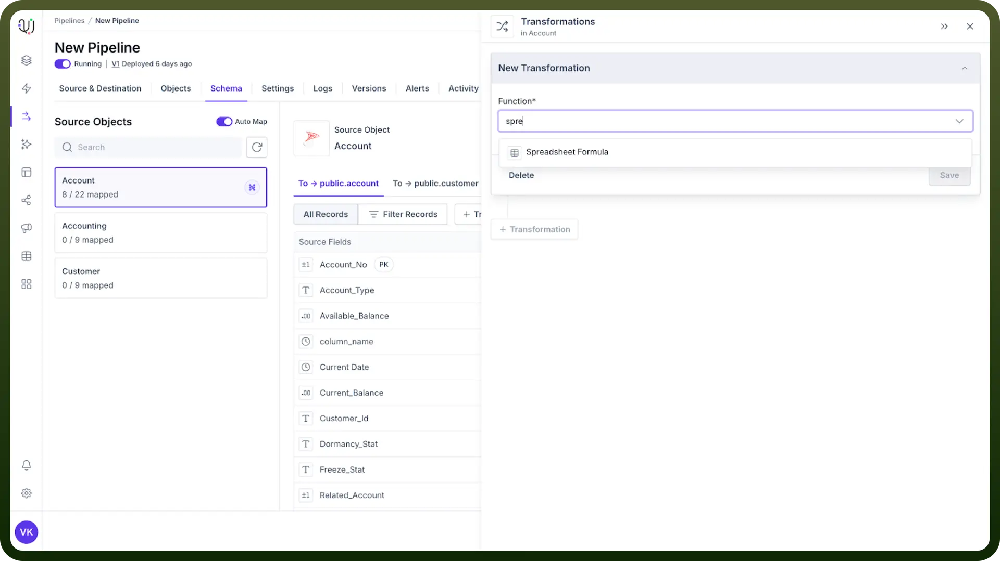
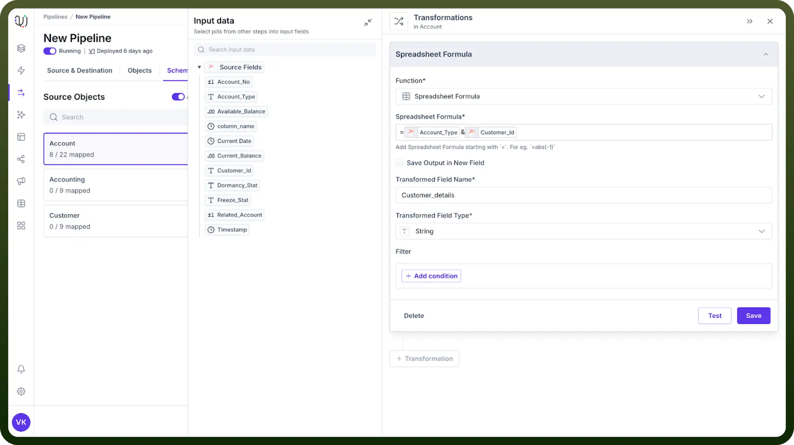
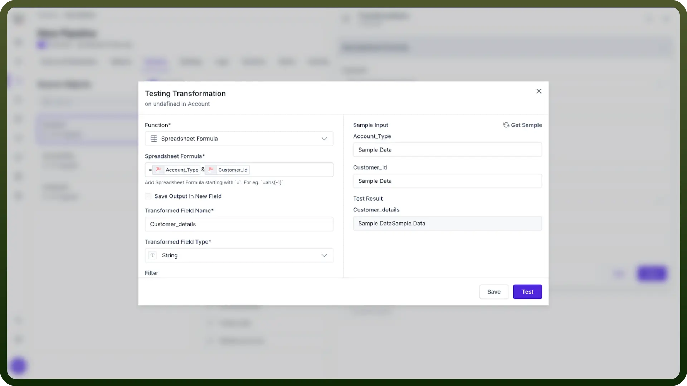

# Spreadsheet Formula

Source: https://www.unifyapps.com/docs/unify-data/spreadsheet-formula
Section: data

---

## **Overview**

Spreadsheet Formula transformations bring familiar Excel-like formulas to your data pipeline, enabling complex calculations and manipulations using syntax that spreadsheet users already know. This powerful feature bridges the gap between spreadsheet expertise and data pipeline development.



## Why Use Spreadsheet Formulas in Your Pipeline?

- **Leverage Existing Skills:** Use familiar Excel-like syntax without learning complex programming
- **Accelerate Development:** Implement complex logic quickly with pre-built functions
- **Enhance Data Quality:** Create validation rules and cleansing operations with simple formulas
- **Improve Consistency:** Standardize calculations across your entire data ecosystem

## How to Apply a Spreadsheet Formula Transformation?

1. Click on the "`+ Transformed Field`**"** button.
2. Select **"**`Spreadsheet Formula`**"** from the Transformations list.
3. Enter your formula using source fields as datapills.
4. Specify the name and datatype for the transient field that will contain the results.
5. Test your formula with sample data before applying to the entire dataset.

  

## Function Categories and Common Pipeline Use Cases

### Text Processing Functions

| **Function** | **Description** | **Pipeline Use Case** |
|---|---|---|
| `CONCATENATE` | Joins text values | Combine first and last names or build complete addresses |
| `LEFT`, `RIGHT`, `MID` | Extract substrings | Parse product codes or extract specific portions of identifiers |
| `TRIM` | Remove extra spaces | Clean messy data from external sources |
| `UPPER`, `LOWER`, `PROPER` | Change text case | Standardize inconsistent text formatting |
| `SUBSTITUTE`, `REPLACE` | Replace text | Fix common typos or standardize terminology |
| `LEN` | Return string length | Validate field length requirements |

**Pipeline Example:** `CONCATENATE(PROPER(First Name), " ", PROPER(Last Name))` - Create properly formatted full names from inconsistent source data.

### Date and Time Functions

| **Function** | **Description** | **Pipeline Use Case** |
|---|---|---|
| `DATE`, `TIME` | Create date/time values | Convert separate date components into standard format |
| `DAY`, `MONTH`, `YEAR` | Extract date parts | Enable date-based aggregation and analysis |
| `WEEKDAY` | Get day of week | Support day-of-week based business rules |
| `TODAY` | Current date | Calculate time-based metrics (age, expiration, etc.) |
| `DATEDIF` | Difference between dates | Calculate duration metrics (days outstanding, age) |

**Pipeline Example:** `IF(DATEDIF(Invoice Date, Payment Date, "D") > 30, "Overdue", "Current")` - Create payment status indicators based on date differences.

### Numeric and Statistical Functions

| **Function** | **Description** | **Pipeline Use Case** |
|---|---|---|
| `ROUND`, `ROUNDUP`, `ROUNDDOWN` | Control rounding | Standardize decimal precision |
| `SUM`, `AVERAGE`, `MIN`, `MAX` | Basic calculations | Aggregates for derived metrics |
| `ABS` | Absolute value | Calculate magnitudes (e.g., price differences) |
| `CEILING`, `FLOOR` | Round to multiples | Create price bands or size categories |
| `PRODUCT` | Multiply values | Calculate area, volume, or compound metrics |

**Pipeline Example:** `ROUND(Quantity * Unit Price * (1 - Discount Rate), 2)` - Calculate standardized line-item totals.

### Lookup and Reference Functions

| Function | Description | Pipeline Use Case |
|---|---|---|
| `VLOOKUP`, `HLOOKUP` | Look up values in tables | Map codes to descriptions or implement business rules |
| `INDEX`, `MATCH` | Advanced lookups | Create complex category mappings |
| `CHOOSE` | Select from alternatives | Implement conditional value mapping |

**Pipeline Example:** `VLOOKUP(Country Code, Country_Mapping_Table, 2, FALSE)` - Map country codes to full country names.

### Logical Functions

| **Function** | **Description** | **Pipeline Use Case** |
|---|---|---|
| `IF` | Conditional logic | Implement business rules and data-driven decisions |
| `AND`, `OR`, `NOT` | Boolean operations | Create complex conditional transformations |
| `ISBLANK`, `ISERROR`, `ISTEXT` | Data validation | Implement data quality checks |

**Pipeline Example:** `IF(AND(Credit Score > 700, Income > 50000), "Approved", "Review")` - Create approval status based on multiple criteria.

## Advanced Pipeline Applications

### Data Cleansing and Standardization

```
// Phone number formatting
IF(LEN(Phone) = 10, 
   CONCATENATE("(", LEFT(Phone, 3), ") ", MID(Phone, 4, 3), "-", RIGHT(Phone, 4)),
   Phone)
```

### Derived Business Metrics

```
// Calculate customer lifetime value
ROUND(
  Average Order Value * 
  Purchase Frequency * 
  Customer Lifespan,
  2)
```

### Data Validation and Quality Checks

```
// Validate email format
IF(AND(
   SEARCH("@", Email) > 1,
   SEARCH(".", Email, SEARCH("@", Email)) > SEARCH("@", Email)
), "Valid", "Invalid")
```

### Enhanced Categorization

```
// Create price bands
CHOOSE(
  IF(Price < 10, 1, 
    IF(Price < 50, 2,
      IF(Price < 100, 3, 4))),
  "Budget", "Economy", "Standard", "Premium")
```

## Testing and Troubleshooting

To ensure your formulas are working as expected:

1. Click the `Test` button before saving your transformation
2. Enter sample values for all fields used in your formula
3. Verify the test results match your expected output
4. For complex formulas, test incrementally by building up from simpler components

  

## Best Practices

- **Document Your Logic:** Add comments to explain complex business rules
- **Break Down Complexity:** Use multiple transformations for very complex calculations
- **Consistent Naming:** Create a naming convention for transformed fields
- **Performance Awareness:** Be mindful of formula complexity with large datasets
- **Create a Formula Library:** Maintain a repository of validated formulas for reuse
