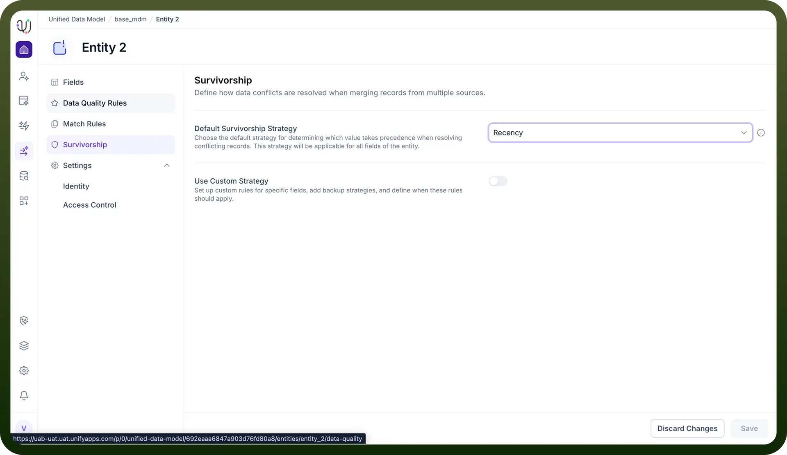

# Survivorship

Source: https://www.unifyapps.com/docs/unify-data/survivorship
Section: data

---

Survivorship is the governance layer in Master Data Management (MDM) that dictates how data conflicts are resolved when merging records from multiple sources.

When UnifyApps identifies duplicate records (e.g., one from Salesforce and one from SAP), it must decide which specific attribute values—such as a phone number or address—should "survive" to populate the final Golden Record.

This process ensures that your master data is not just an arbitrary mix of inputs, but a curated compilation of the most trusted, recent, or frequent information available.

## **Strategic Configuration**

The Survivorship dashboard allows you to configure these rules at two distinct levels of granularity:

## **Global Default Strategy**

You can establish a baseline rule that applies to the entire Entity by default.

For instance, setting the Default Survivorship Strategy to "Recency" ensures that for every field in the object, the system automatically prioritizes the most recently updated data unless told otherwise.

## **Field-Level Custom Strategy**

For more complex data models, you can enable Use Custom Strategy.

This feature allows you to define unique rules for specific fields—for example, trusting the "HR System" for employee IDs while trusting the "Email System" for contact details—ensuring high precision in data mastering.

## **Core Logic Options**

UnifyApps provides several deterministic algorithms to resolve these conflicts:

- **Source System:** Prioritizes values based on a defined hierarchy of trusted systems.
- **Recency:** Selects the value with the latest timestamp.
- **Frequency:** Selects the most commonly occurring value across the duplicate records.
- **Min/Max Value:** Selects the lowest or highest numerical value available.
