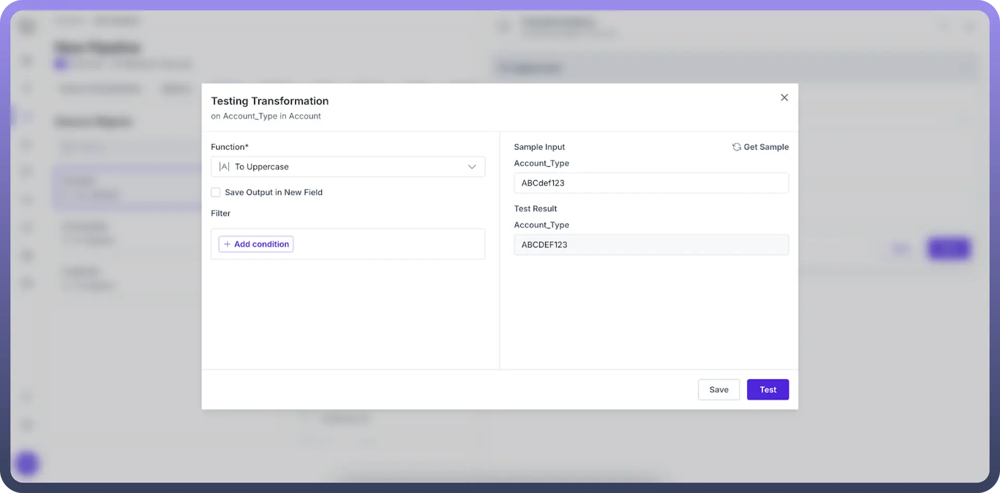
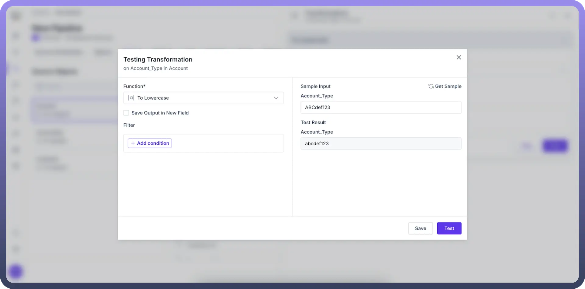
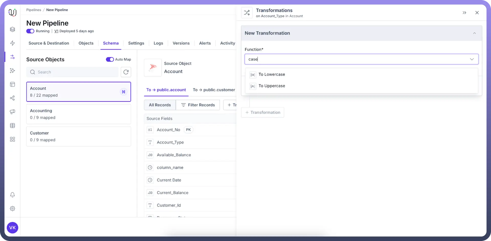

# Text Casing Modification

Source: https://www.unifyapps.com/docs/unify-data/text-casing-modification
Section: data

---

Text casing modification standardizes the capitalization of text data, ensuring consistency in how your information appears across systems and reports. This straightforward yet powerful technique improves data quality and enhances analytical capabilities.

## Why Use Text Casing Modification?

- **Consistency** - Create a uniform appearance across all your datasets
- **Data Cleaning** - Normalize text from diverse sources with varying capitalization patterns
- **Search Efficiency** - Improve match rates and reduce missed results in text searches
- **Analysis Readiness** - Prepare text for case-sensitive operations and algorithms

## Available Text Casing Options

1. `To Lowercase` Converts all alphabetic characters to lowercase format. **Before:** "USER_ID-123" **After:** "user_id-123" **Best for:** Email addresses, usernames, search terms, and general text standardization.

  

2. `To Uppercase` Converts all alphabetic characters to uppercase format. **Before:** "product-code-abc" **After:** "PRODUCT-CODE-ABC" **Best for:** Codes, abbreviations, acronyms, and creating visual emphasis.

  

## How to Apply Text Casing Transformation?

1. Select the desired transformation from the dropdown menu (Lowercase or Uppercase)
2. Configure any additional settings if needed.
3. Click "`Save`" to apply the transformation

> **Note:** Consider storing the original text in a separate field to preserve intentional capitalization when needed.

## Testing Your Transformation

Before applying changes to your entire dataset:

1. Enter representative sample text in the "`Test Transformation`" field.
2. Click "`Test`" to preview the results.
3. Verify the output matches your expectations.
4. Make adjustments to your configuration if necessary.

## Best Practices

- **Be Consistent** - Apply the same casing rules to related fields across your datasets
- **Consider Context** - Choose casing based on data type and how it will be used
- **Document Your Choices** - Record your casing standards for future reference
- **Preserve Originals** - Keep source data intact when maintaining the original format is important
