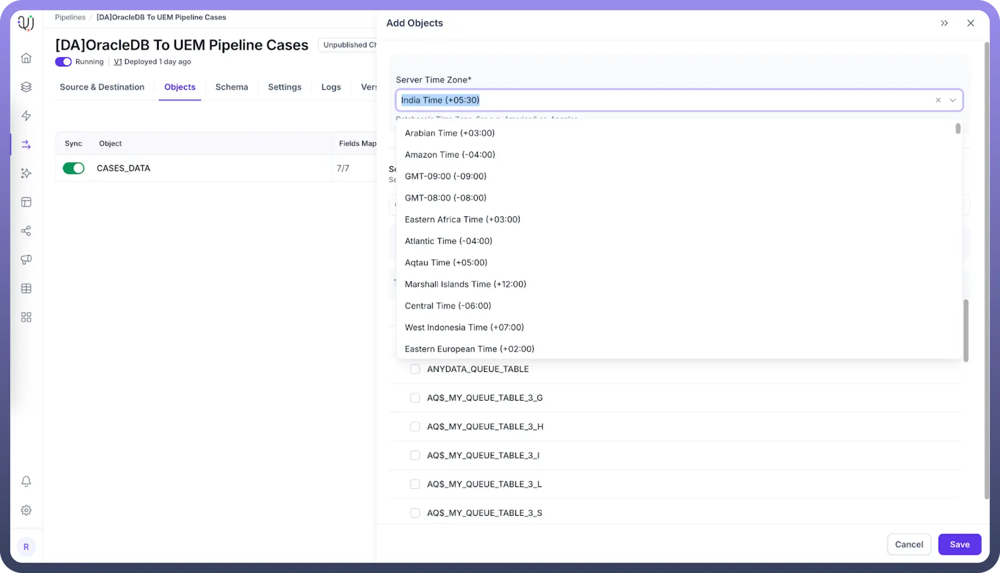

# Timezone Adjustment Use Case

Source: https://www.unifyapps.com/docs/unify-data/timezone-adjustment-use-case
Section: data

---

## Overview

The UnifyApps Data Pipelines platform includes a critical feature that allows users to specify the source database timezone when configuring data ingestion. This setting ensures accurate temporal data conversion by calculating the appropriate offset when storing values at the destination, where all timestamps are standardized to UTC format. This article explains how this feature works and provides common use cases for timezone management in data pipelines.

## How It Works?

When configuring a data source in UnifyApps Data Pipelines:

1. Users select the timezone of the source database during the object selection phase
2. The platform records this timezone setting as metadata for the pipeline
3. During data ingestion, the system automatically calculates the offset between the source timezone and UTC
4. All timestamp data is converted from the source timezone to UTC before being stored in the destination
5. This conversion preserves the exact temporal moment while standardizing the format

  

## Why UTC Standardization Matters?

UnifyApps Data Pipelines stores all temporal data in UTC format at the destination for several important reasons:

- **Consistency**: Eliminates confusion when comparing timestamps from different sources
- **Daylight Saving Time**: Avoids complications with DST transitions
- **Global Operations**: Supports organizations operating across multiple time zones
- **Analytics Accuracy**: Ensures time-based metrics and analyses are correct
- **Integration Simplicity**: Simplifies downstream data integration with other systems

## Example: E-commerce Order Processing

Consider an e-commerce company with operations in multiple regions. They have three regional databases that store order information:

- US East database (New York) - Eastern Time (ET / UTC-5)
- European database (Paris) - Central European Time (CET / UTC+1)
- Asian database (Singapore) - Singapore Time (SGT / UTC+8)

**Source Data in Local Timezones**

Here's a sample of how order data appears in each regional database:

**US East Database (ET / UTC-5)**

| **Order ID** | **Customer** | **Order Time (ET)** | **Total** |
|---|---|---|---|
| US-10001 | John D. | 2025-04-21 15:30:00 | $85.50 |
| US-10002 | Sarah M. | 2025-04-21 16:45:00 | $122.75 |
| US-10003 | Kevin P. | 2025-04-21 17:20:00 | $43.99 |

**European Database (CET / UTC+1)**

| **Order ID** | **Customer** | **Order Time (CET)** | **Total** |
|---|---|---|---|
| EU-20001 | Marie L. | 2025-04-21 20:15:00 | €67.80 |
| EU-20002 | Thomas K. | 2025-04-21 21:30:00 | €94.20 |
| EU-20003 | Sofia B. | 2025-04-21 22:05:00 | €32.50 |

**Asian Database (SGT / UTC+8)**

| **Order ID** | **Customer** | **Order Time (SGT)** | **Total** |
|---|---|---|---|
| AS-30001 | Wei L. | 2025-04-22 05:45:00 | ¥750 |
| AS-30002 | Akira T. | 2025-04-22 06:30:00 | ¥1200 |
| AS-30003 | Priya M. | 2025-04-22 07:15:00 | ¥560 |

**Pipeline Configuration**

When configuring the data source in UnifyApps Data Pipelines, the user selects the appropriate timezone for each source:

- US East pipeline: "Eastern Time (ET / UTC-5)"
- European pipeline: "Central European Time (CET / UTC+1)"
- Asian pipeline: "Singapore Time (SGT / UTC+8)"

**Destination Data in UTC**

After ingestion, all order timestamps are normalized to UTC in the destination data warehouse:

**Consolidated Orders Table (UTC)**

| **Order ID** | **Region** | **Customer** | **Order Time (UTC)** | **Local Time** | **Total** |
|---|---|---|---|---|---|
| US-10001 | US East | John D. | 2025-04-21 20:30:00 | 2025-04-21 15:30:00 | $85.50 |
| US-10002 | US East | Sarah M. | 2025-04-21 21:45:00 | 2025-04-21 16:45:00 | $122.75 |
| US-10003 | US East | Kevin P. | 2025-04-21 22:20:00 | 2025-04-21 17:20:00 | $43.99 |
| EU-20001 | Europe | Marie L. | 2025-04-21 19:15:00 | 2025-04-21 20:15:00 | €67.80 |
| EU-20002 | Europe | Thomas K. | 2025-04-21 20:30:00 | 2025-04-21 21:30:00 | €94.20 |
| EU-20003 | Europe | Sofia B. | 2025-04-21 21:05:00 | 2025-04-21 22:05:00 | €32.50 |
| AS-30001 | Asia | Wei L. | 2025-04-21 21:45:00 | 2025-04-22 05:45:00 | ¥750 |
| AS-30002 | Asia | Akira T. | 2025-04-21 22:30:00 | 2025-04-22 06:30:00 | ¥1200 |
| AS-30003 | Asia | Priya M. | 2025-04-21 23:15:00 | 2025-04-22 07:15:00 | ¥560 |

**Business Benefits**

With all timestamps now in UTC, the business can:

1. **Accurately sequence all global orders**: Despite appearing on different dates in local time, the Asian orders actually occurred on the same UTC day as the US and European orders.
2. **Generate precise analytics**: The company can now determine that their actual global order sequence was:
  - EU-20001 (19:15 UTC)
  - US-10001 (20:30 UTC)
  - EU-20002 (20:30 UTC)
  - EU-20003 (21:05 UTC)
  - US-10002 (21:45 UTC)
  - AS-30001 (21:45 UTC)
  - US-10003 (22:20 UTC)
  - AS-30002 (22:30 UTC)
  - AS-30003 (23:15 UTC)
3. **Create accurate time-based metrics**: The company can identify peak ordering times globally (20:30-22:30 UTC) for optimizing global customer service staffing.
