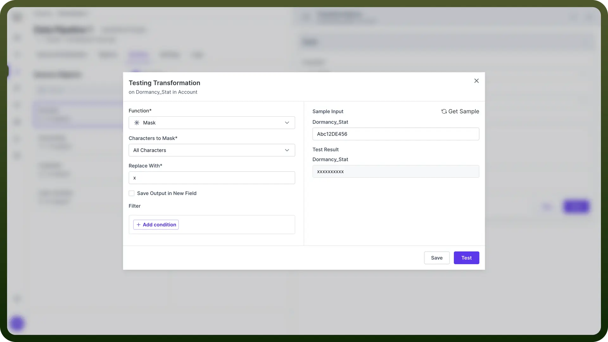
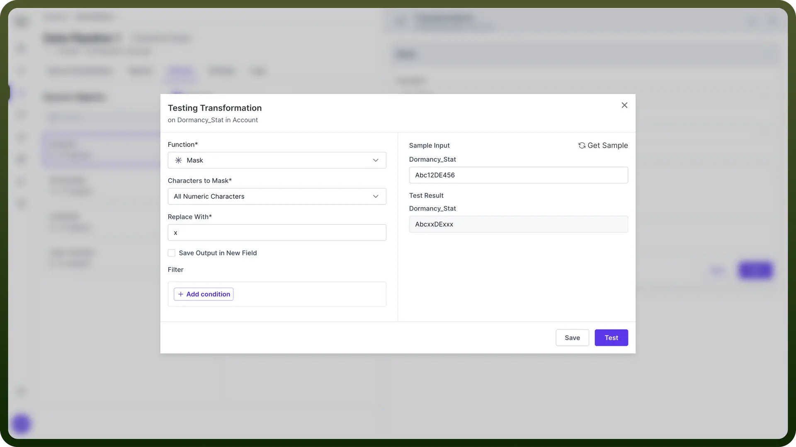
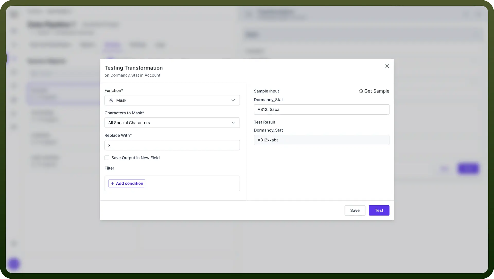
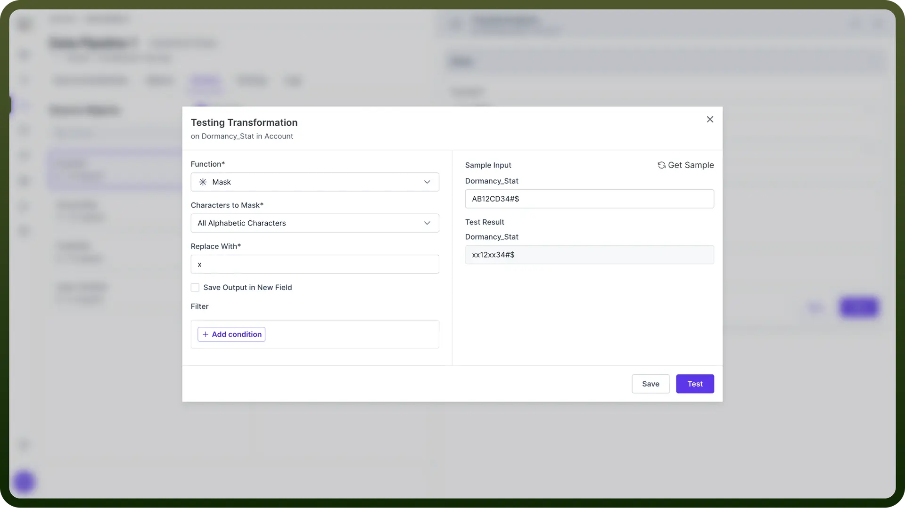
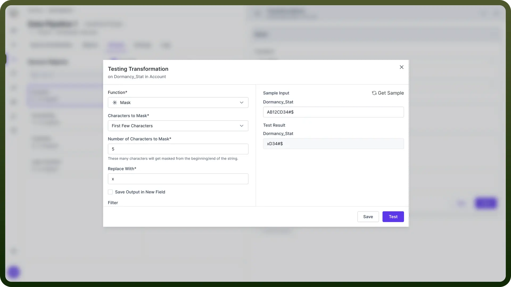
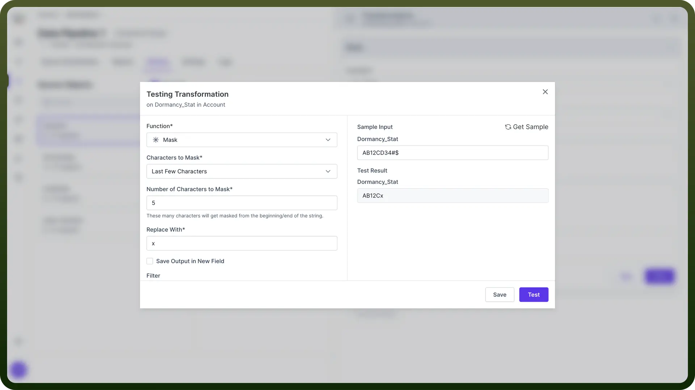
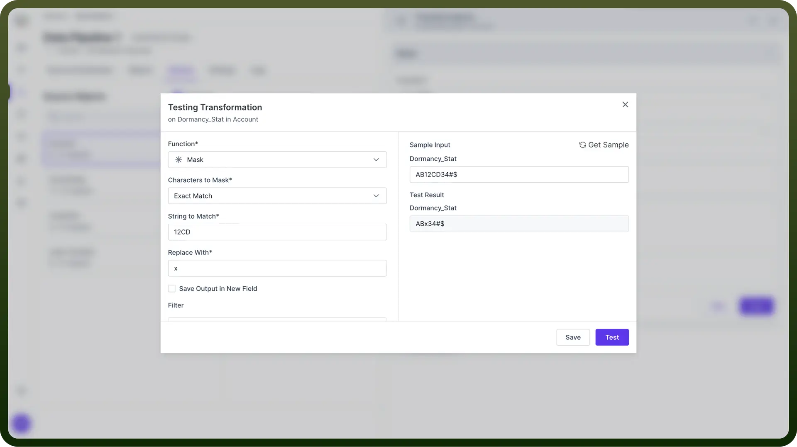

# Masking

Source: https://www.unifyapps.com/docs/unify-data/transformations-masking
Section: data

---

## Introduction

Data masking transformations can be used to **protect sensitive information** by replacing it with fictitious but realistic data. This process helps maintain **data privacy** while preserving the data's utility for development, testing, or analytical purposes.

## Why Use Data Masking?

1. **Risk Reduction**: Minimize the risk of data breaches in non-production environments.
2. **Data Privacy**: Protect individual privacy while maintaining data utility.
3. **Testing and Development**: Use realistic data without exposing sensitive information.

> **Note:** Before implementing data masking, conduct a thorough data audit to identify all sensitive information across your systems.

## Applying Mask Transformation

Follow these steps to apply the mask transformation:

1. Select "`Mask`" from the list of Functions.
2. Choose the "`Characters to Mask`" based on your requirements.
3. Configure additional options as needed.
4. Select a replacement character in the "`Replace With`" field.
5. Click "`Save`" to apply the transformation.

> **Note:** When choosing a replacement character, consider using one that maintains the visual length of the original data to prevent layout issues in applications.

## Masking Options

Various masking options are available to cater to different data protection needs:

1. All Characters
  - **Effect**: Masks every character in the string.
  - **Example**: "Abc12DE456" becomes "xxxxxxxxxx"
  - **Use Case**: When complete obfuscation is required.

    

2. All Numeric Characters
  - **Effect**: Masks **only** the numeric characters.
  - **Example**: "Abc12DE456" becomes "AbcxxDExxx"
  - **Use Case**: Protecting numeric data like account numbers. **Note:** For numeric data, consider using consistent replacement digits (e.g., all 9's or 0's) to maintain data type integrity.

    

3. All Special Characters
  - **Effect**: Masks special characters while preserving alphanumeric content.
  - **Example**: "AB12#$aba" becomes "AB12xxaba"
  - **Use Case**: Hiding specific markers or separators in data.

    

4. All Alphabetic Characters
  - **Effect**: Masks alphabetic characters, leaving numbers and special characters intact.
  - **Example**: "AB12CD34#$" becomes "xx12xx34#$"
  - **Use Case**: Obscuring names or text while preserving numeric data.

    

5. First Few Characters
  - **Effect**: Masks a specified number of characters from the beginning.
  - **Configuration**: Enter the "Number of Characters to Mask"
  - **Example**: "AB12CD34#$" becomes "xxxCD34#$" (masking first 3 characters)
  - **Use Case**: Partially obscuring identifiers while leaving some visible. **Note:** When masking partial strings, ensure that the remaining visible portion doesn't inadvertently reveal sensitive information.

    

6. Last Few Characters
  - **Effect**: Masks a specified number of characters from the end.
  - **Configuration**: Enter the "Number of Characters to Mask"
  - **Example**: "AB12CD34#$" becomes "AB12CDxxx" (masking last 3 characters)
  - **Use Case**: Hiding sensitive suffixes like domain names in email addresses.

    

7. Exact Match
  - **Effect**: Masks a specific substring within the data.
  - **Configuration**: Enter the exact "String to Match"
  - **Example**: "AB12CD34#$" becomes "ABxxxx34#$" (masking "12CD")
  - **Use Case**: Targeting specific known sensitive data patterns.

    

8. Use Regular Expression
  - **Effect**: Masks parts of the string that match a given regular expression.
  - **Configuration**: Enter a regular expression pattern
  - **Example**: "\d{4}" could mask any four-digit number in the string
  - **Use Case**: Advanced pattern-based masking for complex data structures.

> **Note:** Test your regular expressions thoroughly on a sample dataset before applying them to your entire database to ensure they catch all intended patterns without over-masking.

## Best Practices

1. **Consistency**: Use consistent masking across related data fields.
2. **Realism**: Choose masking techniques that preserve the look and feel of the original data.
3. **Comprehensive Coverage**: Identify all instances of sensitive data, including derived fields.
4. **Documentation**: Maintain clear documentation of masking rules and processes.

> **Note:** Regularly review and update your masking rules to account for new types of sensitive data or changes in data structures.
