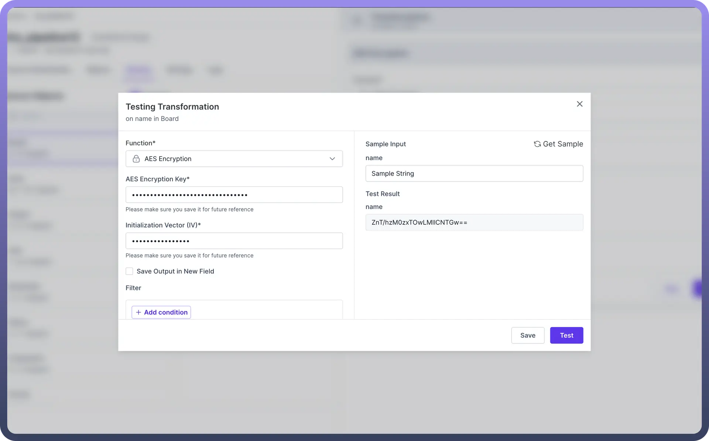
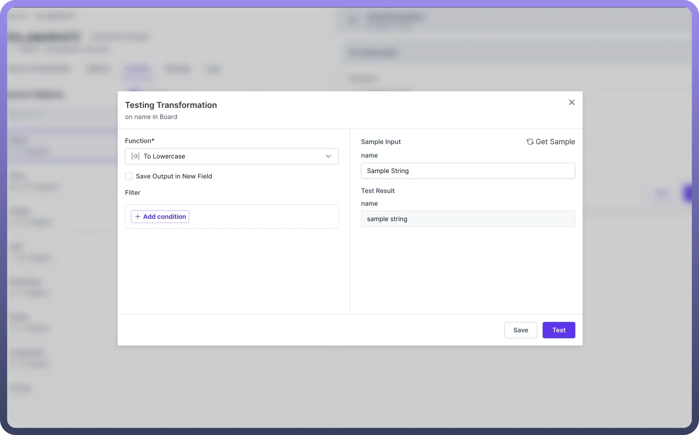
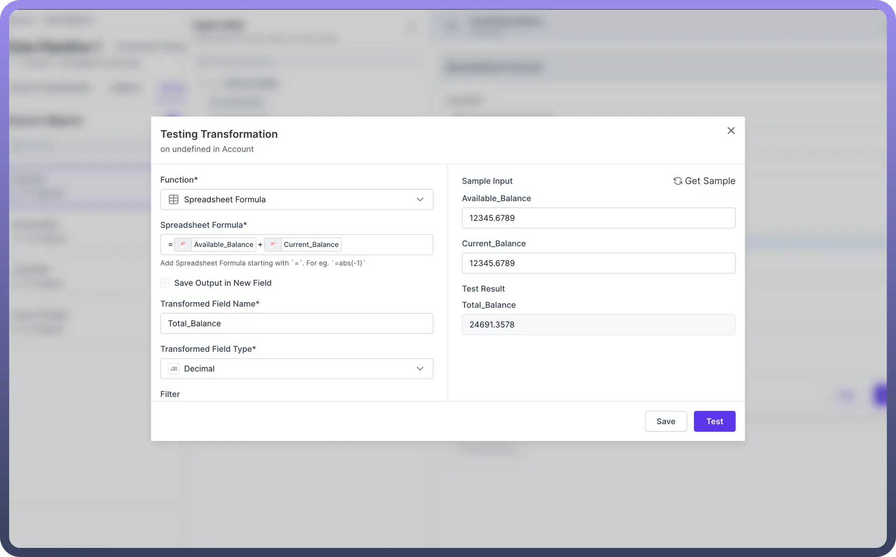
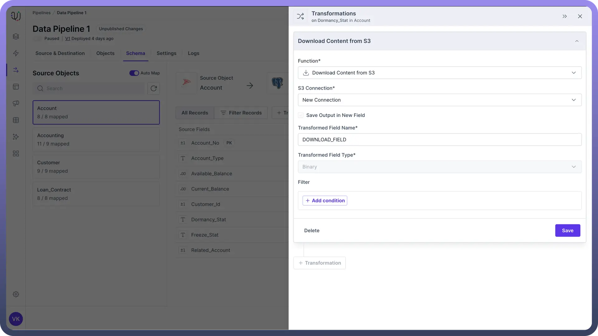
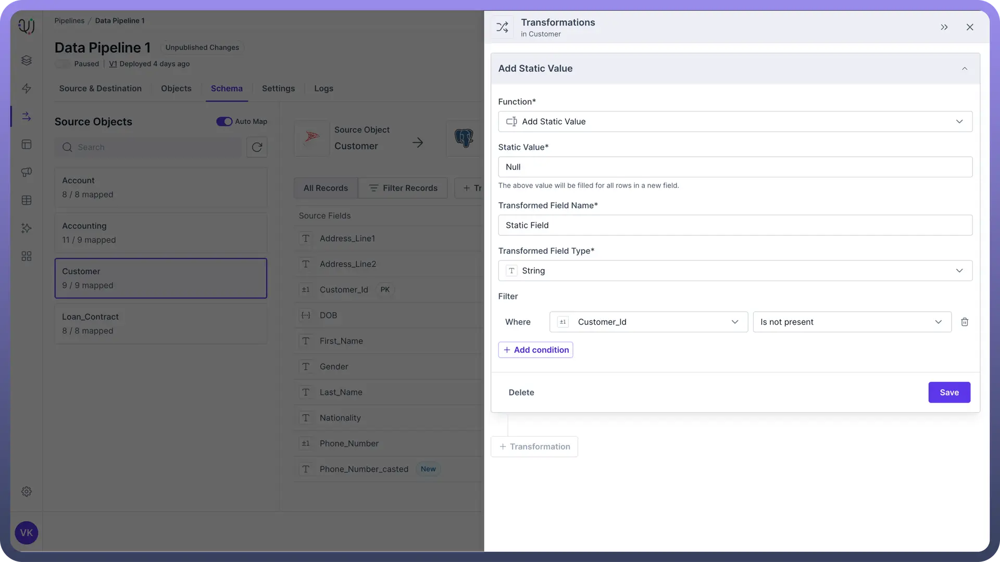

# Types of Transformations

Source: https://www.unifyapps.com/docs/unify-data/types-of-transformations
Section: data

---

Each type of transformation serves a unique purpose to enhance and make your data more useful. 
Whether you need to clean up messy data, secure your information, or add new details, we have a transformation for you.

Here are the various types of transformations we offer and how they can help improve your data.

### Data Shielding

Data shielding transformations focus on ensuring the **security** and **privacy** of your sensitive information:

- **Encryption**: Protect confidential data using advanced encryption algorithms.
- **Encoding**: Convert data into alternate formats for secure transmission or storage.
- **Masking**: Obscure sensitive information while maintaining data utility.

These transformations are crucial for safeguarding Personally Identifiable Information (PII) and complying with data protection regulations.

### Data Cleansing

Data cleansing transformations improve the **quality** and **consistency** of your data:

1. **Standardization**: Ensure uniform formatting across your dataset.
  - Text Casing Modification
2. **Error Correction**: Identify and rectify common data entry mistakes.
  - Extract Text

By applying these transformations, you can clean your data and increase its reliability and accuracy.

### Data Manipulation

Data manipulation transformations allow you to reshape and restructure your data:

1. **Formatting**: Adjust data presentation to meet specific requirements.
  - Cast
  - Duplicate Field
2. **Filtering**: Modifying fields based on specific criterions.
  - Replace Value
  - Spreadsheet Function

These transformations help tailor your data to the specific needs of your destination systems or analysis tools.

### Blob Storage

These transformations can manage and optimize the storage of unstructured data using Blob storage solutions like Amazon S3.

1. Download Content from S3
2. Upload Content to S3

### Data Enrichment

Data enrichment transformations add value to your existing datasets:

1. **Augmentation**: Incorporate additional context from external sources.
  - Lookup
2. **Derivation**: Generate new insights based on existing fields.
  - Callable Automation
3. **Classification**: Categorize data entries for improved organization and analysis.
  - Add Static Value

By applying these transformations, you can unlock hidden insights and enhance the overall value of your data assets.

### Best Practices

1. **Plan Your Transformation Strategy**: Before implementing transformations, define clear objectives for your data pipeline and identify which transformation types will best serve your goals.
2. **Maintain Data Lineage**: Keep track of all transformations applied to your data to ensure transparency and facilitate troubleshooting.
3. **Test Thoroughly**: Always test your transformations before applying them to your data pipeline to prevent unexpected issues.
