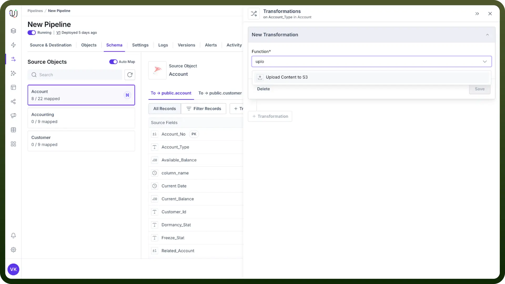
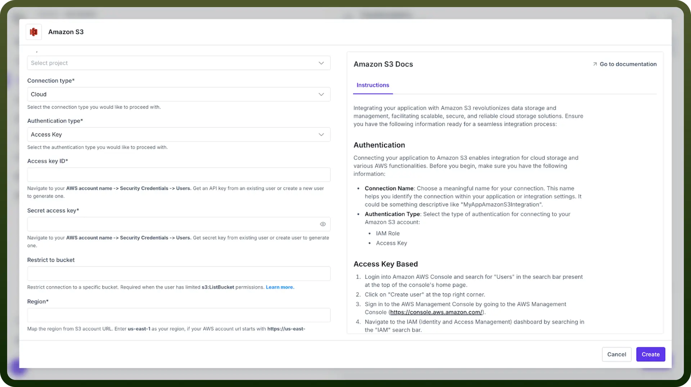
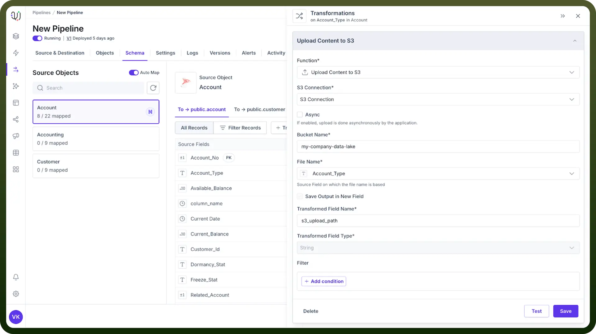

# Upload Content to S3

Source: https://www.unifyapps.com/docs/unify-data/upload-content-to-s3
Section: data

---

The Upload Content to S3 transformation moves your data directly to Amazon S3 cloud storage from within your data pipeline. This powerful capability bridges the gap between data processing and storage, enabling seamless integration with the AWS ecosystem and beyond.

## Why Use Upload Content to S3?

- **Centralize Your Data** - Store processed information in a reliable, highly available cloud repository
- **Enable Downstream Processes** - Trigger AWS Lambda functions, data analytics, or machine learning workflows
- **Simplify Distribution** - Share data with other teams, systems, or business partners
- **Create Data Archives** - Maintain historical records for compliance or reference purposes

> **Note:** Before implementing this transformation, verify you have proper AWS credentials and bucket write permissions configured in your environment.

## Setting Up the S3 Upload Transformation

1. Navigate to your transformation menu and select "`Upload Content to S3`"
2. Choose or create an Amazon S3 connection
3. Configure the required parameters (detailed below)
4. Test the connection with sample data
5. Save and apply the transformation

## Configuration Parameters

1. **S3 Connection** Establishes authentication with AWS using your credentials. **Options:** **Security Best Practice:** Use IAM roles with temporary credentials rather than long-term access keys when possible. **Note:** Check the documentation for Amazon S3 connector [here](https://www.unifyapps.com/docs/unify-automations/amazon-s3).

  

  - Select an existing connection from your saved connections
  - Create a new connection with your AWS access key, secret key, and region
2. **Bucket Name** Specify the destination S3 bucket for your uploads. **Examples:**
  - company-data-lake
  - customer-analytics-prod
  - financial-reports-archive
3. **File Name Field** Specifies which field in your dataset contains the name to use for the uploaded file in S3. **How It Works:** **Examples:**
  - Select an existing field from your dataset that contains the desired filename
  - The value in this field will be used as the actual filename in S3
  - The field can contain just the filename or include a path structure
  - Field value: report.csv → Uploads to s3://bucket-name/report.csv
  - Field value: customer_123/profile.json → Uploads to s3://bucket-name/customer_123/profile.json
  - Field value: reports/2024/04/daily.parquet → Uploads to s3://bucket-name/reports/2024/04/daily.parquet
4. **Transformed Field Name** Creates a new field in your data that stores the complete S3 URL of the uploaded file. **Example Value:** s3://company-data-lake/reports/monthly/2024/04/data.parquet

  

## How It Works?

This transformation follows these steps during execution:

1. Reads the current record's data from the pipeline
2. Establishes a secure connection to your S3 bucket
3. Uploads the content with the specified file name
4. Generates the complete S3 path/URL
5. Adds this path as a new field in your data record

## Common Use Cases

| **Scenario** | **File Type** | **Naming Strategy** | **Benefit** |
|---|---|---|---|
| Daily reports | CSV files | reports/${DATE}/summary.csv | Automatic date organization |
| Customer data | JSON objects | customers/${CUSTOMER_ID}.json | Easy lookup by ID |
| Image processing | Binary files | images/processed/${TIMESTAMP}.jpg | Chronological tracking |
| Log archiving | Text files | logs/${APP_NAME}/${DATE}/${HOUR}.log | Hierarchical organization |

## Best Practices

- **Structure Your Data** - Use folder paths in your file names to create logical organization
- **Consider File Formats** - Choose appropriate formats (CSV, JSON, Parquet) based on downstream needs
- **Set Up Lifecycle Rules** - Configure S3 lifecycle policies to automatically archive or delete old files
- **Monitor Costs** - Watch your S3 storage usage and implement appropriate storage classes
- **Implement Error Handling** - Create fallback procedures for failed uploads

## Troubleshooting

**Issue: Upload failures**

- Check your AWS credentials and permissions
- Verify network connectivity to AWS
- Ensure the bucket name is correct and accessible

**Issue: Files overwritten unexpectedly**

- Implement unique naming with timestamps or UUIDs
- Enable S3 versioning on your bucket
- Use conditional checks before uploads

**Issue: Slow performance**

- Consider compressing large files before upload
- Evaluate your network bandwidth limitations
- For very large files, explore multipart uploads
