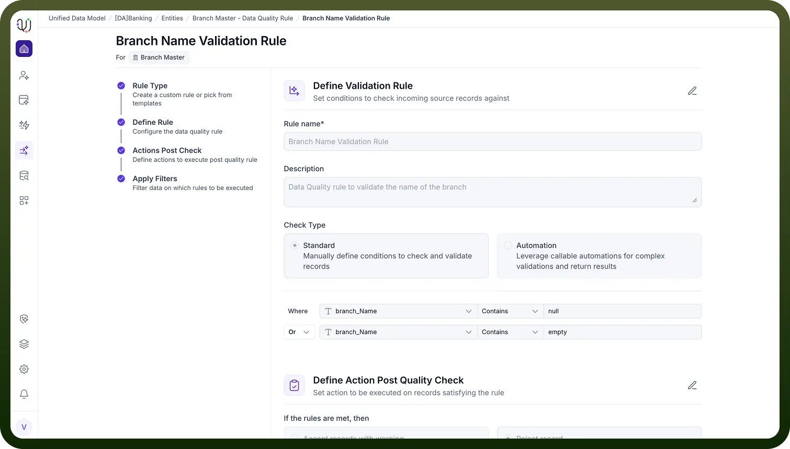
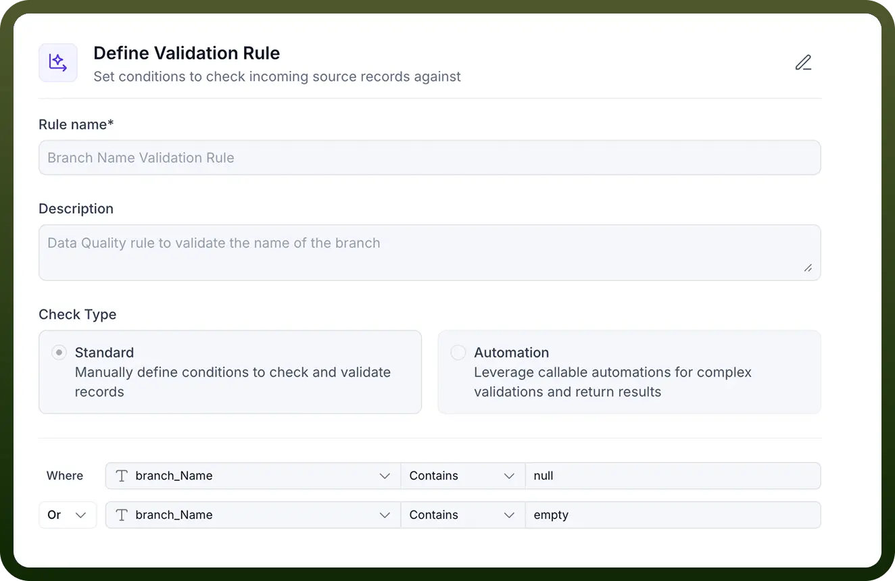

# Validation Rules

Source: https://www.unifyapps.com/docs/unify-data/validation-rules
Section: data

---

Validation Rules are verification mechanisms that test whether data conforms to predefined criteria, business logic, or technical constraints. These rules act as quality checkpoints that prevent invalid, incomplete, or non-compliant data from entering or propagating through your systems. Validation helps us to find whether our data meet our quality standards.

#### **Purpose**

- Ensure Data Integrity: Verify that data adheres to defined formats, data types, and structural requirements
- Enforce Business Logic: Confirm data satisfies business-specific rules and constraints
- Prevent Downstream Errors: Stop invalid data before it causes failures in dependent systems
- Maintain Compliance: Ensure data meets regulatory and governance requirements

#### **Technical Implementation in UnifyApps**

UnifyApps supports two primary approaches for implementing data validation, depending on the complexity of the logic required and where the validation needs to occur.

### **Standard Validation Rules**

Standard rules are built using simple conditions or grouped conditions applied directly to Entity attributes. 
 They are ideal for enforcing common data requirements such as:

- Required fields
- Value ranges
- Pattern or format checks
- Cross-field comparisons **Automation-Based Validation Rules** For scenarios requiring more advanced logic, UnifyApps allows validation to be implemented through workflow automations in the iPaaS layer. This method supports:
- Multi-step or conditional logic
- Complex decision trees
- Calls to third-party services for external validation
- Branching outcomes based on rule results
- Automated alerts or corrective workflows **Validation Type****Description****Example****Format Vaidation**Ensures data matches expected patternEmail format, phone number format, postal code**Range Validation**Checks numeric values fall within boundsAge between 0-120, percentage 0-100**Length Validation**Verifies string length constraintsPassword min 8 chars, description max 500 chars**Type Validation**Confirms data type correctnessField expecting number doesn't contain text**Uniqueness Validation**Ensures no duplicate valuesEmail must be unique, order number unique**Dependency Validation**Validates based on other field valuesIf country=USA, state must be US state code**Custom Business Rules**Application-specific validation logicOrder total equals sum of line items

