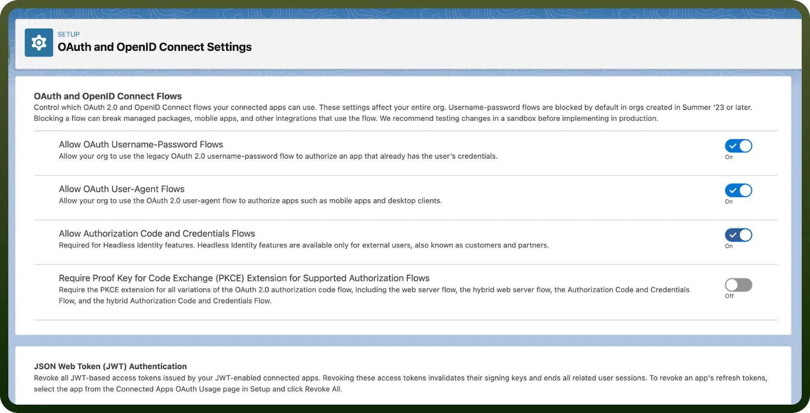
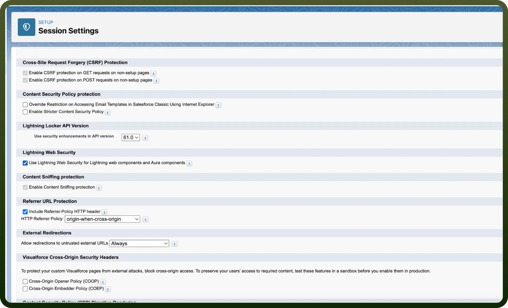
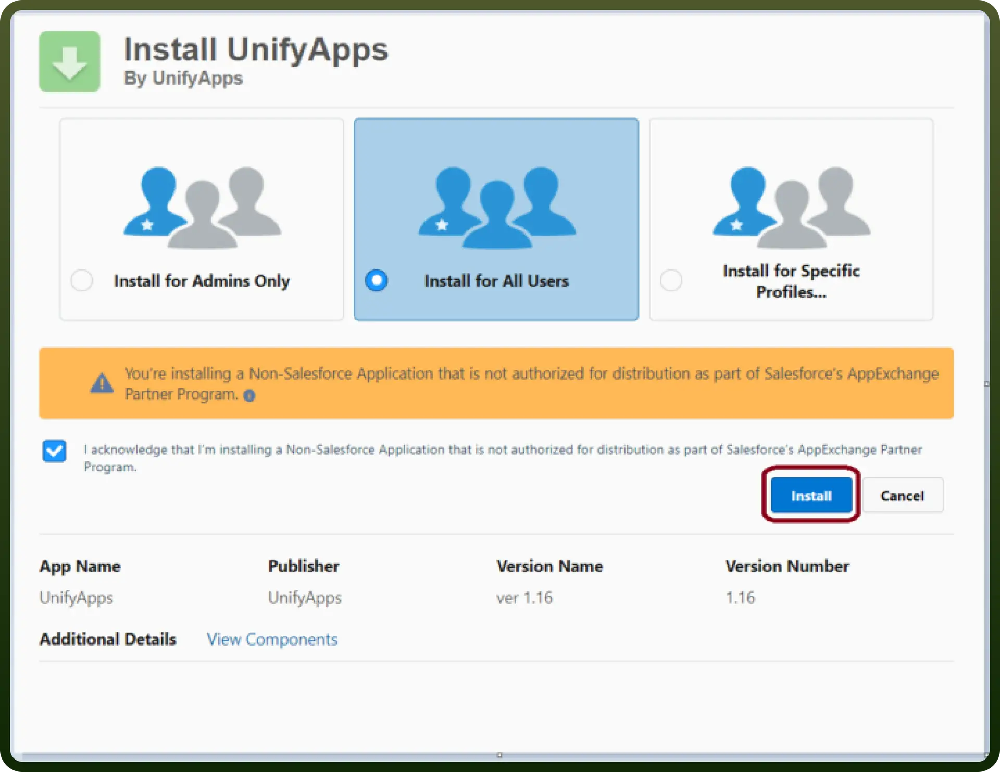
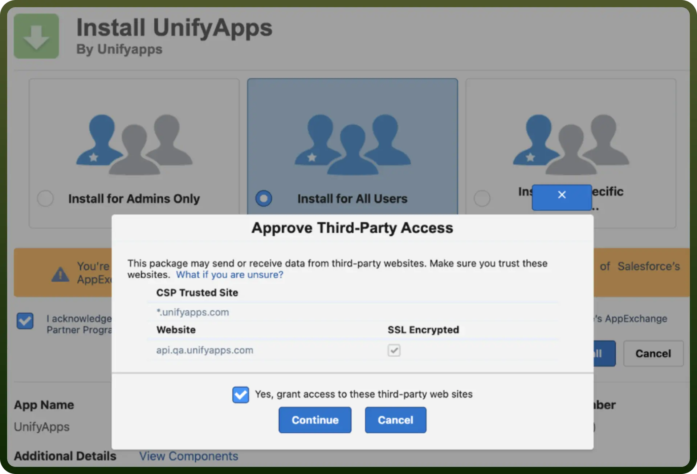
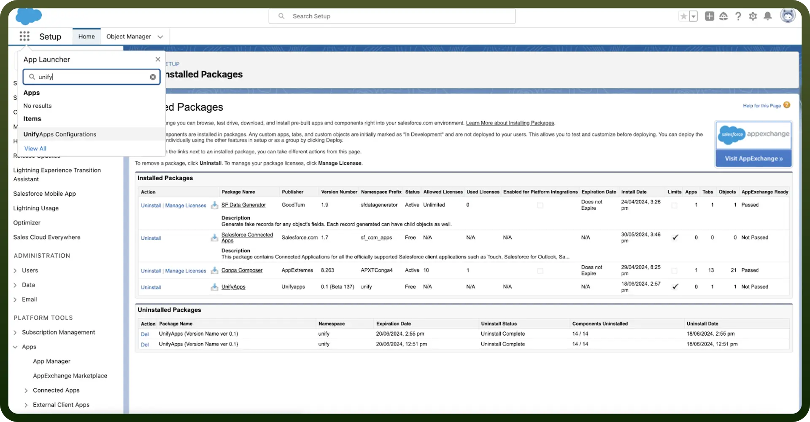
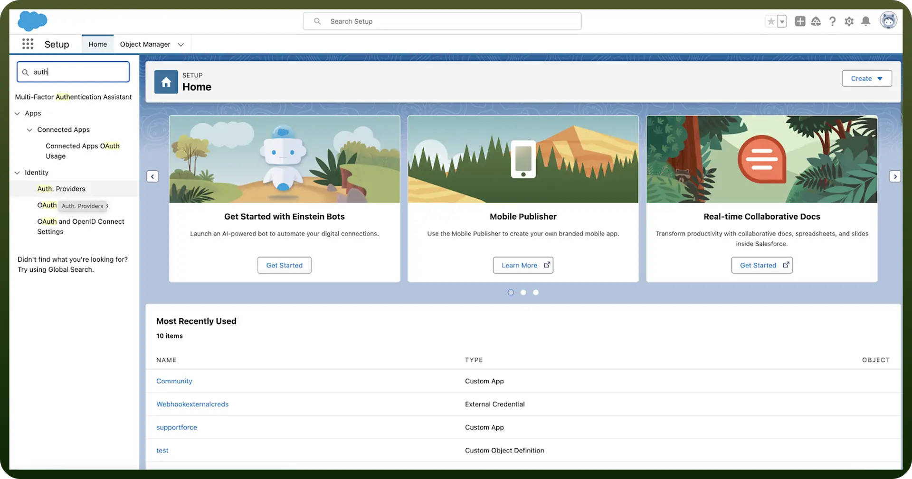
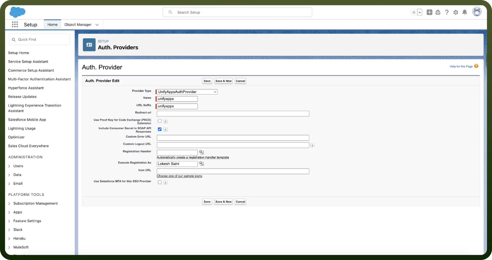
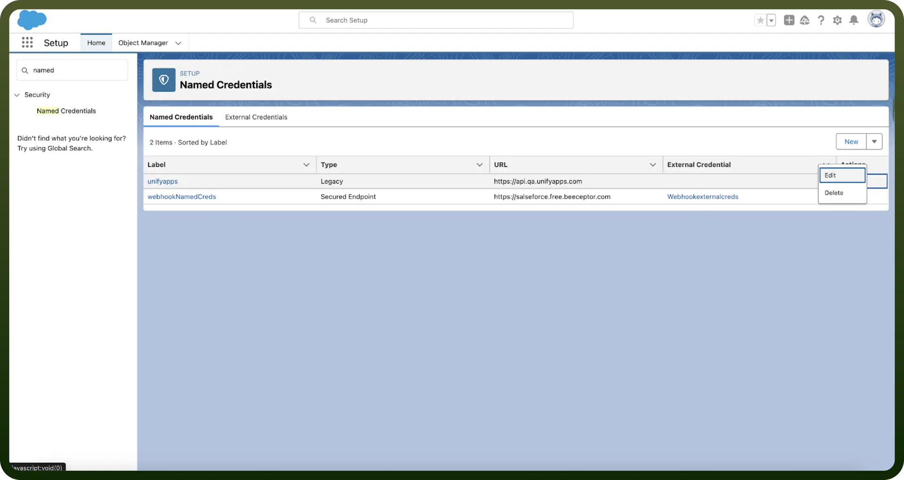
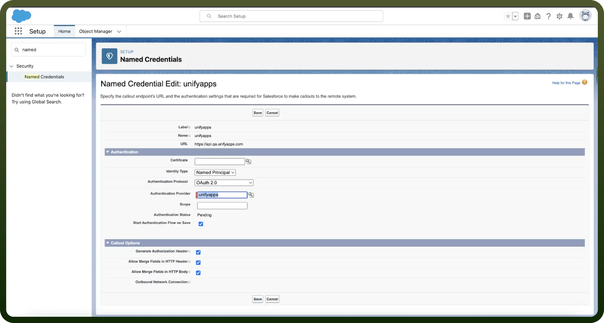

# Embed Salesforce

Source: https://www.unifyapps.com/docs/embedded-integrations/application-embed-salesforce
Section: embedded-integrations

---

## Overview

Embedding UnifyApps applications in Zendesk allows seamless integration of UnifyApps features within your Shopify store.

## Step-by-Step Instructions

### Pre Requisite 1

- Ensure that “`Allow Authorisation Code and Credentials Flows`” is enabled in OAuth and OpenID Connect Settings.
- This is required to fetch Salesforce data in UnifyApps

  

### Pre-Requisite 2

Enable “`Use Lightning Web Security for Lightning web components and Aura components`” in Session Settings.

### Step 1: Install UnifyApps

To begin the integration, you must install the UnifyApps package into your Salesforce organization.

**Package Details:** Version: 1.23

**Published Date:** Apr 14, 2025

**Installation Link:** [Install UnifyApps Package (v1.23)](https://login.salesforce.com/packaging/installPackage.apexp?p0=04tdL0000009C5BQAU)

**Instructions:**

1. Click the link above to be redirected to the Salesforce installation screen.
2. Choose Install for All Users
3. Click the Install button
4. Approve third-party access for Salesforce and click Continue
5. Wait a few minutes for the installation to complete.

*(Note: The UnifyApps package is currently undergoing the AppExchange approval process and will be available there directly in the coming months.)*

-

  

  

### Step 2: Configure UnifyApps

- In Salesforce, Click on `App launcher` and open Unify Apps configuration.
- Enter `Domain` & `Tenant ID`

### Step 3: Authenticate UnifyApps

- Go to the setup page under Settings.
- Search for Auth Providers in setup.
- Create a New Auth with AuthProvider Named “UnifyAppsAuthProvider”

  

- Choose UnifyAppsAuthProvider as Provider Type.
- Keep Name & URL Suffix as unifyapps.
- Choose an admin from your SF org for Execute Registration As Field.
- Click on `Save` Button

  

### Step 4: Named Credentials

- Search for Named Credentials in Setup.
- Edit unifyapps named credentials

  

- Choose `OAuth 2.0` as Authentication Protocol.
- Choose unifyapps as Authentication Provider.
- Select “`Start Authentication Flow on Save`”
- Click on `Save` Button

  

### Step 5: App Builder

- Open Page where you want to add UnifyApps Interface component
- Search for UnifyApps Interface component in Custom-Managed Components.
- Drag and Drop UnifyApps Interface component in the screen to add it
- Add Interface and page id to render UnifyApps application page.
