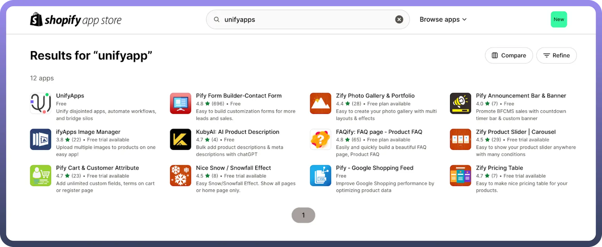
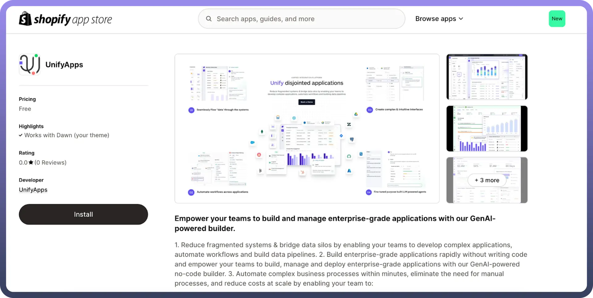
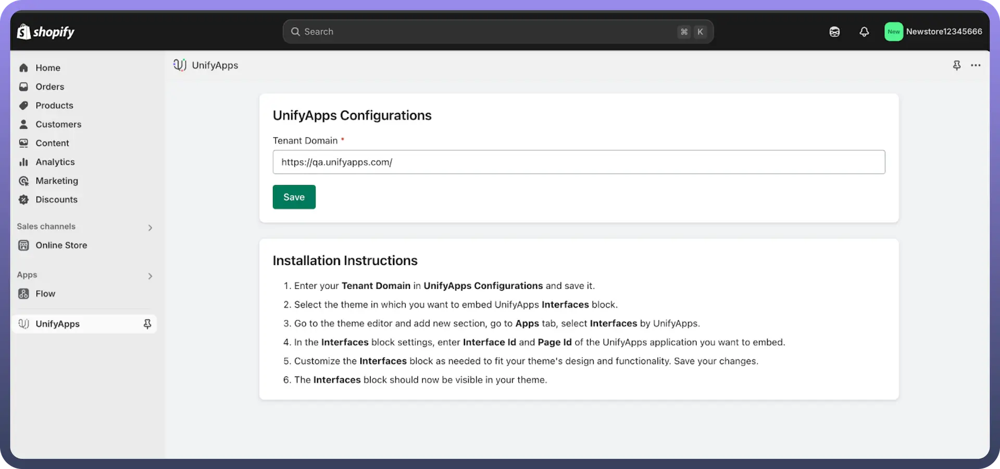
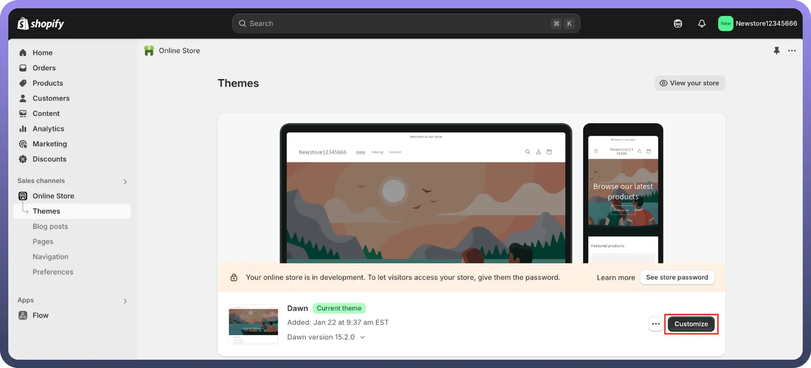
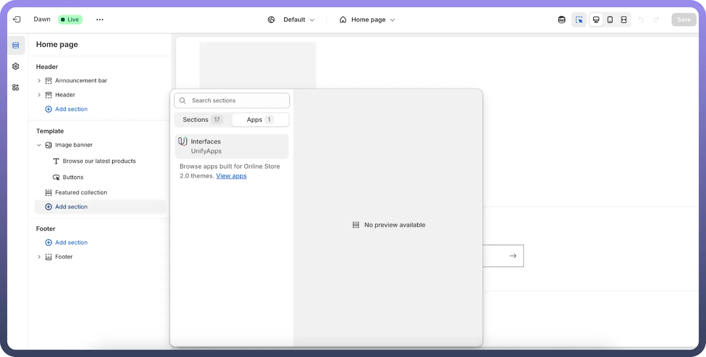
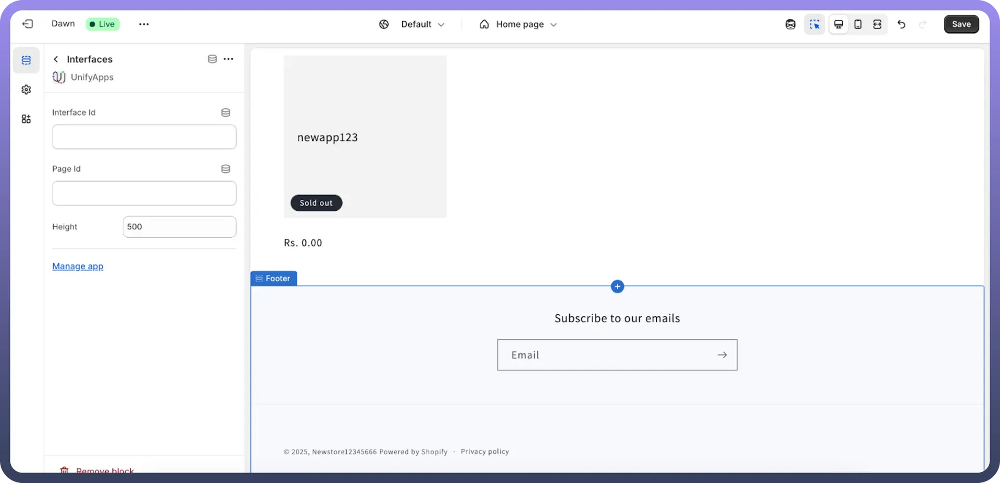
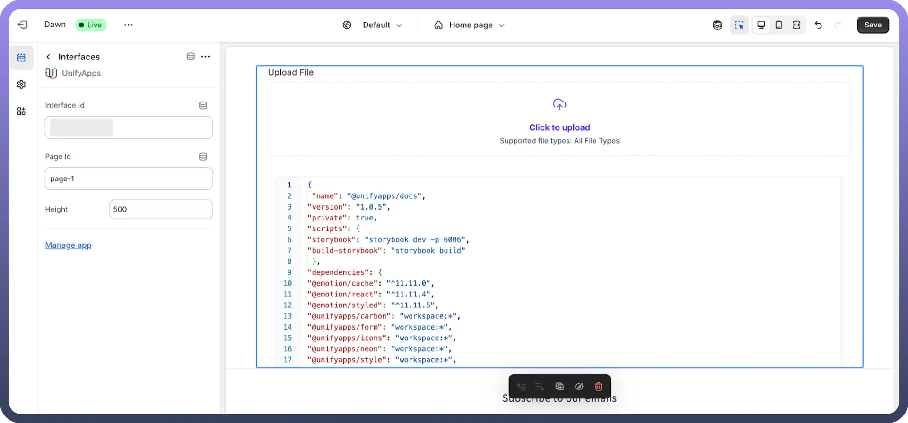

# Embed Shopify

Source: https://www.unifyapps.com/docs/embedded-integrations/application-embed-shopify
Section: embedded-integrations

---

## Overview

Embedding UnifyApps applications in Shopify allows seamless integration of UnifyApps features within your Shopify store.

## Step-by-Step Instructions

### Step 1: Add Shopify Token to the Application

- For the application you want to embed, you will need to add the Shopify token to it to enable proper integration.
- To obtain the required credentials, contact [support@unifyapps.com](mailto:support@unifyapps.com)**.**

### Step 2: Search for UnifyApps in the Shopify App Store

- Navigate to the Shopify App Store and search for "`UnifyApps`".

### Step 3: Install the UnifyApps Application

- Click on the UnifyApps application and install it in your Shopify store.

### Step 4: Provide a Tenant App URL

- Inside the UnifyApps application, provide the main URL of the environment your application is hosted on. For example: https://xyz.abc.unifyapps.com

### Step 5: Navigate to the Online Store Customization Section

- Go to the online store where you want to embed the UnifyApps application.
- Click on `Customize` to modify the store layout.

### Step 6: Add UnifyApps as a Section

- In the `Sections` tab, click `Add Section` at the desired location within the sequence of elements on your page.

### Step 7: Configure UnifyApps Interface

- Select `UnifyApps` from the available sections.
- Enter the required `Interface ID` and `Page ID` based on your application’s URL structure.
  - Example URL: https://xyz.unifyapps.com/p/0/interfaces/**interface-ID**/builder/**page-Id**

### Step 8: Adjust the Display Width

- Configure the width of the UnifyApps interface according to your store layout needs.
