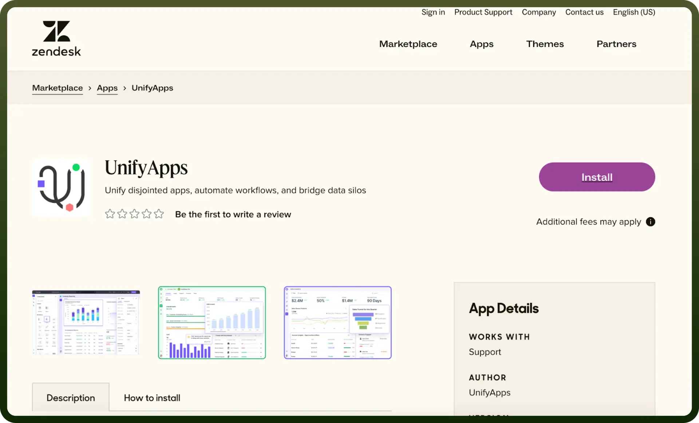
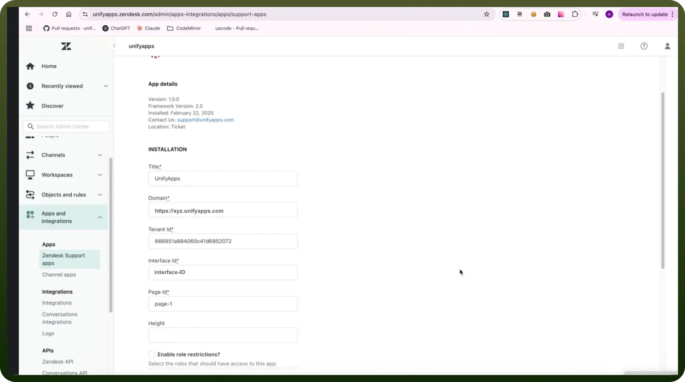
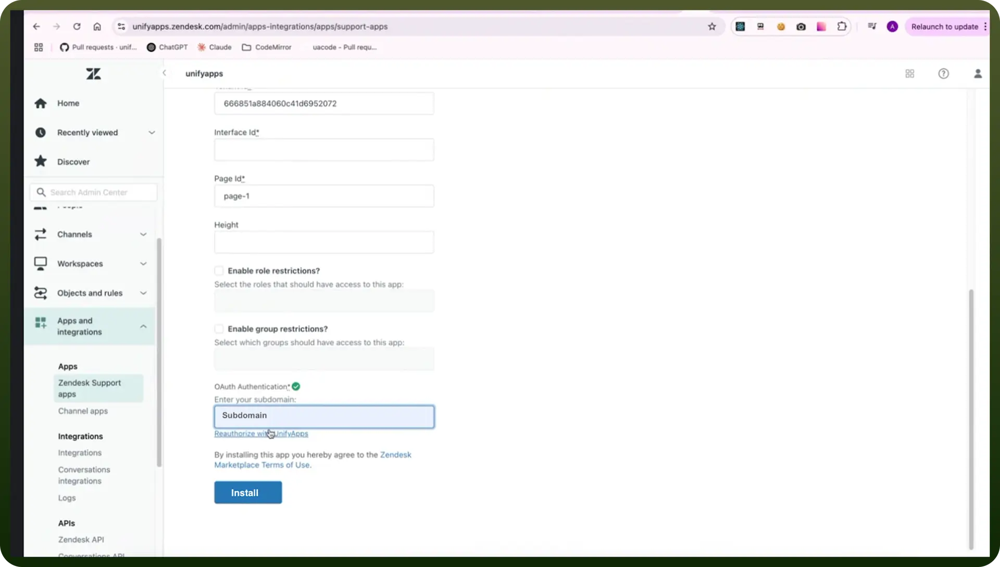
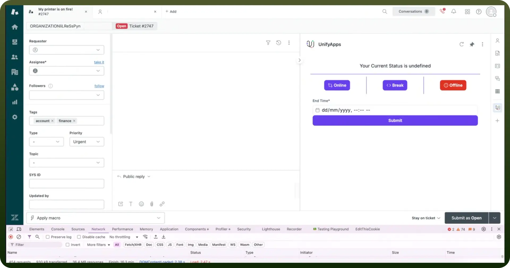

# Embed Zendesk

Source: https://www.unifyapps.com/docs/embedded-integrations/application-embed-zendesk
Section: embedded-integrations

---

## Overview

Embedding UnifyApps applications in Zendesk allows seamless integration of UnifyApps features within your Zendesk support environment.

## Step-by-Step Instructions

### Step 1: Search for UnifyApps in the Zendesk App Store

- Navigate to the Zendesk App Store and search for "`UnifyApps`," or follow this link:[UnifyApps on Zendesk Marketplace](https://www.zendesk.com/in/marketplace/apps/support/1052876/unifyapps).

### Step 2: Install the UnifyApps Application

- Click the `Install` button to add the UnifyApps application to your Zendesk support environment.

### Step 3: Configure UnifyApps in Zendesk Support Apps

- Go to `Apps and Integrations` under Zendesk Support Apps.
- Fill in the required configuration details:
  - `Title` – Provide a relevant title for the integration.
  - `Domain` – Enter your UnifyApps domain (e.g., xyz.prod.unifyapps.com).
  - `Tenant ID` – Specify the tenant ID associated with your environment.
  - `Interface ID` – Enter the interface ID corresponding to your application.
  - `Page ID` – Provide the specific page ID to be used.
  - `Height` – Adjust the height settings for the embedded app.
  - `Role-Based Access` – Enable role restrictions and select which roles should have access to this app.
  - `Group-Based Access` – Enable group restrictions and choose the groups allowed to use the app.
  - `Authentication` – Enter your subdomain and reauthorise with UnifyApps.
- Ensure that the `Interface ID`**,** `Page ID`**,** and `Subdomain` align with your application’s URL structure:
  - Example URL: [https://Subdomain.unifyapps.com/p/0/interfaces/interface-ID/builder/page-Id](https://subdomain.unifyapps.com/p/0/interfaces/interface-ID/builder/page-Id)
- Click on Install.

### Step 4: Place the Embedded Apps

- Position the UnifyApps embedded applications in your Zendesk environment based on your business needs.
