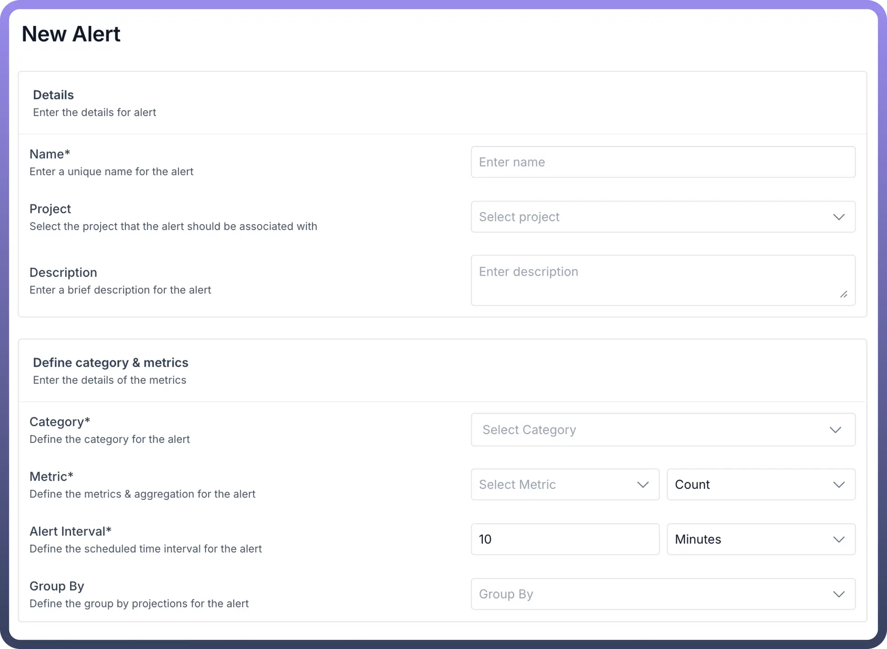
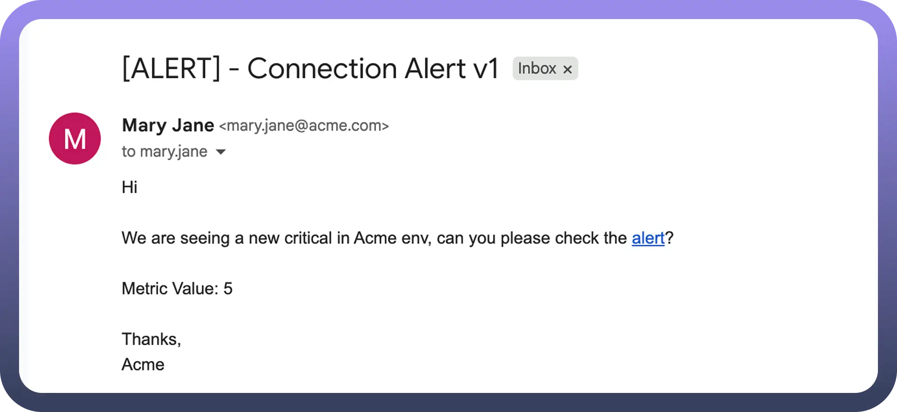
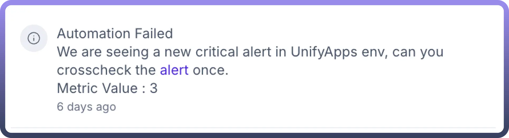
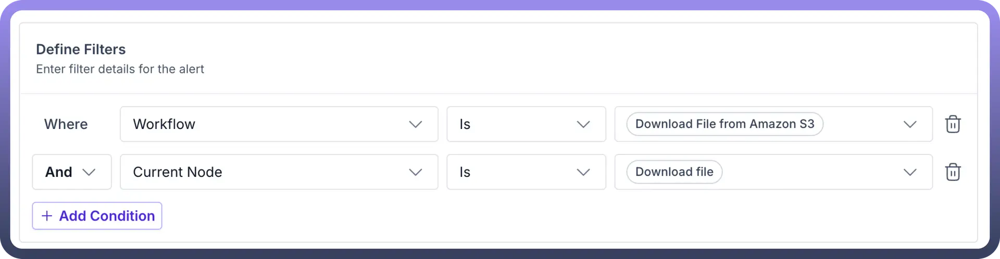
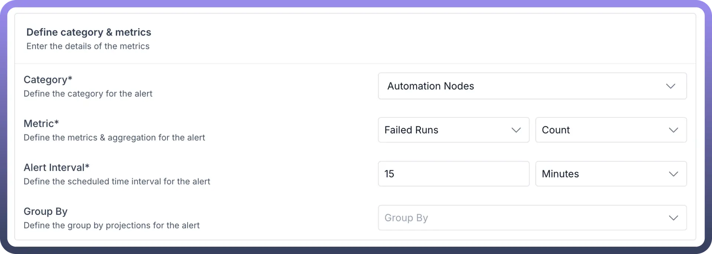
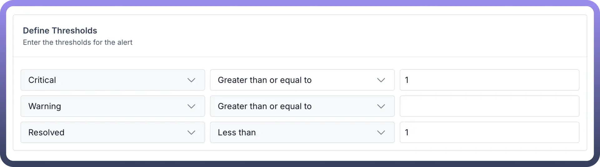
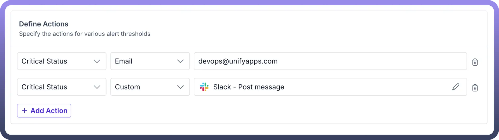

# Alert Manager by UnifyApps

Source: https://www.unifyapps.com/docs/governance/alert-manager-by-unifyapps
Section: governance

---

## Overview

Alert Manager by UnifyApps can be used to monitor your entire integration platform with intelligent alerts for automations, automation nodes, data pipelines, API endpoints, and connections. Track performance metrics, set thresholds, and get instant notifications when issues arise—ensuring smooth operations across your entire iPaaS platform.

## Use Case

Let's say you have a daily backup process that downloads important customer data files from Amazon S3 to your local system at midnight. You need to ensure these critical backups happen without fail.

With Alert Manager, you can:

1. Monitor the S3 download automation workflow by adding filters specifically for the "`Download File`" node.

  

2. Configure warning alerts if file download takes longer than 15 minutes.
3. Set critical alerts if downloads fail or files are missing.
4. Send immediate email notifications to your DevOps team.
5. Get Slack alerts when AWS connection issues occur.
6. Monitor successful runs to ensure daily backup completion.

This ensures your backup data is always available and any S3 download issues are caught immediately, preventing data availability problems the next business day.

## How to set up alerts using Alert Manager ?

- Navigate to '`Alert Manager`' inside Settings, and select '`+ New Alert`', and provide a name & description relevant to your alert.
- **Configure Category & Metrics:** Choose the appropriate category and metrics that align with your monitoring requirements. Also set a monitoring interval that matches the desired response time.

| **Category** | **Description** | **Available Metrics** |
|---|---|---|
| `Automation Nodes` | Components that perform specific tasks in workflows | Total Runs Successful Runs Failed Runs Execution Time Wait Time |
| `Automation` | Complete workflow monitoring | Total Runs Successful Runs Failed Runs Execution Time Wait Time |
| `Pipelines` | Data movement and transformation processes monitoring | Load successful Load skipped Load fail Total number of records ingested Latency Throughput |
| `Connection` | External app connection monitoring | Execution Time Rate limited violations Total Requests |
| `API Endpoint` | API Endpoint monitoring | Total Requests Execution Time Policy violations count Successful Runs Failed Executions |

- **Define Filters:** Configure filters to narrow down the monitoring scope to specific automations, automation nodes, or components you want to track.

  

- **Set Thresholds:** Establish trigger points for different severity levels.
  - **Critical:** Set values for immediate action requirements
  - **Warning:** Configure thresholds for preventive notifications
  - **Resolved:** Specify conditions that indicate return to normal operations

The values should reflect your system's operational boundaries and business impact levels.

- **Configure Actions:** Define notification methods for each threshold status (Critical, Warning, Resolved). For any status level, choose from platform notifications to specific users, email notifications with recipient addresses, or custom app connectors for third-party integrations. Multiple notification methods can be configured for each status using the "`Add Action`" option.

  

- Save your configuration by clicking on the ‘`Save`’ button and click on toggle button in front of the alert to activate it.

The alert will now monitor your specified processes and notify designated recipients according to your configured conditions.

> **Note:** The users need to use Group By 'Per Automation' to enable clickable links in alert notifications that redirect users to the specific automation triggering the threshold alert.
