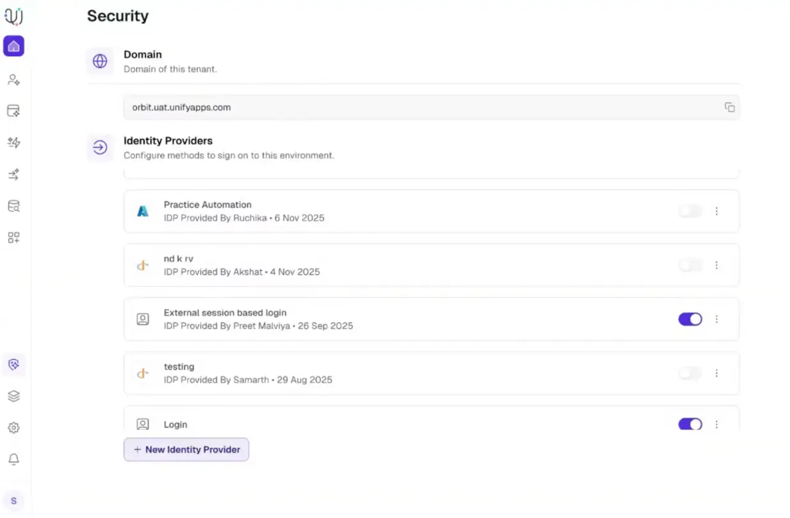
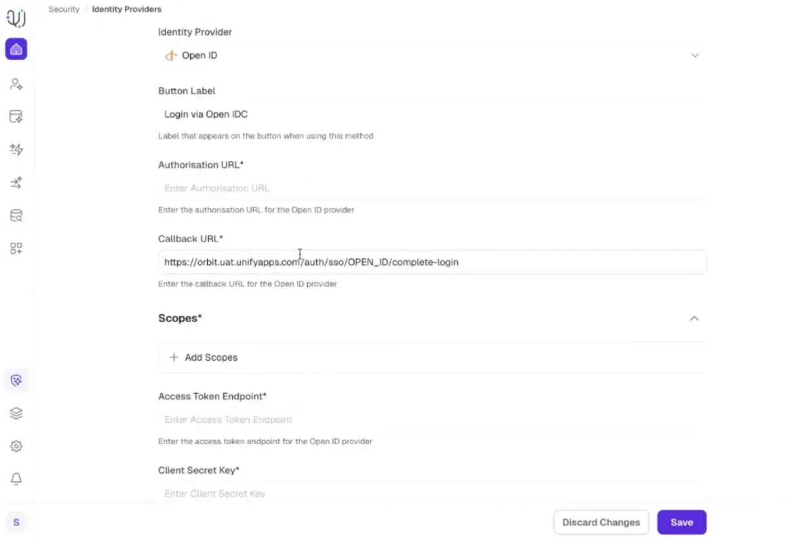
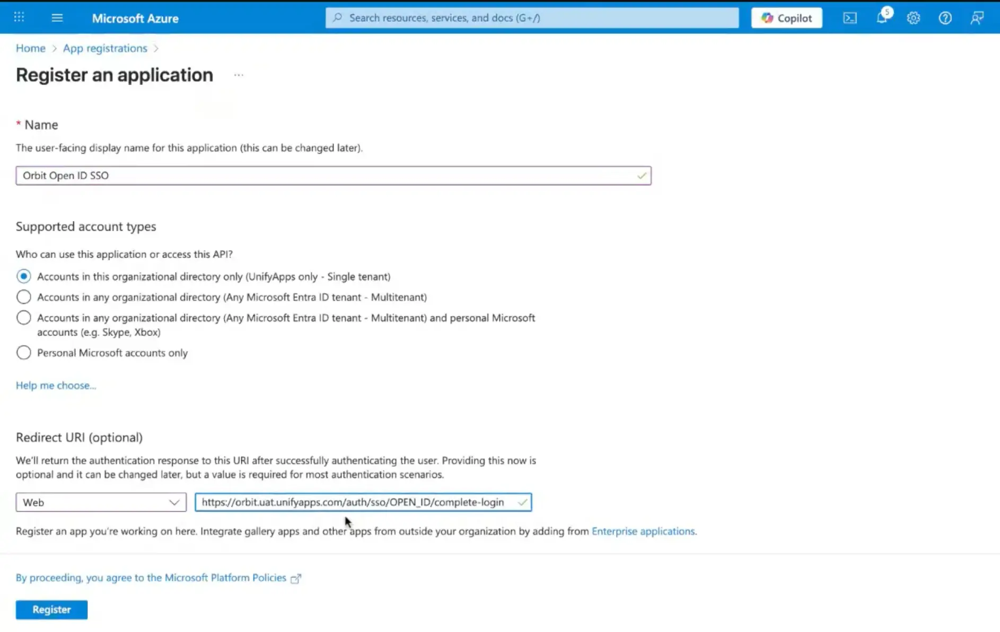
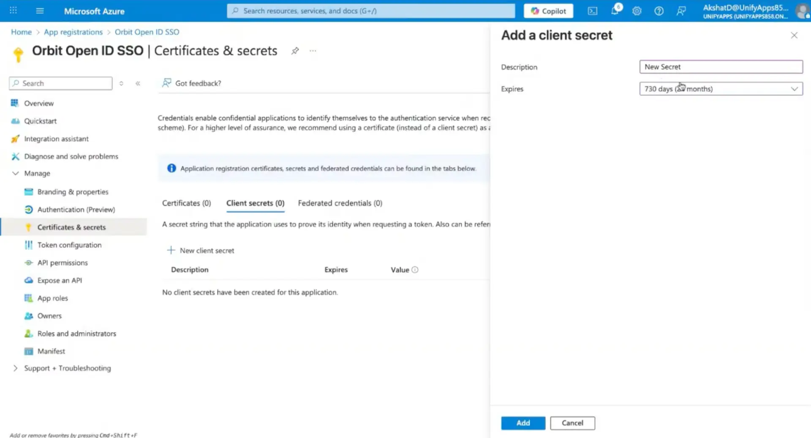
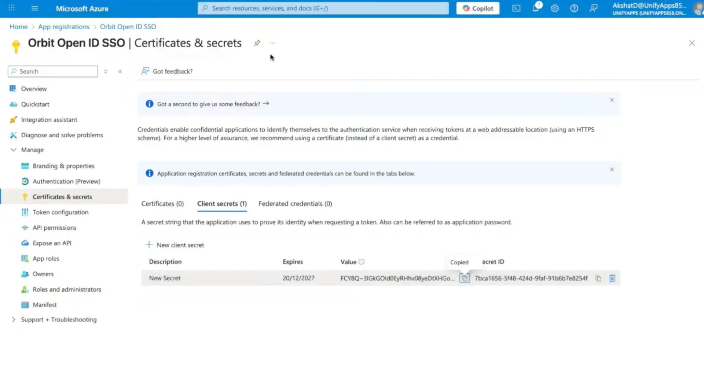
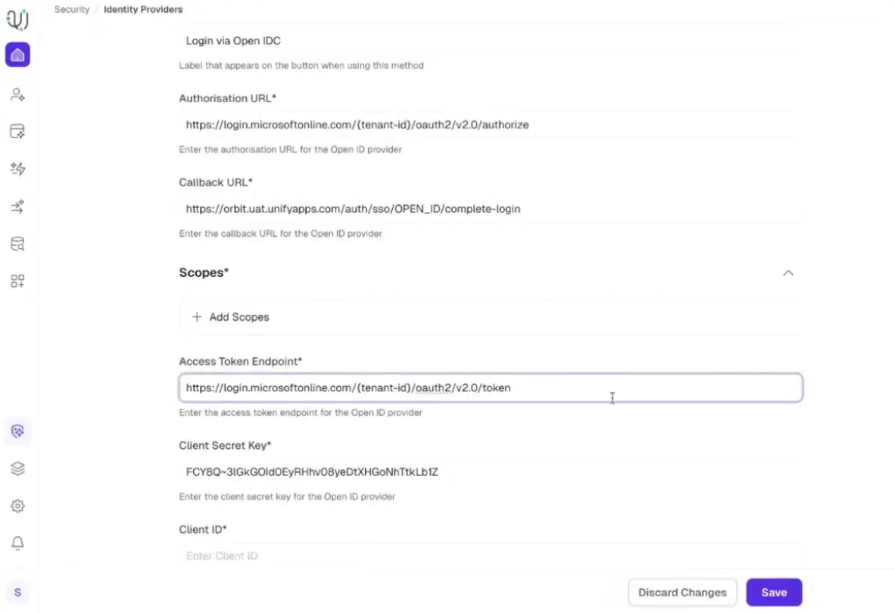
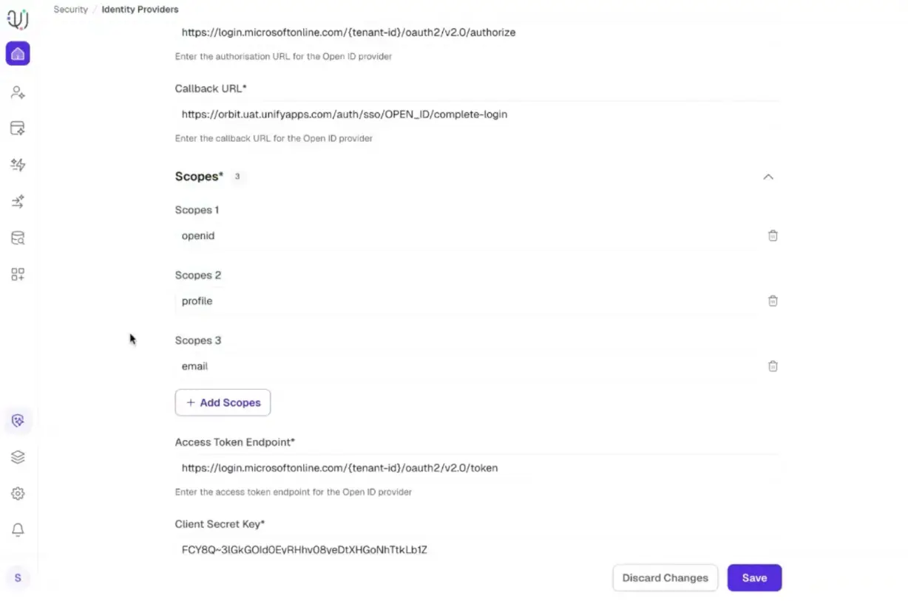
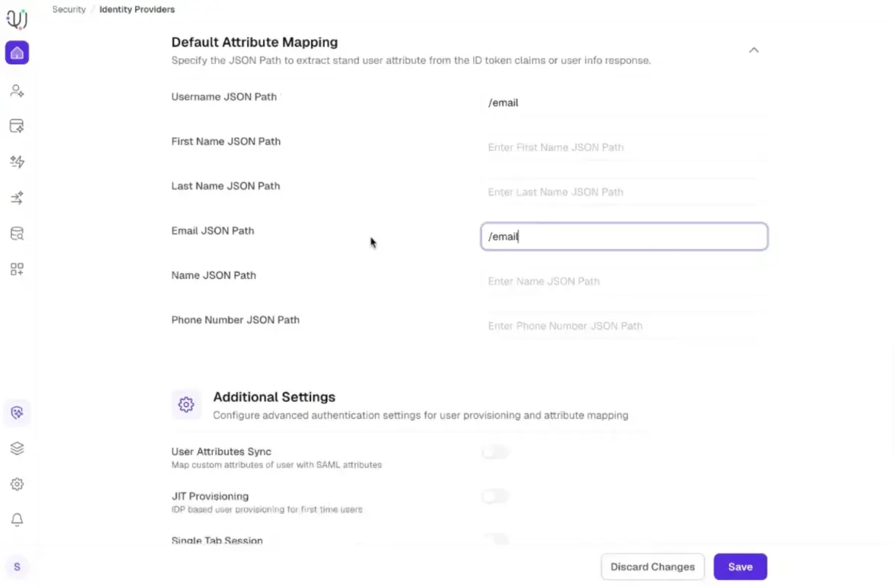
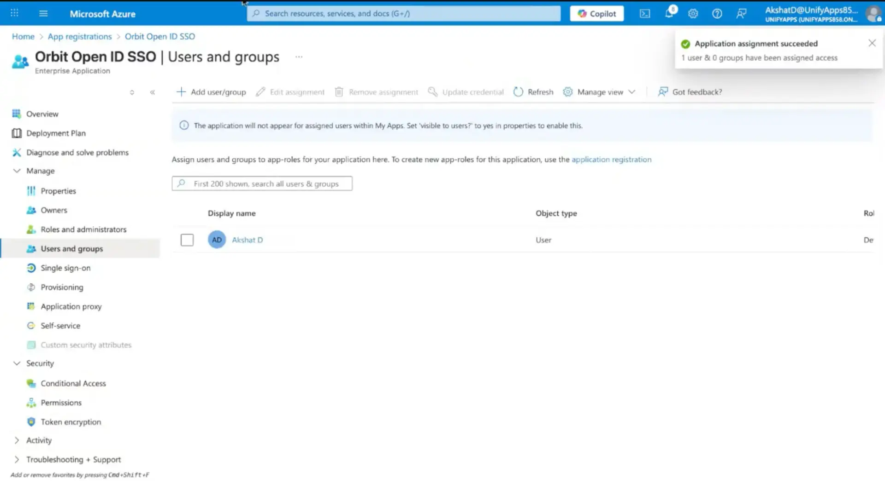

# Azure OpenID SSO Configuration

Source: https://www.unifyapps.com/docs/governance/azure-openid-sso-configuration
Section: governance

---

# **1. Configure Identity Provider in UnifyApps**

Follow the steps below to establish a Single Sign-On (SSO) connection using OpenID between UnifyApps and Microsoft Azure.

**STEP 1 · Open Identity Provider Settings**

Navigate to your specific environment in UnifyApps and go to: **Platform Tools** → **Security** → **Identity Providers**.

**STEP 2 · Select OpenID & Copy Callback URL**

Select **OpenID** from the Identity Provider dropdown menu. Locate the **Callback URL** generated and copy it to your clipboard.

# **2. Register Application in Microsoft Azure**

**STEP 3 · Create a New App Registration**

Log into the Azure Portal, go to **Microsoft Entra ID** (formerly Azure Active Directory), and navigate to **App registrations** → **New registration**. Select the appropriate account access level for your organization.

**STEP 4 · Configure Redirect URI & Register**

In the **Redirect URI** section, set the platform type to **Web** and paste the **Callback URL** you copied from UnifyApps. Click **Register**.

**Sample Redirect URL** : [https://orbit.uat.unifyapps.com/auth/sso/OPEN_ID/complete-login](https://orbit.uat.unifyapps.com/auth/sso/OPEN_ID/complete-login)

**STEP 5 · Generate Client Secret**

Once registered, navigate to **Certificates & secrets** → **Client secrets** → **New client secret**. Select your preferred expiration duration and click **Add**.

⚠️ **Important:** Instantly copy the secret **Value** (not the Secret ID). It will be permanently hidden once you leave the page.

# **3. Complete Setup & Mapping**

**STEP 6 · Add Credentials to UnifyApps**

Return to the UnifyApps Identity Provider setup page and paste the Azure secret value into the **Client Secret Key** field.

**STEP 7 · Configure Endpoints & Tenant ID**

Fill out both the **Authorization URL** and the **Access Token Endpoint** using your specific Azure Tenant ID.

- *Note: Both fields share the same URL structure containing your Tenant ID, which can be found under the* ***Overview*** *tab of your Azure application*

Sample Access Token Endpoint : [https://microsoftonline.com/{tenant-id}/oauth2/v2.0/token](https://microsoftonline.com/%7Btenant-id%7D/oauth2/v2.0/token)

*(Replace the placeholder ‘Tenant-id’ with actual tenant id from Overview tab of Azure application)*

**STEP 8 · Define Scopes & Attribute Mapping**

Add the required authentication scopes to specify the level of data access granted to UnifyApps. Next, fill out the **Default Attribute Mapping** to properly pair Azure user claims with UnifyApps user profiles.

**Scopes -**

| **Scopes** | **Select** |
|---|---|
| **Scope 1** | openid |
| **Scope 2** | profile |
| **Scope 3** | email |

**Default Attribute Mapping -**

| **Field** | **Value** |
|---|---|
| **Username JSON Path** | /email |
| **Email JSON Path** | /email |

**STEP 9 · Assign Users in Azure**

Go back to your Azure application dashboard, navigate to **Enterprise applications** → **Users and groups**, and assign the specific users or groups who should be allowed to log in via this SSO setup.

