# Azure SAML IDP Configuration for UnifyApps

Source: https://www.unifyapps.com/docs/governance/azure-saml-idp-configuration-for-unifyapps
Section: governance

---

This guide outlines configuring Azure as a SAML 2.0 Identity Provider (IdP) for Single Sign-On (SSO) with UnifyApps. You will need administrator access to your Azure organization.

The configuration process involves three main stages:

## Step 1: Initial Configuration on UnifyApps

In this section, you will start the SAML configuration process on UnifyApps and obtain the necessary URLs that Azure will require.

1. **Access Identity Provider Settings:**
  - Navigate to `Settings`.
  - Select `Security` from the settings menu.
  - Under the "`Identity Providers`" section, click on `+ New Identity Provider`

    

2. **Basic Details & Service Provider Information:**
  - `Provider name`: Enter a descriptive name for this configuration (e.g., Azure SAML).
  - `Identity Provider`: Select **Microsoft** **Azure** from the dropdown list.
  - `Button Text`: Specify the text that will appear on the SSO login button (e.g., Login using Azure).
  - **Important: Note the following URLs.** You will need these for the Azure application setup in Part 2.
    - `Assertion Consumer Service URL (ACS URL)`**:** This is the endpoint on **UnifyApps** where Azure will send the SAML assertion. (Example: https://demo.uat.unifyapps.com/auth/sso/SAML/complete-login)
    - `Service Provider Entity ID (SP Entity ID)`**:** This is the unique identifier for **UnifyApps** as the Service Provider. (Example: https://demo.uat.unifyapps.com/sso/saml)

      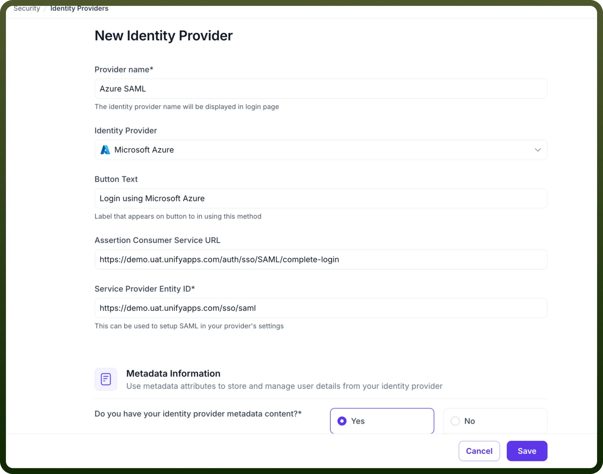

## Step 2: Configuring the SAML Application in Azure

Now, you will create and configure a new SAML 2.0 application in your Azure admin portal.

1. **Create a New SAML App Integration:**
  - Log in to your Azure Admin Portal.
  - In the side navigation menu, go to `All services` > `Identity` > `Enterprise` `applications`.

    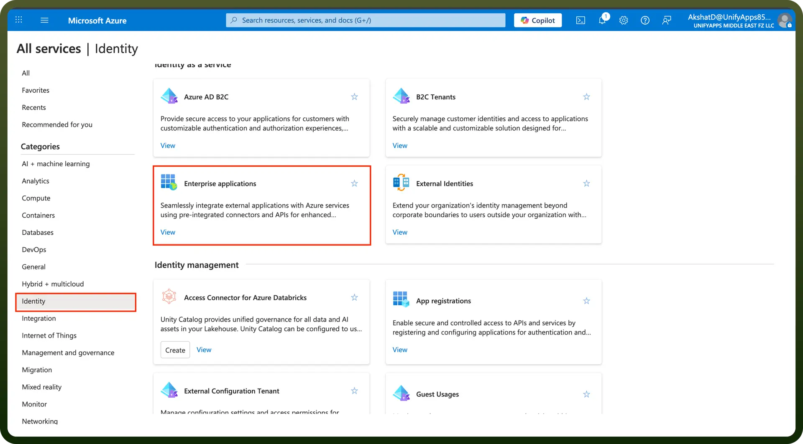

  - Click the `New application` button followed by `Create your own application` button.
  - In the "Create your own application" dialog, select `Integrate any other application you don't find in the gallery (Non-gallery)` and give a name to your application.
  - Click `Create`.

    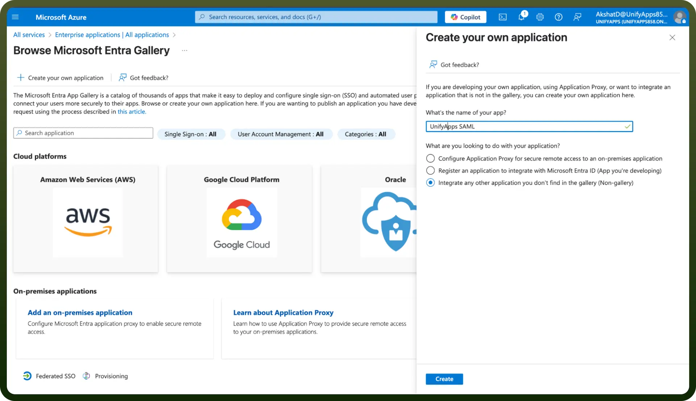

2. **Configure SAML Settings:**
  - Click on `Set up single sign on` and choose `SAML`.
  - Click on the edit button beside the `Basic SAML Configuration` and paste the `Entity ID` and the `Assertion Consumer Service URL` and click on `Save` button.

    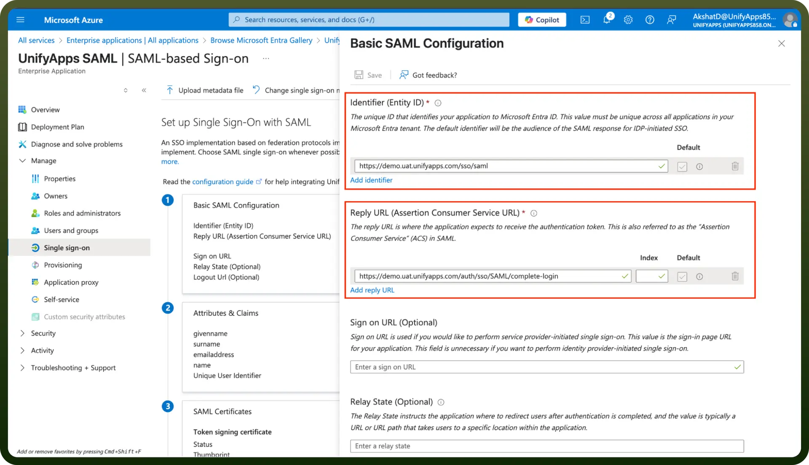

  - Now finally click on the edit button beside the `SAML Certificates` and choose the Signing Option as `Sign SAML response and assertion` and click on `Save`.
3. **Attribute Statements (Crucial for User Data):**
  - Click on the edit button beside the `Attributes & Claims` and add any custom attributes that you might want to send in the SAML Response(optional) and click on `Save` button.

    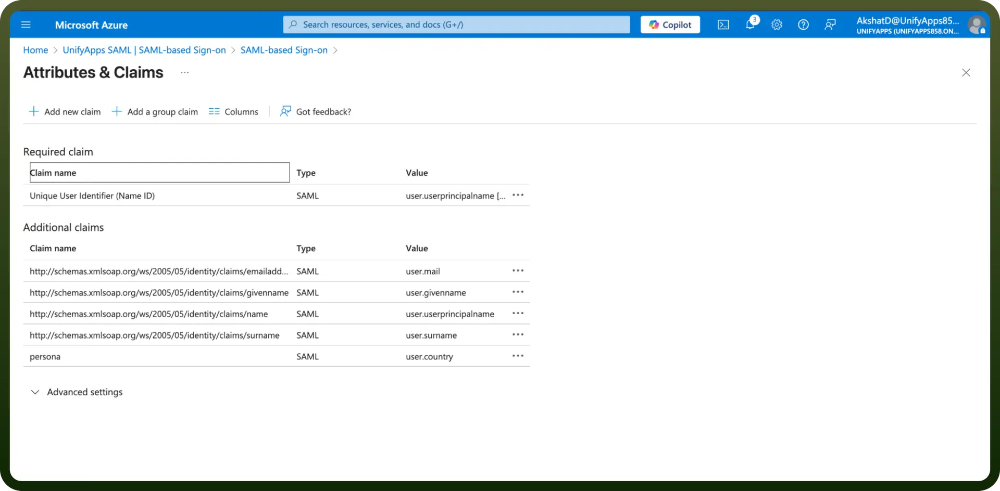

4. **SAML Certificates:**
  - Now finally click on the edit button beside the SAML Certificates and choose the Signing Option as `Sign SAML response and assertion` and click on `Save` button.

    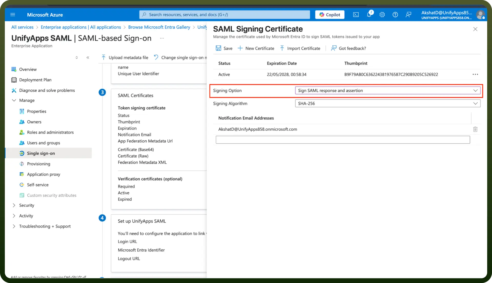

5. **Obtain Azure Identity Provider Metadata:**
  - Once the application is created, download the **"**`Federation Metadata XML`**"**.

    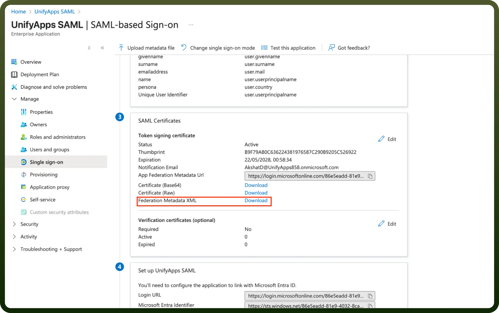

  - Open the downloaded XML file in Chrome or a text editor.
  - **Copy the entire content of this XML page**. This is Azure’s SAML metadata.

    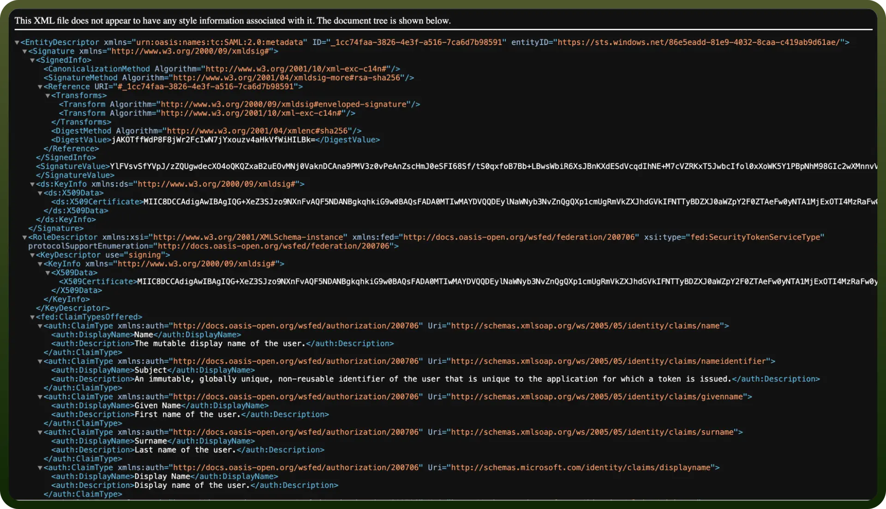

6. **Assign Users and Groups (Essential for Access):**
  - While still in the Azure application settings, navigate to the `Users and groups` tab.
  - Assign the relevant Azure users or groups who should be granted access to UnifyApps via this SSO configuration. Users not assigned here will be unable to log in.

    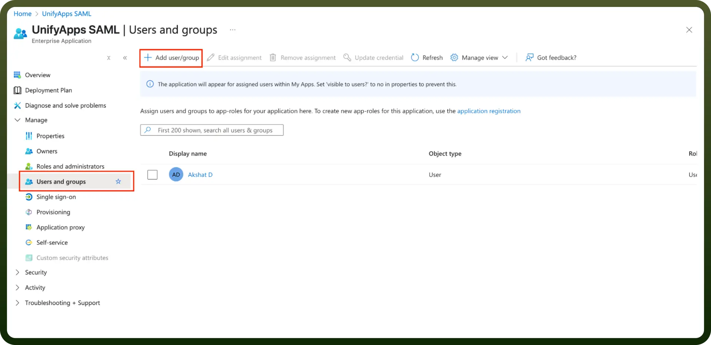

## Step 3: Finalizing Configuration in UnifyApps

Return to the **UnifyApps** IdP configuration page you left open.

1. **Paste Azure Metadata:**
  - Paste the entire Federation Metadata XML in the `Metadata Content` field.
2. **Additional Settings (Optional):**
  - `User Attributes Sync`: Enable if you wish to map custom attributes from Azure to user fields within **UnifyApps.**
  - `JIT Provisioning (Just-In-Time Provisioning)`: Enable to automatically create user accounts when they first log in via Azure.
  - `Enable Refresh Token`: Configure according to your organization's session management requirements.
  - If you enable `User Attributes Sync`, proceed to the `Attribute Mapping` section. Here, you will map `User Fields` to the `SAML Attributes` that will be sent by **Azure** (e.g., mapping a userType_custom_attribute field to a SAML attribute named persona).

    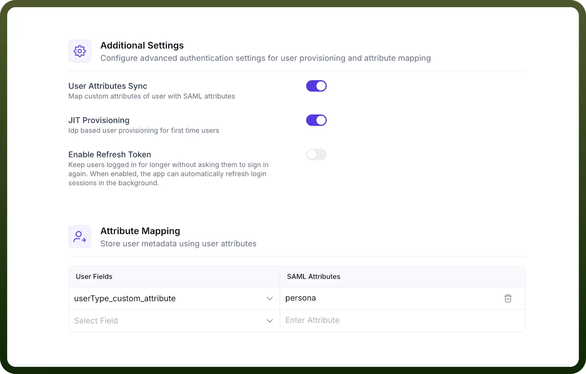

3. Click the `Save` and turn on the toggle for the IdP.

  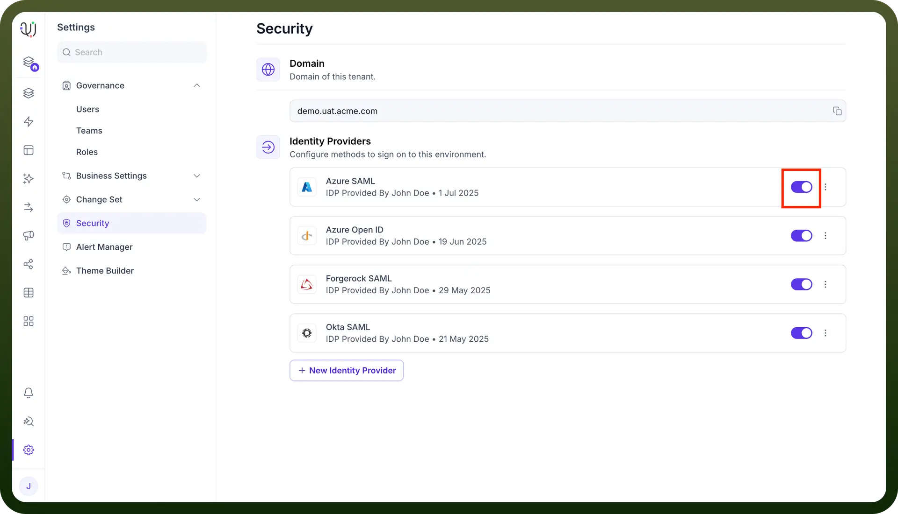
