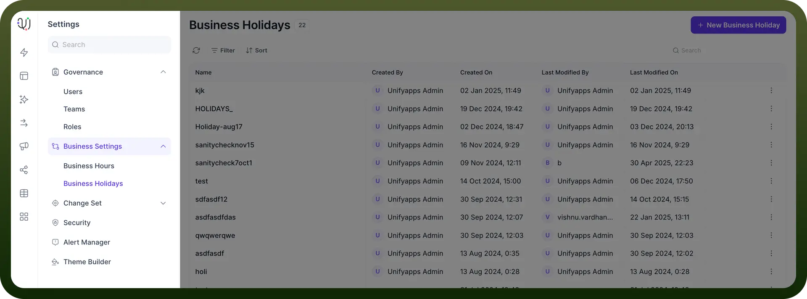
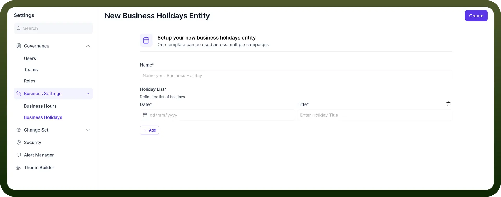
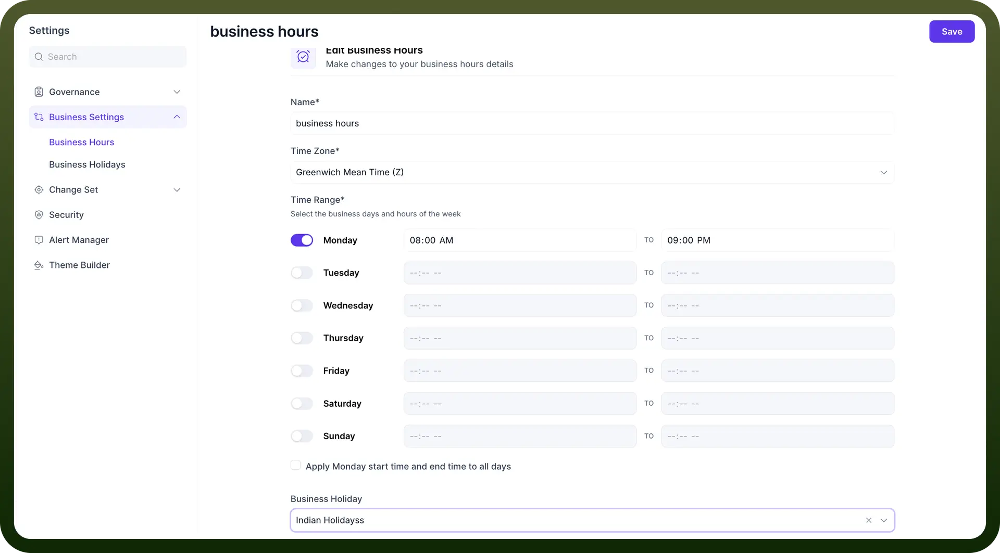

# Business Holidays

Source: https://www.unifyapps.com/docs/governance/business-holidays
Section: governance

---

## Overview

Business Holidays by UnifyApps enables organizations to define and manage non-working days that seamlessly integrate with automation workflows. This means you can create holiday templates, associate them with business hours, and ensure automations respect your organization's actual working calendar, making it perfect for maintaining consistent workflow schedules across multiple campaigns and departments.

## Use Cases

**Seasonal Campaign Management:**

A marketing team creates a "Holiday Season 2025" template with all major holidays. By associating this template with their email campaign automations, they ensure marketing emails are only sent during business hours on working days, preventing customer support inquiries from arriving when no staff is available to respond.

**Regional Office Coordination:**

A multinational company with offices in different countries creates separate holiday entities for each location (e.g., "US Holidays 2025," "UK Holidays 2025"). These templates are then associated with region-specific automations, ensuring that workflows respect local holidays and business hours without requiring separate automation configurations.

**Customer Support Queue Management:**

A support team configures their ticket processing automation with business holidays, ensuring that SLA calculations and escalation workflows account for company holidays. This prevents tickets from being inappropriately prioritized or escalated during periods when the office is closed, maintaining accurate response time metrics.

## Business Holidays Entity Setup

The Business Holidays Entity feature in UnifyApps allows users to create and manage collections of holidays that integrate with business hours settings across multiple automations.

**Input Fields:**

`Entity Name`**:** Provide a descriptive name for your holiday collection (e.g., "Company Holidays 2025" or "Regional Office Holidays").

**Holiday Definition:**

- **Date:** Specify the holiday date in dd/mm/yyyy format
- **Title:** Enter a name for the holiday (e.g., "New Year's Day," "Independence Day")

**Management Controls:**

- `Add Holiday`**:** Add additional holidays to the entity
- `Expand/Collapse`**:** Toggle visibility of individual holiday details
- `Delete`**:** Remove specific holidays from the entity

**Output:**

The action creates a reusable holiday entity that can be referenced across multiple automations and business hour configurations.

## Integration with Business Hours

The Business Hours Integration feature allows users to associate holiday entities with business hour definitions, creating comprehensive scheduling rules for automations.

**Input Fields:**

- `Select Business Hours`**:** Choose the business hours configuration to associate with holidays.
- `Select Holiday Entity`**:** Select a previously created holiday entity to associate with these business hours.

**Application Settings:**

- `Apply to Automations`**:** Enable or disable the combined business hours and holidays rules for specific automations
- `Default Behavior`**:** Configure how automations should behave outside business hours (pause, skip, or continue with modified parameters)

**Output:**

The integration creates a comprehensive time-based control system that ensures automations run only during valid business hours on working days, skipping any defined holidays.
