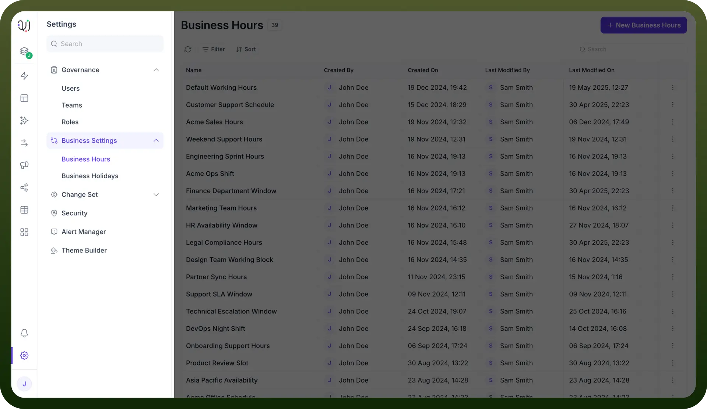
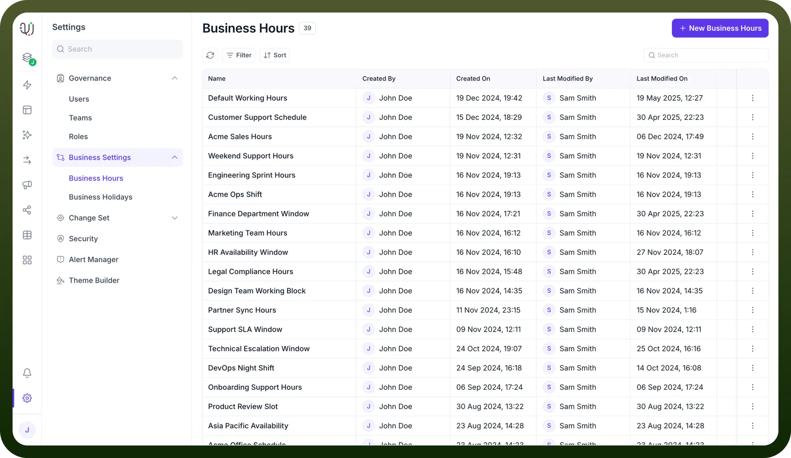
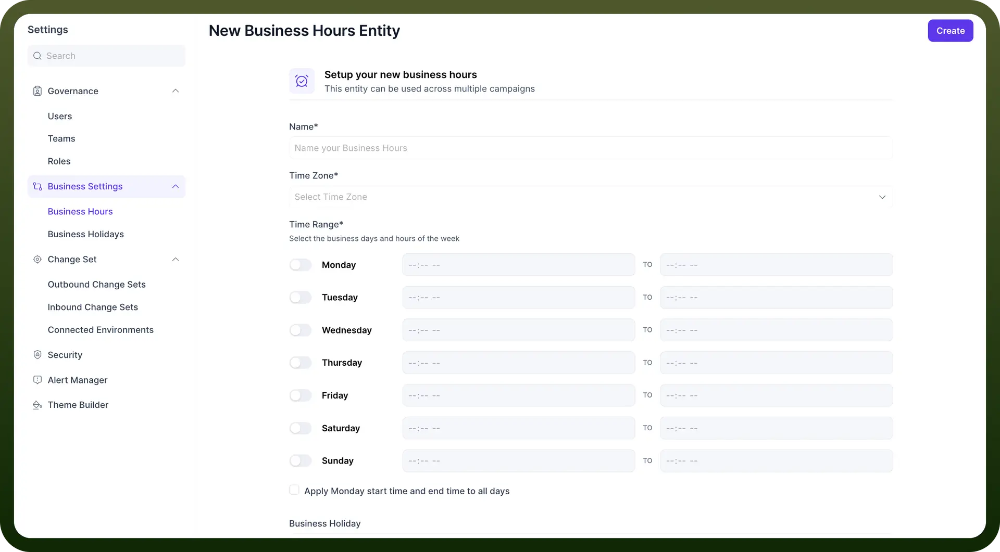
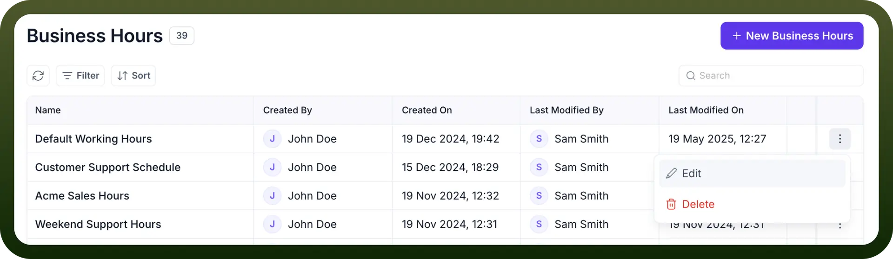
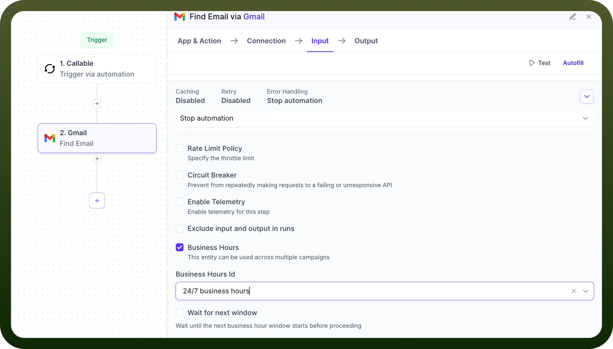

# Business Hours Configuration

Source: https://www.unifyapps.com/docs/governance/business-hours-configuration
Section: governance

---

The **Business Hours** feature in Platform Settings allows you to define specific working hours for your organisation. Once configured, these business hours can be linked to workflows, ensuring they are triggered or executed only during the designated time slots. This feature is especially useful for managing operations like support, ticketing, customer communications, or campaign execution, ensuring they only run during appropriate hours.

## Use Cases

Here are some common ways **Business Hours** can be used to optimize operations:

1. **Campaign Scheduling**: Ensure email, SMS, or WhatsApp campaigns are sent only during peak engagement hours (e.g., weekdays between 9 AM – 6 PM), improving open rates and compliance with regional outreach regulations.
2. **Smart Workflow Automation:** Prevent automated workflows (e.g., follow-up messages, lead assignments) from triggering after hours, ensuring that actions like contact engagement or escalations happen only when staff are available.
3. **Live Chat and Support Routing**: Limit bot interactions or support agent assignments to active business hours, preventing SLA violations by ensuring timely human responses.
4. **Region-Specific Working Hours:** Create separate business hours for different regions (e.g., US vs. APAC) so localized workflows and campaigns respect regional time zones and holiday calendars.
5. **Fail-safe for Sensitive Triggers:** Avoid executing sensitive or high-impact automations (e.g., billing reminders, user onboarding sequences) during off-hours when monitoring and rollback support may be limited.

## How to configure?

1. Go to `Settings` from the left-hand navigation bar.
2. Click on `Business Settings`.
3. Select `Business Hours` from the submenu.

  

## Business Hours List View

The **Business Hours** dashboard presents a list of all configured business hour entries. Each row shows: **Name**, **Created By**, **Created On**, **Last Modified By** and **Last Modified On.**

## Creating a New Business Hours Entry

When you click the `+ New Business Hours` button, you are taken to the **New Business Hours Entity** form.

**Required Fields:**

1. `Name`: Enter a clear and descriptive name (e.g., "Support Hours - US Region").
2. `Time Zone`: Select the appropriate time zone. This ensures workflows align with regional working hours.
3. `Time Range`:
  - Toggle ON the days you want to configure (e.g., Monday to Friday).
  - Specify the `Start Time` and `End Time` for each selected day.
  - Optionally, use the checkbox “`Apply Monday start time and end time to all days`” for quick setup.

Once complete, click `Create` in the top-right corner.

## Editing or Deleting Business Hours

From the Business Hours list view:

- Click the three-dot menu (⋮) at the end of the row.
- Choose `Edit` to update any values.
- Choose `Delete` to remove the business hours permanently. Be cautious—this could affect linked workflows.

  

## Connecting Business Hours to Workflows

After creating a Business Hours entity:

- Navigate to your workflow configuration panel.
- Use the **Business Hours** condition in the drawer section of any node..
- Select the relevant Business Hours entity to ensure the workflow only executes within the defined time frame.

  

## Best Practices

- Create separate business hours for each region if you support multiple geographies.
- Name business hours consistently (e.g., “Sales_US_Eastern”) for easy identification.
- Regularly review and update entries during daylight saving changes or company policy shifts.
