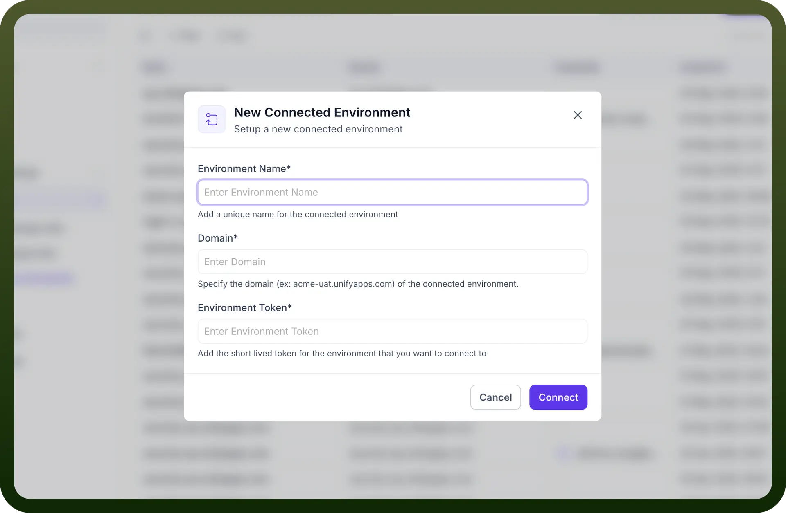
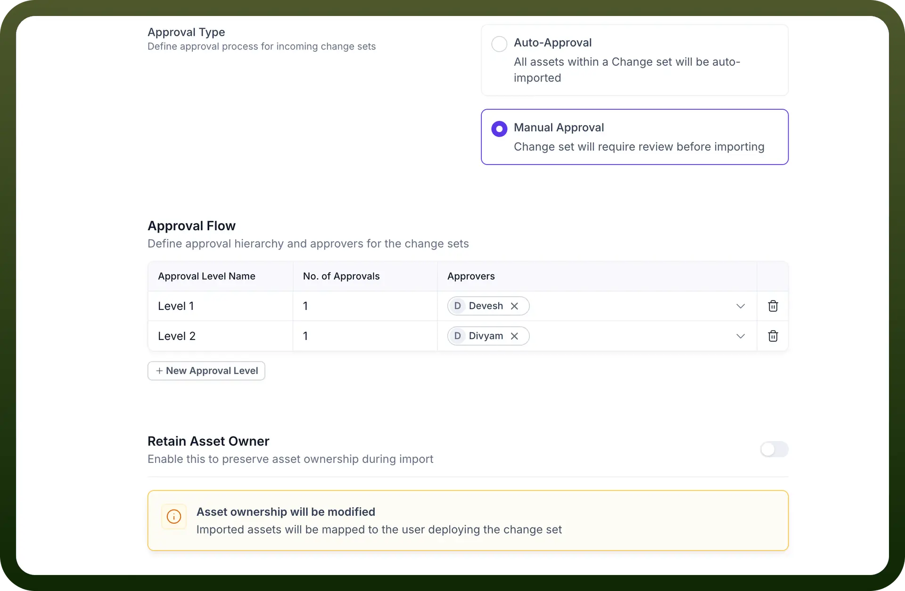

# Connected Environments

Source: https://www.unifyapps.com/docs/governance/connected-environments
Section: governance

---

## Overview

**Connected Environments** is a module within **UnifyApps** that allows users to link different environments and seamlessly move changesets between them. Once two environments are connected, transferring assets becomes simple and efficient.

Two environments, however, cannot be created arbitrarily — they must follow defined authentication mechanism, ensuring safety and security in how environments are linked

## Configuring Connected Environments

**Step 1: Access Change Set Settings**

- Navigate to `Settings` in the main navigation.
- Under the `Change Set` section, select `Connected Environments`.
- You will now see a list of all Connected Environments

**Step 2: Create a New Connected Environment**

- Click on `New Connected Environment`
- Provide the following details
  - `Environment Name`: Add a unique name for the connected environment
  - `Domain`: Specify the domain (ex: acme-uat.unifyapps.com) of the connected environment
  - `Environment Token`: Add the short lived token for the environment that you want to connect to. Please refer to the “Environment Token” section below for more details

    

**Step 3: Generate Environment Token**

Environment Token is used for authentication and is generated from the DESTINATION environment, i.e. user will have to navigate to the destination environment and generate a token, which can be used in the SOURCE environment while creating a new connected environment

- Navigate to the `Destination Environment`
- Click on `Generate Environment Token`
- You will see a new token generated which can be used in the source environment
- Please note that this token is valid for 10 minutes, save this token in a secure place. you won’t be able to access this specific token again once you click on done.

## Configuring Settings for Connected Environments

Once two environments have been connected, users can click on them and define detailed settings which will govern the changeset process. Following options are available :

- **Approval Settings**
  - **Type 1: Auto Approval:**
    - If this is selected , All assets within a Change set will be auto-imported
  - **Type 2: Manual Approval:**
    - If this is selected , changeset will need manual approval before deployments
    - Approval levels can also be defined where specific users/teams can be selected to provide changeset approvals
- **Retain Asset Ownership**
  - Enable this to preserve asset ownership during import
  - `MATCHING PROPERTY`**:** This is used to Map custom user attributes to match identities between environments. This can have values like Email, Name, UserId etc.
  - `JIT Provisioning`**:** This is used to auto create new users when no matching user is found

    

## Best Practices

1. **Use Descriptive Names:** Give your Connective Environments clear, descriptive names that indicate their purpose and destination.
2. **Include Detailed Descriptions**: Add comprehensive descriptions to help reviewers understand the purpose and scope.
3. **Review Dependencies Thoroughly**: Always verify that all necessary dependencies are included to prevent functionality issues after migration.
4. **Test After Connection**: After connecting 2 environments, test the connection using a sample/dummy changeset
