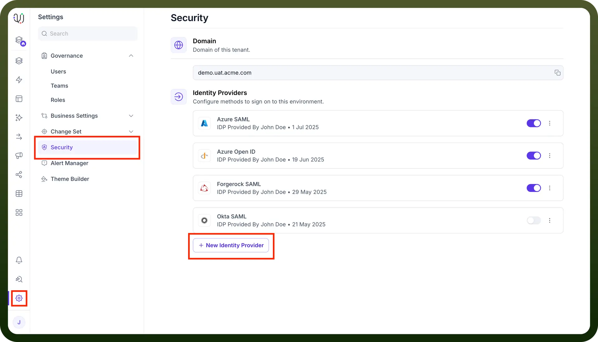
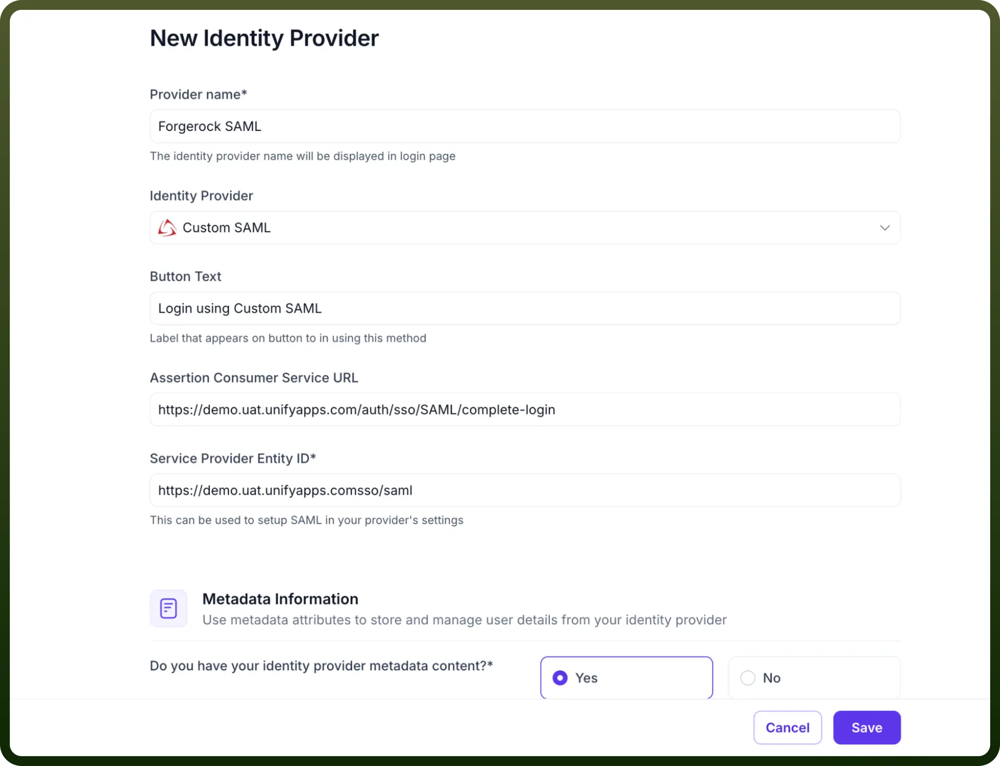
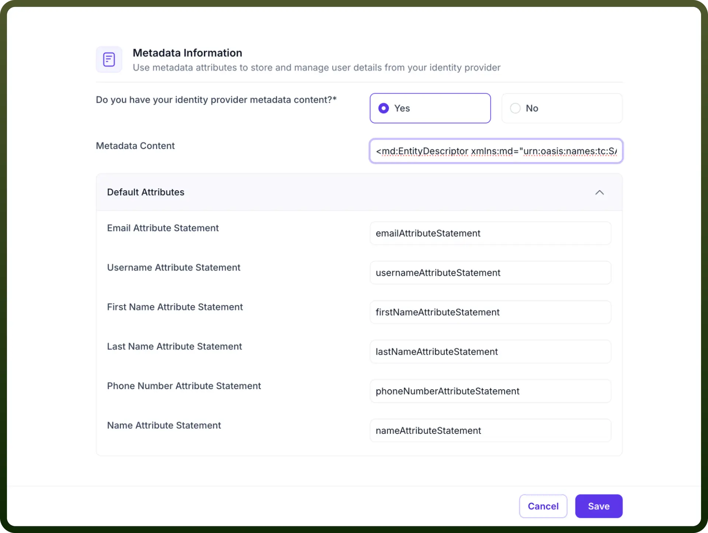
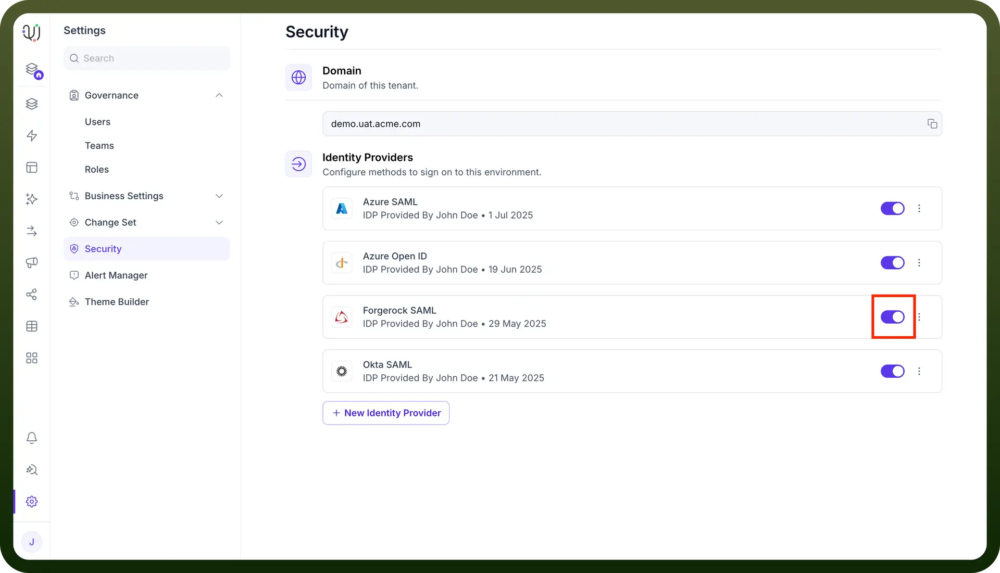

# Custom SAML IDP Configuration for UnifyApps

Source: https://www.unifyapps.com/docs/governance/custom-saml-idp-configuration-for-unifyapps
Section: governance

---

This guide outlines configuring any custom identity provider as a SAML 2.0 Identity Provider (IdP) for Single Sign-On (SSO) with UnifyApps. This would be applicable for Forgerock, JumpCloud, etc.

The configuration process involves three main stages:

## Step 1: Initial Configuration on UnifyApps

In this section, you will start the SAML configuration process on **UnifyApps** and obtain the necessary URLs that Custom IdP will require.

1. **Access Identity Provider Settings:**
  - Navigate to `Settings`.
  - Select `Security` from the settings menu.
  - Under the "Identity Providers" section, click on `+ New Identity Provider`

    

2. **Basic Details & Service Provider Information:**
  - `Provider name`: Enter a descriptive name for this configuration (e.g., Forgerock SAML).
  - `Identity Provider`: Select `Custom SAML` from the dropdown list.
  - `Button Text`: Specify the text that will appear on the SSO login button (e.g., Login using Custom SAML).
  - **Important: Note the following URLs.** You will need these for the Custom SAML application setup in Part 2.
    - `Assertion Consumer Service URL (ACS URL)`**:** This is the endpoint on **UnifyApps** where IdP will send the SAML assertion. (Example: https://demo.uat.unifyapps.com/auth/sso/SAML/complete-login)
    - `Service Provider Entity ID (SP Entity ID)`**:** This is the unique identifier for **UnifyApps** as the Service Provider. (Example: https://demo.uat.unifyapps.com/sso/saml)

      

## Step 2: Configuring the SAML Application in your SAML tool

Now, you will create and configure a new SAML 2.0 application in your admin portal.

1. **Create a New SAML App Integration**
2. **Configure SAML Settings:**
  - Consume the `Assertion Consumer Service URL` and `Service Provider Entity ID`.
3. **Attribute Statements (Crucial for User Data):**
  - Add the attributes or any custom attributes that you might want to send in the SAML Response.
4. **SAML Certificates:**
  - Choose the appropriate signing option which should **Sign both SAML response and assertion**.
5. **Obtain Azure Identity Provider Metadata:**
  - Once the application is created, download the **"Metadata XML"** file.
  - Open the downloaded XML file in Chrome or a text editor.
  - **Copy the entire XML content of this page**.

    

6. **Assign Users and Groups (Essential for Access):**
  - While still in the application settings, assign the relevant users or groups who should be granted access to **UnifyApps** via this SSO configuration. Users not assigned here will be unable to log in.

## Step 3: Finalizing Configuration in UnifyApps

Return to the **UnifyApps** IdP configuration page you left open.

1. **Uploading the publicly signed certificate in Mongo (Optional)**, so that it can be used on an environment level. It would be added to all the Identity Provider configurations on UnifyApps by default (you can opt-out if needed).
  - **Sample command to insert certificate in Mongo**: `db.ResourceConfig.insertOne( { _id: 'SAML_CREDENTIALS:SAML_CREDENTIALS:0', _t: 'com.unifyapps.auth.lib.beans.SAMLCredentialsConfig', resourceCategory: 'SAML_CREDENTIALS', resourceType: 'SAML_CREDENTIALS', privateKey: 'MIIEvQIBADANBgkqhkiG9w0BAQEFAASCBKcwggSjAgEAAoIBAQCowfhpT3T/RRLDJBOpckUOH8r5anH5rZqATAbs9ewz5RAmF08wcrgcNhCxsRltMoRrao2i4po7X2xfq+sEbjcTgiOO8jOH7rLCnU9fCQ4Z4nni1LrSTdeRTW3L76mLPTgFQEEyPTrdmjz6OU+A4wDqOHQgkH1CGGMW2lmIcYRP+GFTcFkGOMHy0TiXxWYhcV6+2jxb24n7i0byJ7htB0SGPfUid9w/FHXnFYTYgYNC0WSHSR+O1nzxoy1Z+3IPwQv8Bgk9wCt+xNONtX8xrc66zgvnR0P2PqHn80AphLfJkyAhSfSjA09sGQ2APgmibUoW1cA2iOItPofFIXghkuuPAgMBAAECggEAAt7PVYwEu4WWizVblKfwaIwxSbe+E4oySAwpZZgzOcvwgxO/aypwWwgVlZtWouBXZA2IAv69GW7TxMOdHjisfPHB0ay18RIMZIbRDEoQcG+rm6hhoX6yDXMjMtmAAtgta6cLOz1sxf5ZgV0+Ygm6Zyfc3DCI9a0jgyAYolthh3JB5xvBPqYNg3JyoaI2CmZ4sBiF6GmO+Ej8jiR3xO58sUOXlu0yInwP4oJ6IT8dG5i/BqfglWBpvUEKOrEg3Y7Vi8DjIA24gBeHjEp+YVN6ZJHWI3UlO857IxeTXvm58cIf2o11X/cY6J3ih36OSKCEQ5cMx1MxGlIbPpz46BOv4QKBgQDT3jTJm94s+d8EdPkbHqxUPRMIFT0+wmQLAO/G2YTDCS6WnupfNHgVnctIPVR0nHjML4ZX9ApxcUp8oM5wQK100aOnqA5MnGXcDLHyvjfUlisxvQv7vtHa11W5CfDVML6m3zKa0f7u8PdbP7Hcy0gpztFx1GeWw3lA1/PltTrG4QKBgQDL6OvVahoOgfI1Zz/XB+Nnkm0EPwY9wVm/65BKXLkukfZknlWNd2x0Ft2lL+SEyJlC+nkSyEsK0ecgz+v0ZmX9sBVteL9Q890zZOTlWOBCMuoFethkrqMazfFQzCS52/F6C1aAJBdCwo6LMSn0k/4tmZaVK3SKD6CtcP95m9ywbwKBgQCTTxmG4A//V5C/qZEWUSJiw8A6y4G05DXpDLKqoMzVSsoQwdeVcIbaCMexp6rUFYNL/PM8rhqgu7OdqbU/iUjRQ321cXzXuZp9AHqtm6J39h18TMRLOmbw8O3SZV4E7QpyPhgSW1YUzog98rB5IwI+x2UK7zNDORBSjJQxL+v5IQKBgEuHTAtx0JL9GQ0k4GWyu0260/yVp6cqPiczhu+0ZrdUQ3LDnybWTGq3qYOtOLTiZLqFcmE9pWYtl7H0sg6F+1M7bMRuzFac7ZtCzPISuIZsu3gqJ4srkKi2DaOC6juZt1kgZ/rw41jMHeZ64HKCeszDLh60yOb2oOp9h3OxAs6rAoGAFDopHgyBqXDwU/DBpYBRfEpBF4PjPdouTDpdmWB4SyzE24EgedEl+ukJPbjk2E2/+M2KTQhEkpjnU4q2L/5BGfCzNxLKiUs1TQXxLS5zkhwekTqZK4KnJvtHmeI6dDxIVKJVSuAw1lzat2eavKK+1kp8mbeL2ptVo1hhzVUfg5c=', certificate: 'MIIDwzCCAqugAwIBAgIUexiPXSxxH7T+DIERdfWmGeQYABswDQYJKoZIhvcNAQELBQAwcTELMAkGA1UEBhMCSU4xEDAOBgNVBAgMB0hhcnlhbmExETAPBgNVBAcMCEd1cnVncmFtMRIwEAYDVQQKDAlVbmlmeUFwcHMxDzANBgNVBAsMBkRldk9wczEYMBYGA1UEAwwPKi51bmlmeWFwcHMuY29tMB4XDTI1MDUyMzExMzYxNVoXDTM1MDUyMTExMzYxNVowcTELMAkGA1UEBhMCSU4xEDAOBgNVBAgMB0hhcnlhbmExETAPBgNVBAcMCEd1cnVncmFtMRIwEAYDVQQKDAlVbmlmeUFwcHMxDzANBgNVBAsMBkRldk9wczEYMBYGA1UEAwwPKi51bmlmeWFwcHMuY29tMIIBIjANBgkqhkiG9w0BAQEFAAOCAQ8AMIIBCgKCAQEAqMH4aU90/0USwyQTqXJFDh/K+Wpx+a2agEwG7PXsM+UQJhdPMHK4HDYQsbEZbTKEa2qNouKaO19sX6vrBG43E4IjjvIzh+6ywp1PXwkOGeJ54tS60k3XkU1ty++piz04BUBBMj063Zo8+jlPgOMA6jh0IJB9QhhjFtpZiHGET/hhU3BZBjjB8tE4l8VmIXFevto8W9uJ+4tG8ie4bQdEhj31InfcPxR15xWE2IGDQtFkh0kfjtZ88aMtWftyD8EL/AYJPcArfsTTjbV/Ma3Ous4L50dD9j6h5/NAKYS3yZMgIUn0owNPbBkNgD4Jom1KFtXANojiLT6HxSF4IZLrjwIDAQABo1MwUTAdBgNVHQ4EFgQUqqVnZnBS21UYwBedKKe137a2o28wHwYDVR0jBBgwFoAUqqVnZnBS21UYwBedKKe137a2o28wDwYDVR0TAQH/BAUwAwEB/zANBgkqhkiG9w0BAQsFAAOCAQEALYkEL2oRXJvLoZ51LxGiVRsocL7uKQRANMpJRMiq9wMFE6WAjkirCzSW1SM5F+0SJn/KvWytMrMjJDL1Na/okJvwWNlaSy2eQpmmVOx5HSDJSASegoZ9eb4kiZL8XmFr+5KiSFlVYkqNbBbs8Nhxf/VhUKYz5N5/jEyptPMeEZnIxYQsED01nbsriBxH04kTtmf8kBwiu/Jc3mW6c3bkq68aeV2q4UkFTJ3e0QpppXNhGNmc7Pw6086Lo2Fi7zheep3dT8FG8wPDIXc3nYZSFbg0X1jxmdWNU2DJ4dANh8fjkvJz8CuuFiEaGZAMbAwyid24WmwGh8j2cdS1obBmYQ==' })`
2. **Paste Azure Metadata:**
  - Paste the entire Metadata XML in the `Metadata Content` field.
  - Crosscheck that default Attributes are mapped for username , email, first & last name.

    

3. **Additional Settings (Optional):**
  - `User Attributes Sync`: Enable if you wish to map custom attributes from custom IdP to user fields within **UnifyApps.**
  - `JIT Provisioning (Just-In-Time Provisioning)`: Enable it if you want to automatically create user accounts when they first log in via Custom IdP.
  - `Enable Refresh Token`: Configure according to your organization's session management requirements.
  - If you enable `User Attributes Sync`, proceed to the `Attribute Mapping` section. Here, you will map `User Fields` to the `SAML Attributes` that will be sent by **your Custom SAML** (e.g., mapping a userType_custom_attribute field to a SAML attribute named persona).

    

4. Click `Save` and turn on the toggle for the IDP.

  
