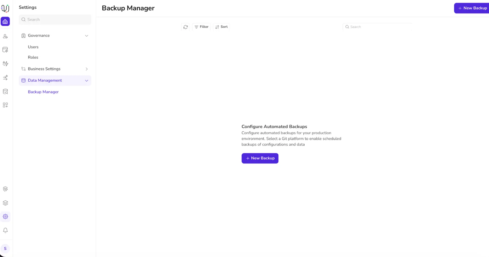
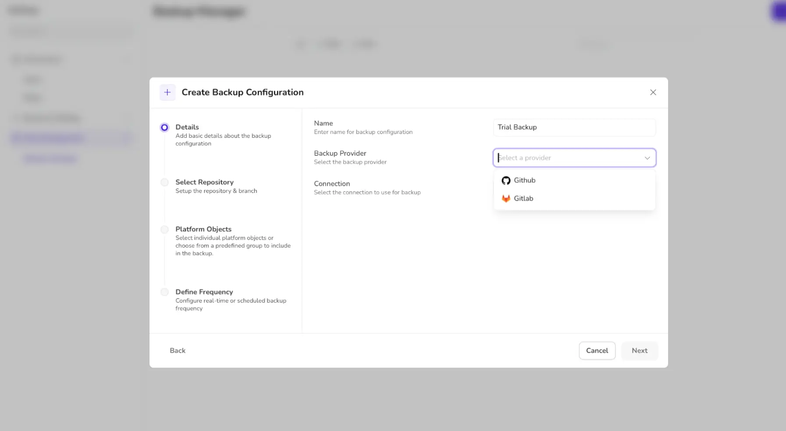
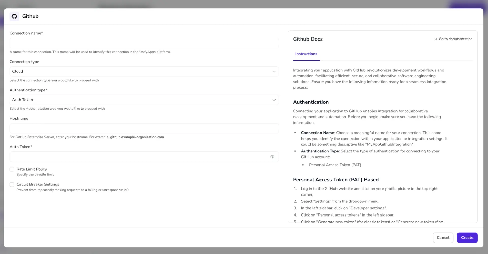
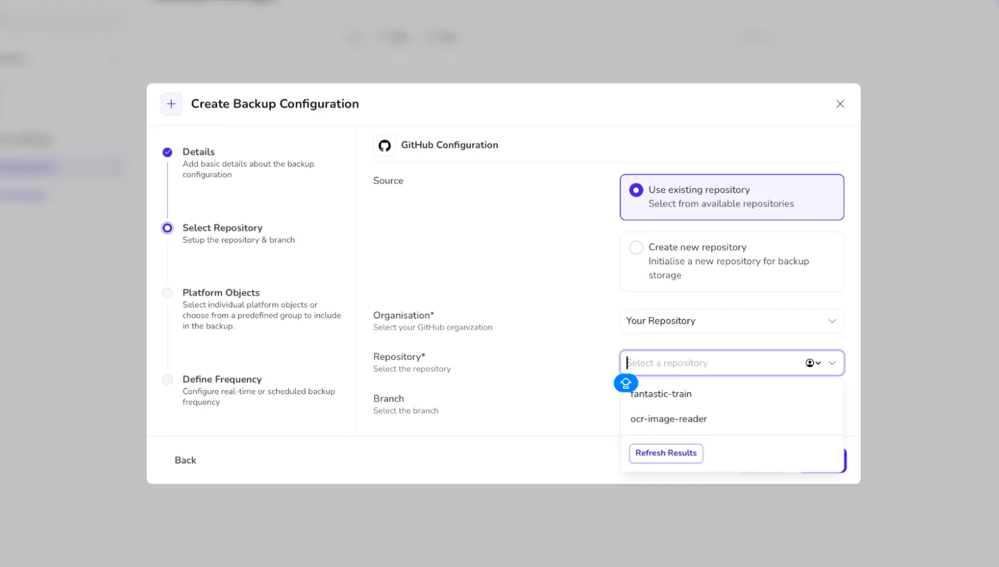
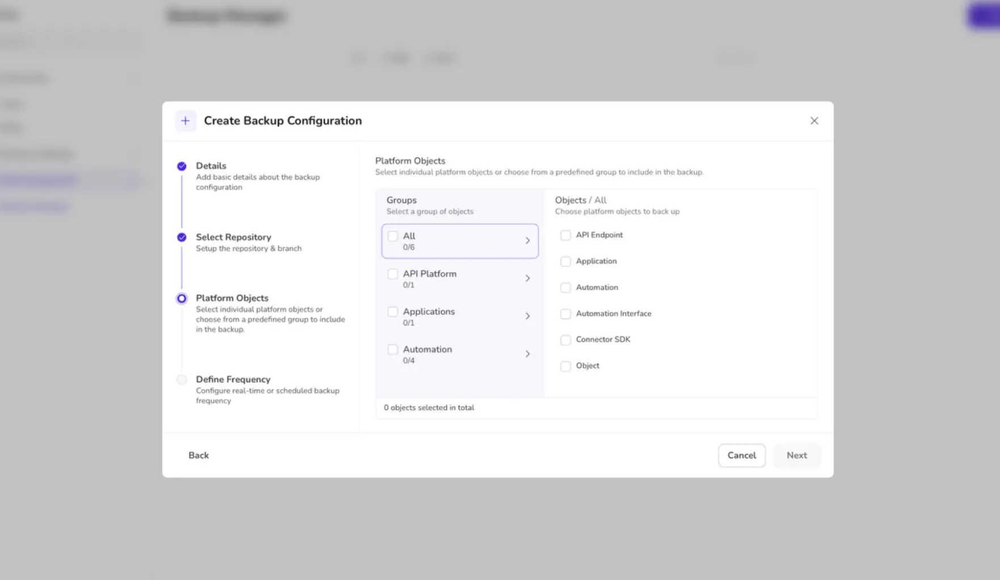
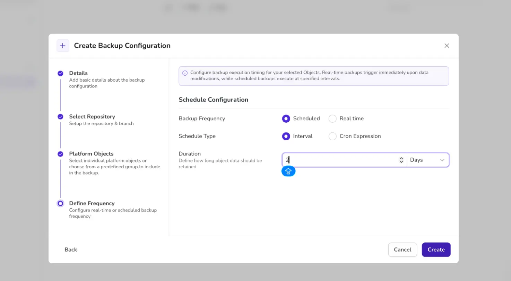

# Data Protection

Source: https://www.unifyapps.com/docs/governance/data-protection
Section: governance

---

## Overview

Data backup and protection ensure that critical information remains safe, available, and recoverable in case of data loss, system failure, cyberattacks, or human error. Regular backups create copies of data stored in secure, separate locations (such as cloud or off-site storage), while protection measures like encryption, access controls, and monitoring prevent unauthorized access or corruption. Together, these practices help maintain data integrity, support business continuity, and reduce the risk of permanent data loss.

## Data Backup in Unifyapps

## 

Whenever creating a New Backup, the platform asks for configuration details.

Add the connection name and choose the backup provider.

While choosing the connection, click on ADD CONNECTION to make a new connection. Adding a new connection will require you to fill the connection configurations. The instructions are already given to ease your journey.

Choose the relevant details and click on CREATE.

Select the repository and branch you want to connect. You can use an existing repository or create a new one to connect.

Select the Platform Objects to include in the backup. You can choose individual platform objects or from a predefined group to include in the backup.

Define Frequency for backup. The platform provides two options to choose from: *SCHEDULED* or *REAL-TIME*

Click the CREATE button to confirm the creation of the backup.

## Use cases

1. **Protecting Automation Inputs and Outputs**
- Secure handling of data flowing through automation pipelines
- Preventing leakage of sensitive inputs (documents, prompts, configs)
- Ensuring outputs generated by workflows and agents are not exposed or tampered with.
2. **Safeguarding Agent Memory and Context**
- Protecting agent conversation history and long-term memory
- Controlling access to agent state, embeddings, and cached knowledge
- Preventing cross-tenant data access between agents
3. **Governance and Access Control**
- Role-based access to automations, apps, and agents
- Approval workflows for publishing or modifying automations
- Visibility into who accessed or changed what, and when
4. **Secure Data Lifecycle Management**
- Enforcing data retention and expiration policies
- Secure deletion of temporary and intermediate automation data
- Preventing over-retention of sensitive information
