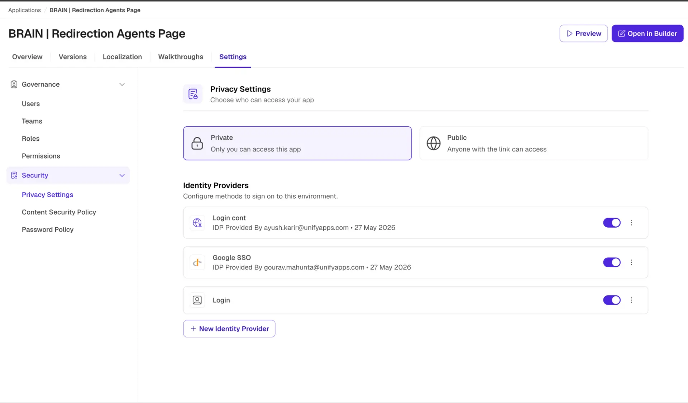
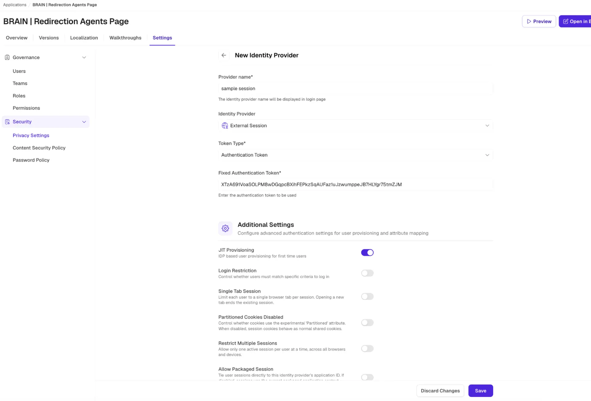
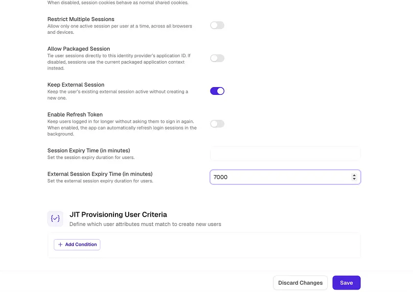
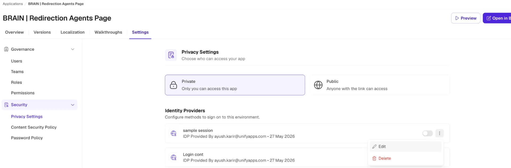
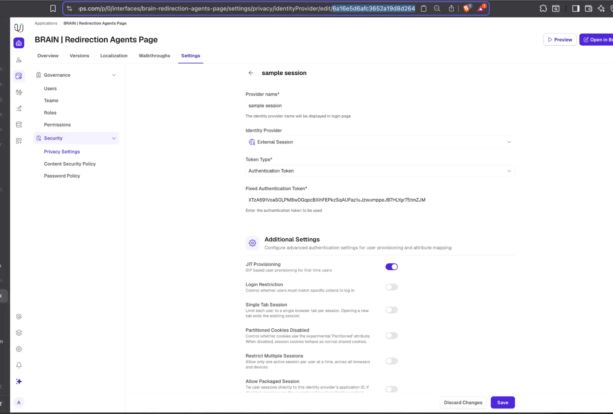
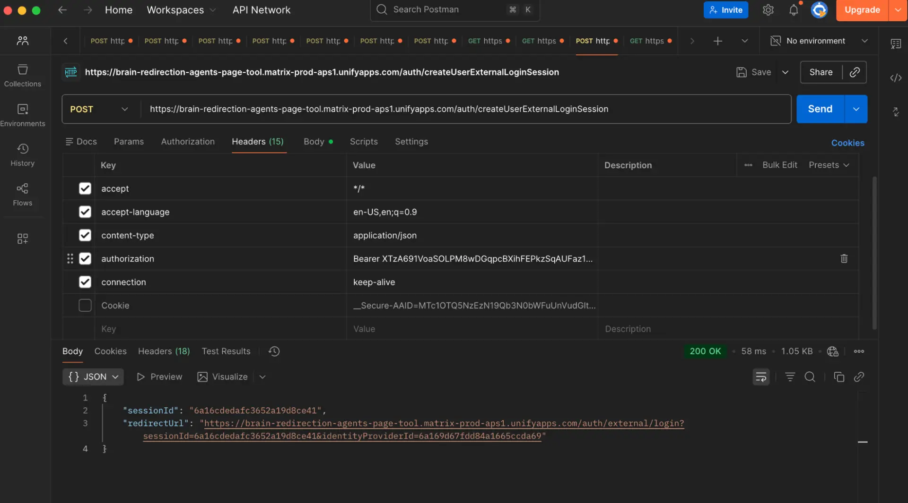
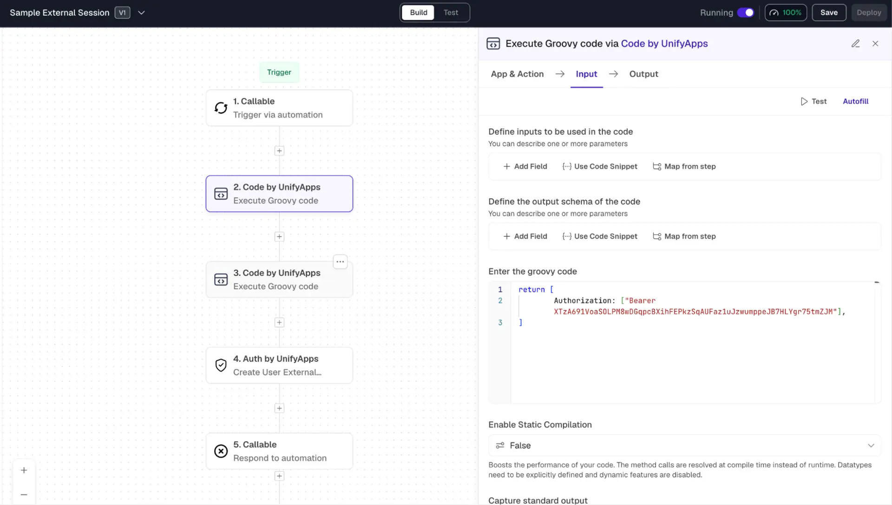
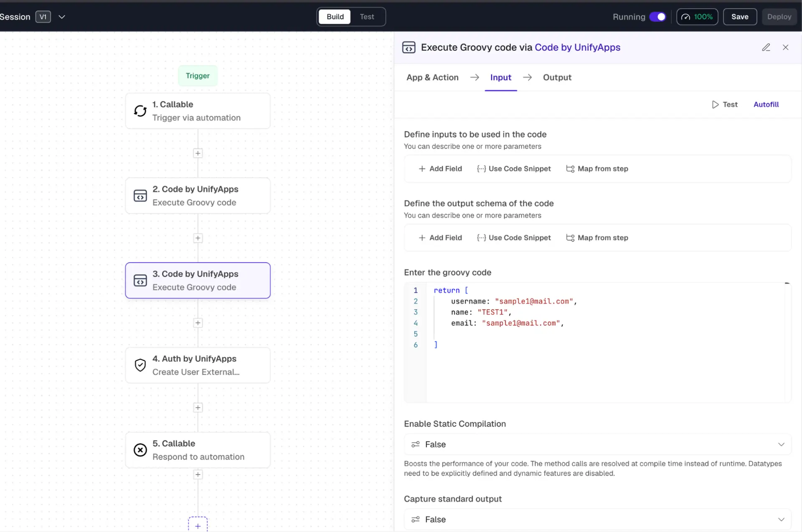
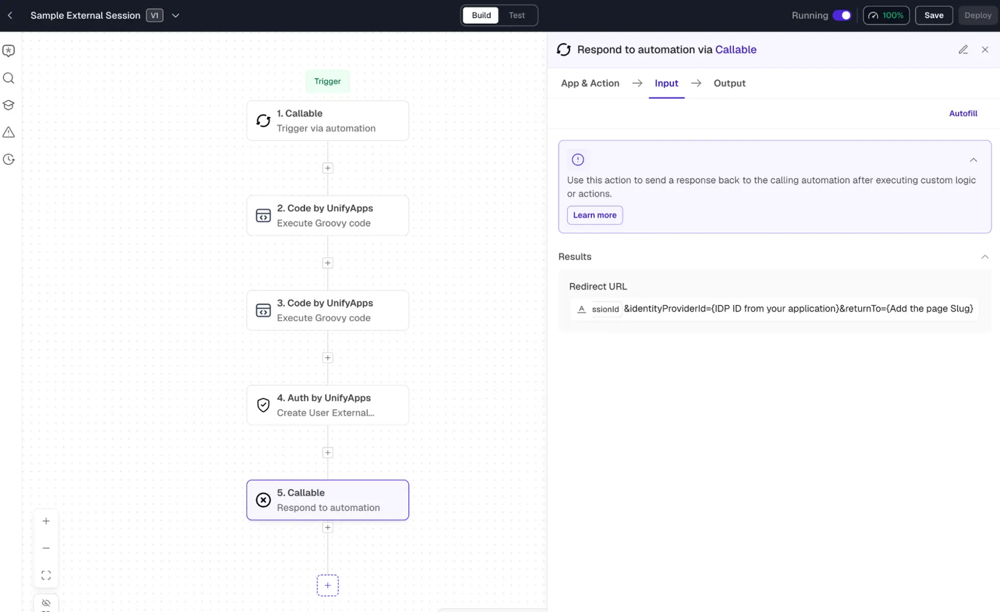

# External Session Setup Guide

Source: https://www.unifyapps.com/docs/governance/external-session-setup-guide
Section: governance

---

# **1.  Create External Session via cURL**

Follow the steps below to configure your Identity Provider (IDP) and generate an external login session using a cURL request.

**STEP 1 -** **Open Privacy Settings**

Navigate to:  Settings  →  Security  →  Privacy Setting for your app.

**STEP 2** **Create a New External Session**

Click Create a new external session.

Generate a Fixed Auth Token from the token generator:

Token generator: [https://it-tools.tech/token-generator?length=63](https://it-tools.tech/token-generator?length=63)

**STEP 3** **Save and Enable IDP**

Once the session is configured, click Save.

Turn on your IDP and click Edit to open its settings.

**STEP 4** **Collect Required Values**

Copy the following values from your IDP settings:

| **Value** | **Where to find it** |
|---|---|
| **Fixed Auth Token** | IDP settings → Fixed Auth Token field |
| **IDP ID** | Extracted from the URL of the IDP settings page |
| **Matrix App Link** | IDP settings → Matrix Link for the application |

**STEP 5** **Build & Execute the cURL Request**

Replace the placeholders in the cURL template below with your collected values, then run it in Postman or any HTTP client.

| curl --location 'https://{matrix app link}/auth/createUserExternalLoginSession' \--header 'accept: */*' \--header 'accept-language: en-US,en;q=0.9' \--header 'content-type: application/json' \--header 'authorization: Bearer {Fixed auth token}' \--header 'connection: keep-alive' \--data-raw '{    "identityProviderId": "{IDP Id}",    "formData": {        "username": "sample1@mail.com",        "name": "TEST1",        "email": "sample1@mail.com",        "customProperties": {}    }}' |
|---|

| **Placeholder** | **Replace with** |
|---|---|
| **{matrix app link}** | Your Matrix app URL (up to /auth) |
| **{Fixed auth token}** | Your Fixed Authentication Token |
| **{IDP Id}** | Your Identity Provider ID |

**STEP 6** **Get the Redirect URL**

Paste the cURL into Postman and execute the request.

Copy the  redirectURL from the JSON response.

**STEP 7** **Log In to Your Application**

Paste the redirect URL into your browser.

You should now be logged in. A new user entry may appear under  Settings → Users.

# **2.  Create External Session via Automation**

Use the sample automation to generate external sessions within UnifyApps.

**STEP 1** **Copy the Sample Automation**

Open the sample automation from the link below and make a copy into your workspace.

[https://orbit.uat.unifyapps.com/p/0/automations/6a16ef1890a87e3b8b5f00ff/builder?activeStep=n_dmZz0](https://orbit.uat.unifyapps.com/p/0/automations/6a16ef1890a87e3b8b5f00ff/builder?activeStep=n_dmZz0)

**STEP 2** **Update the Auth Token**

In the automation, locate the auth token field and replace it with the Fixed Auth Token you used for your IDP.

**STEP 3** **Configure the Automation Logic**

Adjust the automation steps to match your use case and user creation logic.

**💡** **Sample Working URL:** [Click Here](https://brain-redirection-agents-page-tool.matrix-prod-aps1.unifyapps.com/auth/external/login?sessionId=6a16e8c0fdd84a1665cce798&identityProviderId=6a169d67fdd84a1665ccda69&returnTo=cloud-cost)

**💡  Note:** Only include the  returnTo   parameter if you want to redirect users to a specific page after login. If you want the default homepage, remove the  returnTo  field entirely.

